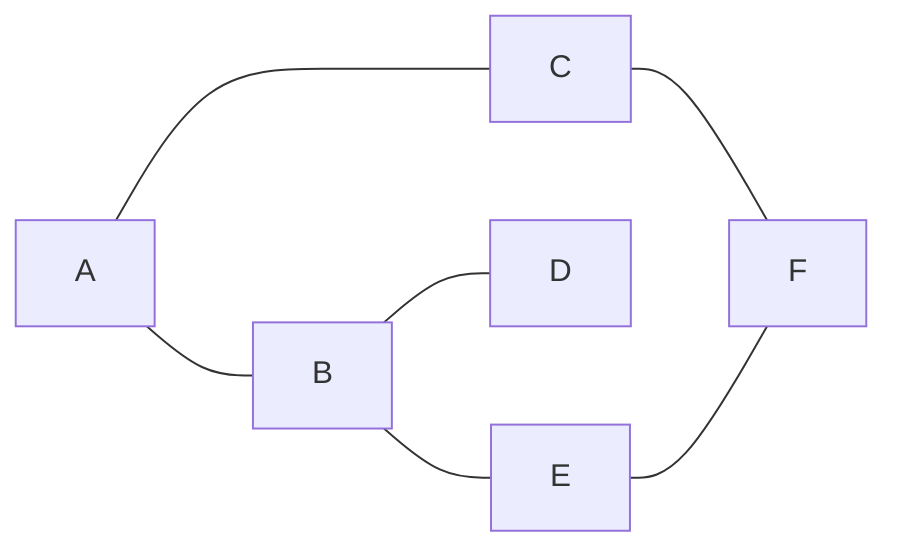

# ! BFS广度优先搜索

## 一、前置知识

*   **图（Graph）**:
    *   了解图的基本概念：顶点（Vertex）、边（Edge）、有向图（Directed Graph）、无向图（Undirected Graph）。
    *   图的表示方法：邻接矩阵（Adjacency Matrix）、邻接表（Adjacency List）。BFS 通常在邻接表上效率更高。
*   **队列（Queue）**:
    *   先进先出（FIFO）的数据结构。
    *   基本操作：入队（enqueue/push）、出队（dequeue/pop）、判空（empty）、获取队首元素（front）。C++ STL 中的 `queue` 可以很方便地实现。
*   **集合（Set）或布尔数组（Boolean Array）**: 用于记录已访问过的顶点，防止重复访问和陷入无限循环。C++ STL 中的 `unordered_set` 或 `vector<bool>` 可以使用。

## 二、算法分析

### 1. 算法描述

*   **核心思想**: BFS 是一种用于图遍历或搜索的算法。它从一个起始顶点开始，首先访问其所有直接相邻的邻居顶点，然后逐层向外扩展，访问下一层的邻居顶点，依此类推。
*   **层级遍历**: BFS 的特点是按层级（距离起始点的步数）进行遍历。首先访问距离起始点为 0 的顶点（即起始点本身），然后是距离为 1 的所有顶点，接着是距离为 2 的所有顶点，等等。
*   **应用场景**:
    *   查找无权图中的最短路径。
    *   层序遍历（Level Order Traversal）树或图。
    *   解决一些需要按距离或步数扩展的问题，如迷宫问题、连通性问题等。

### 2. 算法特点

*   **非递归**: BFS 通常使用迭代方式实现，借助队列来存储待访问的顶点。
*   **保证最短路径（无权图）**: 在无权图中，BFS 找到的从起点到任何其他可达顶点的路径都是最短的（边数最少）。
*   **空间换时间**: BFS 需要额外的空间（队列和访问标记）来存储顶点信息。

### 3. 关键概念

*   **访问标记**: 必须记录哪些顶点已经被访问过，以避免重复处理和在有环图中陷入死循环。
*   **队列**: 核心数据结构，用于存储待访问的顶点，保证按层级顺序访问。

## 三、示例分析

### 1. 基本示例（无向图）

考虑以下无向图：



**从顶点 A 开始进行 BFS：**

1.  **初始化**: 队列 `Q = [A]`, 访问标记 `visited = {A}`。
2.  **第 1 层**:
    *   出队 A。
    *   访问 A 的邻居 B 和 C。
    *   将 B 和 C 入队，标记为已访问。`Q = [B, C]`, `visited = {A, B, C}`。
3.  **第 2 层**:
    *   出队 B。
    *   访问 B 的邻居 D 和 E（A 已访问）。
    *   将 D 和 E 入队，标记为已访问。`Q = [C, D, E]`, `visited = {A, B, C, D, E}`。
    *   出队 C。
    *   访问 C 的邻居 F（A 已访问）。
    *   将 F 入队，标记为已访问。`Q = [D, E, F]`, `visited = {A, B, C, D, E, F}`。
4.  **第 3 层**:
    *   出队 D。D 没有未访问的邻居。`Q = [E, F]`。
    *   出队 E。E 的邻居 F 已访问（B 已访问）。`Q = [F]`。
    *   出队 F。F 的邻居 C 和 E 已访问。`Q = []`。
5.  **结束**: 队列为空，BFS 结束。

**遍历顺序**: A -> B -> C -> D -> E -> F (同一层的顺序可能因邻居访问顺序而不同，例如也可能是 A -> C -> B -> F -> D -> E)

### 2. 特殊情况（图不连通）

如果图不连通，从一个起始点进行 BFS 只会访问到该起始点所在的连通分量。若要访问整个图，需要对每个未访问过的顶点启动一次 BFS。

### 3. 边界测试

*   **空图**: 输入为空图，直接返回。
*   **单个顶点**: 队列初始放入该顶点，然后出队，无邻居，结束。
*   **有环图**: 访问标记确保不会陷入无限循环。

## 四、解题思路（算法流程）

### 1. 问题分析

BFS 的核心在于如何系统地、不重复地、按层级顺序访问图中的所有可达顶点。

### 2. 算法设计

*   **数据结构**:
    *   使用**队列** `Q` 存储待访问的顶点。
    *   使用**集合**或**布尔数组** `visited` 记录已访问的顶点。
    *   图通常用**邻接表** `adj` 表示。
*   **核心逻辑**:
    *   从起始点开始。
    *   利用队列实现层级访问。
    *   利用访问标记避免重复。

### 3. 解题步骤

1.  **初始化**:
    *   创建一个空队列 `Q`。
    *   创建一个集合或布尔数组 `visited` 用于标记访问状态，初始时所有顶点都标记为未访问。
    *   选择一个起始顶点 `start_node`。
    *   将 `start_node` 加入队列 `Q`。
    *   将 `start_node` 标记为已访问 `visited[start_node] = true`。
2.  **循环**: 当队列 `Q` 不为空时，执行以下操作：
    *   **出队**: 从队列 `Q` 中取出一个顶点 `u`（队首元素）。
    *   **(处理顶点)**: 在这里可以对顶点 `u` 进行所需的操作（例如，打印、计算距离等）。
    *   **访问邻居**: 遍历顶点 `u` 的所有邻居 `v`：
        *   **检查访问状态**: 如果邻居 `v` **未被访问** (`visited[v] == false`)：
            *   **标记**: 将 `v` 标记为已访问 `visited[v] = true`。
            *   **入队**: 将 `v` 加入队列 `Q`。
3.  **结束**: 当队列 `Q` 为空时，表示从 `start_node` 可达的所有顶点都已被访问，BFS 过程结束。

## 五、代码实现

### 1. 完整代码 (基于邻接表)

```cpp
#include <iostream>
#include <vector>
#include <queue>
#include <vector> // 用于 visited 数组
#include <unordered_map> // 如果节点不是从0开始的连续整数，可以用 map
#include <unordered_set> // 或者用 set 记录 visited
using namespace std;

/**
 * @brief 使用邻接表执行广度优先搜索
 * @param adj 邻接表表示的图，键是顶点，值是邻居列表
 * @param start_node 起始顶点
 * @param num_nodes 图中顶点的数量 (如果使用 vector<bool> 作为 visited)
 *                  或者可以不传，如果使用 map/set 作为 visited
 */
void bfs(const unordered_map<int, vector<int>>& adj, int start_node) {
    // 访问标记，可以使用 unordered_set 或 vector<bool>
    // 如果节点是从 0 到 num_nodes-1 的连续整数，vector<bool> 更高效
    // 这里假设节点可能是任意整数，使用 unordered_set
    unordered_set<int> visited;
    // 创建队列
    queue<int> q;

    // 1. 初始化
    q.push(start_node);
    visited.insert(start_node);
    cout << "BFS starting from node " << start_node << ": ";

    // 2. 循环直到队列为空
    while (!q.empty()) {
        // 2.1 出队
        int u = q.front();
        q.pop();

        // 2.2 处理顶点 (这里仅打印)
        cout << u << " ";

        // 2.3 访问邻居 (检查 adj 是否包含 u)
        if (adj.count(u)) {
            for (int v : adj.at(u)) {
                // 2.3.1 检查访问状态
                if (visited.find(v) == visited.end()) { // 如果 v 未被访问
                    // 2.3.2 标记
                    visited.insert(v);
                    // 2.3.3 入队
                    q.push(v);
                }
            }
        }
    }
    cout << endl;
}

// --- 示例用法 ---
int main() {
    // 构建示例图的邻接表
    unordered_map<int, vector<int>> adj;
    // 无向图，边需要双向添加
    adj[0].push_back(1); adj[1].push_back(0);
    adj[0].push_back(2); adj[2].push_back(0);
    adj[1].push_back(3); adj[3].push_back(1);
    adj[1].push_back(4); adj[4].push_back(1);
    adj[2].push_back(5); adj[5].push_back(2);
    adj[4].push_back(5); adj[5].push_back(4);

    // 假设节点编号从 0 开始，但为了演示 map，我们使用 0-5
    // 如果节点是 1, 2, ..., N，需要相应调整
    bfs(adj, 0); // 从节点 0 开始 BFS

    // 示例：处理不连通图或从不同点开始
    // bfs(adj, 3);

    return 0;
}
```

### 2. 关键代码段解析

```cpp
    // 核心循环
    while (!q.empty()) {
        // 取出当前层的一个节点
        int u = q.front();
        q.pop();

        // 处理节点 u ...

        // 遍历 u 的所有邻居 v
        // adj.count(u) 检查 u 是否有邻居 (在 map 中是否存在)
        if (adj.count(u)) {
            for (int v : adj.at(u)) {
                // visited.find(v) == visited.end() 检查 v 是否未访问
                if (visited.find(v) == visited.end()) {
                    // 标记 v 为已访问
                    visited.insert(v);
                    // 将 v 加入队列，待下一层处理
                    q.push(v);
                }
            }
        }
    }
```

*   `while (!q.empty())`: 只要队列中有待处理的节点，就继续循环。
*   `q.front()` & `q.pop()`: 实现 FIFO，取出最早加入队列的节点。
*   `adj.at(u)`: 获取节点 `u` 的邻居列表。
*   `visited.find(v) == visited.end()`: 检查邻居 `v` 是否已经在 `visited` 集合中。如果不在，表示未访问。
*   `visited.insert(v)` & `q.push(v)`: 标记已访问并加入队列，确保每个节点只入队一次。

### 3. 代码优化

*   **访问标记数据结构**:
    *   如果顶点是从 0 到 N-1 的连续整数，使用 `vector<bool> visited(N, false)` 比 `unordered_set` 通常更快且内存占用更少。
    *   如果顶点是字符串或其他复杂类型，`unordered_set` 或 `unordered_map<NodeType, bool>` 是不错的选择。
*   **邻接表表示**:
    *   如果顶点是 0 到 N-1，可以使用 `vector<vector<int>> adj(N)`。
    *   如果顶点不连续或类型复杂，`unordered_map<NodeType, vector<NodeType>>` 更通用。

## 六、模拟代码过程

**以示例图从顶点 0 开始 BFS 为例：**

1.  **`main`**: 创建邻接表 `adj`。
2.  **`bfs(adj, 0)`**:
    *   `visited = {}` (空集合)
    *   `q = []` (空队列)
    *   `start_node = 0`
    *   `q.push(0)` -> `q = [0]`
    *   `visited.insert(0)` -> `visited = {0}`
    *   输出 "BFS starting from node 0: "
3.  **`while` 循环 (第 1 次)**:
    *   `q.empty()` 为 false。
    *   `u = q.front()` -> `u = 0`。
    *   `q.pop()` -> `q = []`。
    *   输出 "0 "。
    *   遍历 `adj[0]` 的邻居 (1, 2):
        *   `v = 1`: `visited.find(1) == visited.end()` (true)。`visited.insert(1)` -> `visited = {0, 1}`。`q.push(1)` -> `q = [1]`。
        *   `v = 2`: `visited.find(2) == visited.end()` (true)。`visited.insert(2)` -> `visited = {0, 1, 2}`。`q.push(2)` -> `q = [1, 2]`。
4.  **`while` 循环 (第 2 次)**:
    *   `q.empty()` 为 false。
    *   `u = q.front()` -> `u = 1`。
    *   `q.pop()` -> `q = [2]`。
    *   输出 "1 "。
    *   遍历 `adj[1]` 的邻居 (0, 3, 4):
        *   `v = 0`: `visited.find(0) != visited.end()` (false)，跳过。
        *   `v = 3`: `visited.find(3) == visited.end()` (true)。`visited.insert(3)` -> `visited = {0, 1, 2, 3}`。`q.push(3)` -> `q = [2, 3]`。
        *   `v = 4`: `visited.find(4) == visited.end()` (true)。`visited.insert(4)` -> `visited = {0, 1, 2, 3, 4}`。`q.push(4)` -> `q = [2, 3, 4]`。
5.  **`while` 循环 (第 3 次)**:
    *   `q.empty()` 为 false。
    *   `u = q.front()` -> `u = 2`。
    *   `q.pop()` -> `q = [3, 4]`。
    *   输出 "2 "。
    *   遍历 `adj[2]` 的邻居 (0, 5):
        *   `v = 0`: `visited.find(0) != visited.end()` (false)，跳过。
        *   `v = 5`: `visited.find(5) == visited.end()` (true)。`visited.insert(5)` -> `visited = {0, 1, 2, 3, 4, 5}`。`q.push(5)` -> `q = [3, 4, 5]`。
6.  **`while` 循环 (第 4 次)**:
    *   `q.empty()` 为 false。
    *   `u = q.front()` -> `u = 3`。
    *   `q.pop()` -> `q = [4, 5]`。
    *   输出 "3 "。
    *   遍历 `adj[3]` 的邻居 (1):
        *   `v = 1`: `visited.find(1) != visited.end()` (false)，跳过。
7.  **`while` 循环 (第 5 次)**:
    *   `q.empty()` 为 false。
    *   `u = q.front()` -> `u = 4`。
    *   `q.pop()` -> `q = [5]`。
    *   输出 "4 "。
    *   遍历 `adj[4]` 的邻居 (1, 5):
        *   `v = 1`: `visited.find(1) != visited.end()` (false)，跳过。
        *   `v = 5`: `visited.find(5) != visited.end()` (false)，跳过。
8.  **`while` 循环 (第 6 次)**:
    *   `q.empty()` 为 false。
    *   `u = q.front()` -> `u = 5`。
    *   `q.pop()` -> `q = []`。
    *   输出 "5 "。
    *   遍历 `adj[5]` 的邻居 (2, 4):
        *   `v = 2`: `visited.find(2) != visited.end()` (false)，跳过。
        *   `v = 4`: `visited.find(4) != visited.end()` (false)，跳过。
9.  **`while` 循环 (第 7 次)**:
    *   `q.empty()` 为 true，循环结束。
10. 输出换行。`bfs` 函数结束。

**最终输出**: `BFS starting from node 0: 0 1 2 3 4 5`

## 七、复杂度分析

设图有 `V` 个顶点和 `E` 条边。

### 1. 时间复杂度

*   **每个顶点入队一次，出队一次**: O(V)。
*   **访问邻居**: 在 BFS 过程中，每条边最多被访问两次（无向图，从边的两端各访问一次）或一次（有向图）。因此，检查所有邻居的总时间与边的数量成正比，即 O(E)。
*   **`visited` 操作**:
    *   如果使用 `unordered_set`，插入和查找的平均时间复杂度是 O(1)，最坏情况（哈希冲突严重）是 O(V)。总的 `visited` 操作平均是 O(V)。
    *   如果使用 `vector<bool>`，访问和修改是 O(1)。总的 `visited` 操作是 O(V)。
*   **总体时间复杂度**: O(V + E)。这是因为算法需要访问每个顶点和每条边（至少一次）。

### 2. 空间复杂度

*   **队列 `q`**: 在最坏情况下（例如星形图或完全图），队列可能需要存储接近 `V` 个顶点。所以空间复杂度为 O(V)。
*   **访问标记 `visited`**:
    *   `unordered_set`: 最坏情况存储 `V` 个顶点，空间复杂度 O(V)。
    *   `vector<bool>`: 需要 `V` 个布尔值，空间复杂度 O(V)。
*   **邻接表**: 如果邻接表是作为输入，通常不计入额外空间复杂度。如果需要在函数内构建，则为 O(V + E)。
*   **总体空间复杂度**: O(V) (不考虑输入图的存储)。

### 3. 优化空间

*   BFS 的核心复杂度 O(V + E) 通常被认为是图遍历的最优复杂度，难以进一步优化基本算法本身。
*   优化主要体现在具体实现上，如根据顶点类型选择合适的 `visited` 数据结构。

## 八、常见错误

### 1. 代码错误

*   **忘记标记访问**: 没有在顶点入队时或出队后立即标记为已访问，导致同一个顶点被多次加入队列，可能导致死循环或错误结果。
    ```cpp
    // 错误示例: 在处理邻居之后才标记
    while (!q.empty()) {
        int u = q.front(); q.pop();
        // ... 处理 u ...
        for (int v : adj[u]) {
             if (visited.find(v) == visited.end()) {
                 q.push(v); // 先入队了
             }
        }
        // visited.insert(u); // 标记太晚，且标记的是 u 而不是 v
    }
    // 正确做法: 在入队前标记 v
    if (visited.find(v) == visited.end()) {
        visited.insert(v); // 先标记
        q.push(v);         // 再入队
    }
    ```
*   **访问标记位置错误**: 在处理完一个节点的所有邻居后才标记该节点，这仍然可能导致邻居节点在被标记前被其他路径重复加入队列。最佳实践是在将邻居加入队列**之前**就标记它。
*   **队列为空判断**: 循环条件写错，或在 `q.front()` 前未检查 `!q.empty()` (虽然 `while` 循环保证了这一点，但在其他可能使用队列的场景要注意)。
*   **邻接表访问越界/键不存在**: 使用 `vector` 作为邻接表时，确保索引不越界；使用 `unordered_map` 时，使用 `adj.count(u)` 检查键是否存在后再用 `adj.at(u)` 访问，或直接用 `adj[u]`（如果键不存在会自动创建空列表）。

### 2. 思路错误

*   **错误地认为 BFS 能找到加权图的最短路径**: BFS 只保证在**无权图**（或所有边权重相同）中找到最短路径（边数最少）。对于加权图，需要使用 Dijkstra 或 Bellman-Ford 等算法。
*   **混淆 BFS 和 DFS**: 错误地使用了栈（DFS 的特性）而不是队列，导致遍历顺序错误。
*   **未处理不连通图**: 如果需要遍历整个图（可能不连通），需要一个外层循环来确保从每个连通分量的未访问节点启动 BFS。

### 3. 调试建议

*   **打印队列状态**: 在循环的开始和结束时打印队列内容，观察节点的入队和出队顺序。
*   **打印访问标记**: 每次标记一个节点时打印出来，确认标记逻辑正确。
*   **小规模手动模拟**: 用一个非常简单的图（3-5个节点）手动模拟一遍代码执行流程，对照代码检查。
*   **使用调试器**: 设置断点，单步执行，观察 `q` 和 `visited` 的变化。

## 九、扩展思考

### 1. 算法变种与应用

*   **查找最短路径 (无权图)**: BFS 本身就能找到最短路径。可以记录每个节点被访问时的层数（距离起始点的步数），或者记录每个节点的前驱节点以重建路径。
    ```cpp
    // 记录距离
    unordered_map<int, int> distance;
    distance[start_node] = 0;
    // ... 在访问邻居 v 时 ...
    if (visited.find(v) == visited.end()) {
        visited.insert(v);
        distance[v] = distance[u] + 1; // 记录距离
        q.push(v);
    }
    ```
*   **双向 BFS (Bidirectional BFS)**: 从起点和终点同时开始 BFS，当两个搜索相遇时找到最短路径。通常能更快地找到解，尤其在状态空间巨大的情况下。
*   **0-1 BFS**: 用于边权仅为 0 或 1 的图。使用双端队列（deque），权重为 0 的边连接的邻居加到队首，权重为 1 的加到队尾。
*   **多源 BFS**: 同时从多个源点开始 BFS，例如求所有节点到最近的某个特殊节点的距离。将所有源点初始加入队列即可。
*   **拓扑排序 (Kahn's Algorithm)**: BFS 是 Kahn 算法的核心，用于有向无环图（DAG）的拓扑排序。维护节点的入度，将入度为 0 的节点加入队列。

### 2. 面试相关

*   **必考算法**: BFS 是面试中非常常见的图算法题目。
*   **变形题**: 面试官可能要求你修改 BFS 来解决特定问题，如查找路径、计算距离、处理特殊图结构等。
*   **复杂度分析**: 必须能准确分析 BFS 的时间和空间复杂度。
*   **代码实现**: 要求能快速、准确地写出 BFS 代码，并处理好边界情况。
*   **对比 DFS**: 可能会被问到 BFS 和 DFS 的区别、优缺点以及适用场景。
    *   BFS: 队列，非递归，层序遍历，无权图最短路径，空间 O(V)。
    *   DFS: 栈（或递归），递归/迭代，深入优先，可能非最短路径，空间 O(H) (H为最大深度)。

### 3. 实战技巧

*   **模板化**: 准备好一个 BFS 的代码模板，可以快速套用。
*   **状态表示**: 在一些问题中（如迷宫、棋盘），节点可能不是简单的数字，而是坐标 `(x, y)` 或更复杂的状态。需要设计合适的数据结构来表示节点和 `visited` 标记（例如 `set<pair<int, int>>` 或二维 `vector<bool>`）。
*   **层级处理**: 有时需要明确知道当前处理的是第几层。可以在 BFS 中加入一个层级计数器，或者在每一轮外层循环处理完当前层的所有节点。
    ```cpp
    // 按层处理
    int level = 0;
    while (!q.empty()) {
        int level_size = q.size(); // 当前层的节点数
        cout << "Level " << level << ": ";
        for (int i = 0; i < level_size; ++i) {
            int u = q.front(); q.pop();
            cout << u << " ";
            // ... 访问邻居并入队 ...
        }
        cout << endl;
        level++;
    }
    ```

## 十、相关题目

BFS 是解决许多 LeetCode 问题的基础算法，尤其是在图、矩阵（看作图）、树的层序遍历等场景。

### 1. 基础应用

*   [102. 二叉树的层序遍历](https://leetcode.cn/problems/binary-tree-level-order-traversal/) (树是特殊的图)
*   [199. 二叉树的右视图](https://leetcode.cn/problems/binary-tree-right-side-view/) (层序遍历变种)
*   [111. 二叉树的最小深度](https://leetcode.cn/problems/minimum-depth-of-binary-tree/) (找到第一个叶子节点即停止)
*   [752. 打开转盘锁](https://leetcode.cn/problems/open-the-lock/) (状态图搜索，BFS找最短步数)
*   [542. 01 矩阵](https://leetcode.cn/problems/01-matrix/) (多源 BFS)
*   [994. 腐烂的橘子](https://leetcode.cn/problems/rotting-oranges/) (多源 BFS，计算时间)

### 2. 矩阵/迷宫问题

*   [200. 岛屿数量](https://leetcode.cn/problems/number-of-islands/) (可以用 BFS 或 DFS 遍历连通块)
*   [130. 被围绕的区域](https://leetcode.cn/problems/surrounded-regions/) (从边界的 'O' 开始 BFS/DFS)
*   [417. 太平洋大西洋水流问题](https://leetcode.cn/problems/pacific-atlantic-water-flow/) (多源 BFS/DFS，分别从两个大洋边界开始)
*   [127. 单词接龙](https://leetcode.cn/problems/word-ladder/) (构建隐式图，BFS 找最短转换序列)

### 3. 图论问题

*   [785. 判断二分图](https://leetcode.cn/problems/is-graph-bipartite/) (BFS/DFS 进行染色)
*   [841. 钥匙和房间](https://leetcode.cn/problems/keys-and-rooms/) (图遍历，判断是否所有节点都可达)
