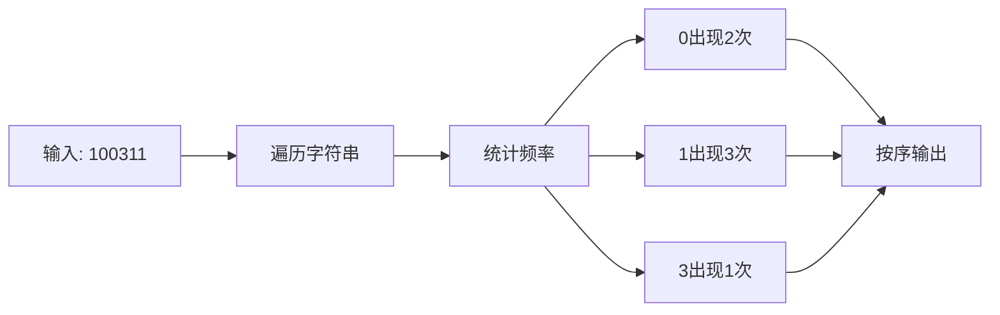

# L1-003 个位数统计

## 一、前置知识
- 字符串基础操作
- 哈希表(unordered_map)的使用
- 字符和数字的转换

## 二、题目分析

### 1. 题目描述
- 题目链接：[个位数统计](https://pintia.cn/problem-sets/994805046380707840/exam/problems/type/7?problemSetProblemId=994805143738892288&page=0)
- 本地链接：[L1-003-个位数统计.cpp](../Algorithm/PTA/L1-003-个位数统计.cpp)
- 难度级别：简单
- 相关标签：字符串、哈希表

### 2. 题目要求
- 输入格式：一个k位整数N
- 输出要求：按数字升序输出每个数字出现的次数
- 时间限制：1秒
- 空间限制：64MB

### 3. 关键概念
- 个位数：0-9的数字
- 出现次数统计
- 按序输出要求

## 三、示例分析

### 1. 基本示例
```
输入：100311
输出：
0:2
1:3
3:1
解释：
- 数字0出现2次
- 数字1出现3次
- 数字3出现1次
- 其他数字未出现，不输出
```

### 2. 特殊情况
```
输入：1234567890
输出：
0:1
1:1
2:1
3:1
4:1
5:1
6:1
7:1
8:1
9:1
分析：所有数字各出现一次的情况
```

### 3. 边界测试
```
输入：00000
输出：
0:5
说明：处理全0的情况
```

## 四、解题思路

### 1. 问题分析
- 问题的本质是统计字符出现频率
- 需要考虑大数处理
- 要求有序输出结果

### 2. 算法设计
- 使用string存储输入数字
- 使用哈希表统计频率
- 按序遍历0-9输出结果

### 3. 解题步骤
1. 输入处理
   - 使用string接收输入
   - 避免整数溢出问题
2. 频率统计
   - 遍历字符串统计每个数字出现次数
   - 使用哈希表存储统计结果
3. 结果输出
   - 按0-9顺序遍历
   - 只输出出现过的数字

## 五、代码实现

### 1. 完整代码
```cpp
/**
 * @file L1-003-个位数统计.cpp
 * @brief 统计一个整数中各个数字出现的次数
 * @author RainbowRain9
 * @date 2025-04-01
 */
#include <iostream>
#include <string>
#include <unordered_map>
using namespace std;

int main() {
    // 使用哈希表存储每个数字出现的次数
    unordered_map<long long, long long> mp;
    
    // 使用string接收输入，避免整数溢出
    string n;
    cin >> n;
    
    // 统计每个数字出现的次数
    for (auto &&i : n) {
        long long digit = i - '0';  // 字符转数字
        mp[digit]++;
    }
    
    // 按0-9顺序输出结果
    for (long long i = 0; i < 10; i++) {
        if (mp.count(i)) {
            cout << i << ":" << mp[i] << endl;
        }
    }
    return 0;
}
```

### 2. 关键代码段解析
```cpp
// 字符转数字的关键操作
long long digit = i - '0';  // 将字符'0'-'9'转换为数字0-9

// 使用count检查数字是否出现过
if (mp.count(i)) {
    cout << i << ":" << mp[i] << endl;
}
```

### 3. 代码优化
```cpp
// 优化前：使用long long类型
unordered_map<long long, long long> mp;

// 优化后：使用int类型即可
unordered_map<int, int> mp;
// 因为数字只有0-9，不需要long long
```

## 六、模拟代码过程

### 1. 执行流程
- 输入数据："100311"
- 处理过程：
  1. 遍历字符串，统计频率
  2. 按序检查0-9是否出现

### 2. 图示说明


### 3. 调试技巧
- 检查字符转数字是否正确
- 验证哈希表统计结果
- 确认输出顺序

## 七、复杂度分析

### 1. 时间复杂度
- 最好情况：O(n)
- 最坏情况：O(n)
- 平均情况：O(n)
其中n为输入字符串长度

### 2. 空间复杂度
- 辅助空间：O(1)
- 哈希表空间：O(1)
- 总体空间：O(1)
因为最多存储10个数字的频率

### 3. 优化空间
- 可以使用数组代替哈希表
- 使用更小的数据类型
- 减少不必要的变量

## 八、常见错误

### 1. 代码错误
```cpp
// 错误代码
int digit = i;  // 直接使用字符作为数字
// 正确代码
int digit = i - '0';  // 需要转换为数字
```

### 2. 思路错误
- 使用整数类型存储大数
- 忘记按序输出结果
- 输出格式不正确

### 3. 调试建议
- 测试大数输入
- 验证全0输入
- 检查输出格式

## 九、扩展思考

### 1. 题目变形
- 统计字符出现频率
- 找出出现次数最多的数字
- 按频率降序输出

### 2. 面试相关
- 字符串处理方法
- 哈希表的应用
- 大数处理技巧

### 3. 实战技巧
- 使用string处理大数
- 哈希表统计频率
- 格式化输出结果

## 十、相关题目

### 1. 类似题目
1. [1365. 有多少小于当前数字的数字](https://leetcode.cn/problems/how-many-numbers-are-smaller-than-the-current-number/) - 数字统计
2. [387. 字符串中的第一个唯一字符](https://leetcode.cn/problems/first-unique-character-in-a-string/) - 字符频率统计

### 2. 推荐练习
- 字符串基础操作题
- 哈希表应用题
- 频率统计相关题
