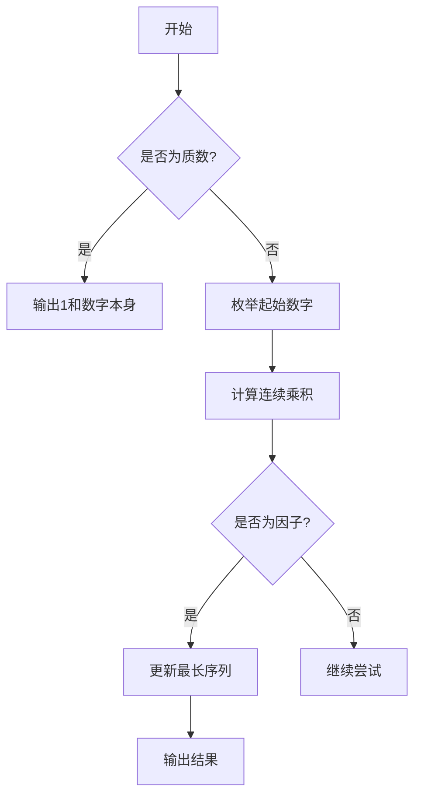

# L1-006.连续因子

## 一、前置知识
- 数论基础：因子、质数的概念
- 循环与枚举
- 整数乘法与溢出处理
- 时间复杂度分析

## 二、题目分析

### 1. 题目描述
- 题目链接：[L1-006 连续因子](https://pintia.cn/problem-sets/994805046380707840/exam/problems/type/7?problemSetProblemId=994805138600869888&page=0)
- 本地链接：[L1-006. 连续因子](../Algorithm/PTA/L1-006-连续因子.cpp)
- 难度级别：简单
- 相关标签：数论、枚举

### 2. 题目要求
- 输入格式：一个正整数 N (1 < N < 2^31)
- 输出要求：
  1. 第一行输出最长连续因子的个数
  2. 第二行输出最小的连续因子序列，因子之间用*号连接
- 时间限制：400 ms
- 空间限制：64 MB

### 3. 关键概念
- 连续因子：连续的正整数，它们的乘积是N的因子
- 最长序列：具有最多连续数字的因子序列
- 最小序列：当存在多个最长序列时，选择起始数字最小的序列

## 三、示例分析

### 1. 基本示例
```
输入：630
输出：
3
5*6*7
解释：
1. 630的所有可能的连续因子序列：
   - 3,4,5 (乘积=60，是630的因子)
   - 5,6,7 (乘积=210，是630的因子)
2. 两个序列长度都是3，选择起始数字较小的5,6,7
```

### 2. 特殊情况
```
输入：7（质数）
输出：
1
7
分析：质数只有1和自身两个因子，所以最长连续因子就是其本身
```

### 3. 边界测试
```
输入：2147483646（接近int最大值）
输出：需要注意乘积可能溢出，使用long long类型
```

## 四、解题思路

### 1. 问题分析
- 本质是寻找连续的正整数序列，使其乘积是N的因子
- 需要考虑序列的起始位置和长度
- 要处理质数的特殊情况
- 注意数据范围和溢出问题

### 2. 算法设计
- 使用双层循环：
  - 外层循环枚举起始数字
  - 内层循环尝试连续乘积
- 使用long long避免溢出
- 记录最长序列的长度和起始位置

### 3. 解题步骤
1. 判断是否为质数
   - 实现isPrime函数
   - 质数直接返回1和数字本身
2. 枚举起始数字
   - 从2开始到sqrt(N)
   - 计算连续乘积
3. 更新最优解
   - 记录最长序列信息
   - 保存起始数字

## 五、代码实现

### 1. 完整代码
```cpp
/**
 * @file L1-006-连续因子.cpp
 * @brief 寻找最长连续因子序列
 * @param N 输入的正整数
 * @return 无返回值，直接输出结果
 */
#include <iostream>
using namespace std;

// 判断是否为质数
bool isPrime(int n) {
    if (n < 2) return false;
    if (n == 2) return true;
    if (n % 2 == 0) return false;
    for (int i = 3; i * i <= n; i += 2) {
        if (n % i == 0) return false;
    }
    return true;
}

int main() {
    int n;
    cin >> n;

    // 处理质数的特殊情况
    if (isPrime(n)) {
        cout << 1 << endl;
        cout << n << endl;
        return 0;
    }

    int maxLen = 0;    // 最长序列长度
    int first = 0;     // 最长序列的起始数字
    
    // 枚举起始数字
    for (int i = 2; i * i <= n; i++) {
        long long product = 1;  // 使用long long防止溢出
        
        // 尝试连续数字的乘积
        for (int cur = i; cur <= n; cur++) {
            product *= cur;
            if (product > n) break;  // 乘积超过n就停止
            
            // 找到一个有效序列
            if (n % product == 0) {
                int curLen = cur - i + 1;
                if (curLen > maxLen) {
                    maxLen = curLen;
                    first = i;
                }
            }
        }
    }

    // 输出结果
    cout << maxLen << endl;
    for (int i = 0; i < maxLen; i++) {
        if (i > 0) cout << "*";
        cout << first + i;
    }
    cout << endl;

    return 0;
}
```

### 2. 关键代码段解析
```cpp
// 核心循环部分
for (int i = 2; i * i <= n; i++) {
    long long product = 1;
    for (int cur = i; cur <= n; cur++) {
        product *= cur;
        if (product > n) break;
        if (n % product == 0) {
            // 更新最优解
        }
    }
}
```

### 3. 代码优化
```cpp
// 优化前
for (int i = 2; i <= n; i++)  // 遍历到n

// 优化后
for (int i = 2; i * i <= n; i++)  // 只需遍历到sqrt(n)
```

## 六、模拟代码过程

### 1. 执行流程
以输入630为例：
```
1. 检查630是否为质数：否
2. 开始枚举：
   i=2: 2*3*4*5=120 (不是因子)
   i=3: 3*4*5=60 (是因子，长度=3)
   i=4: 4*5=20 (是因子，长度=2)
   i=5: 5*6*7=210 (是因子，长度=3)
   ...
3. 最终结果：maxLen=3, first=5
```

### 2. 图示说明


### 3. 调试技巧
- 使用小数据测试代码正确性
- 检查乘积是否溢出
- 验证边界条件处理

## 七、复杂度分析

### 1. 时间复杂度
- 最好情况：O(1)（输入为质数）
- 最坏情况：O(√n * log n)
- 平均情况：O(√n * log n)

### 2. 空间复杂度
- 辅助空间：O(1)
- 递归深度：无递归
- 总体空间：O(1)

### 3. 优化空间
- 可以通过预处理质数加速判断
- 可以优化内层循环的终止条件

## 八、常见错误

### 1. 代码错误
```cpp
// 错误：使用int存储乘积
int product = 1;  // 可能溢出

// 正确：使用long long
long long product = 1;
```

### 2. 思路错误
- 忘记处理质数的特殊情况
- 遍历范围过大，导致超时
- 没有考虑数据溢出

### 3. 调试建议
- 使用小数据验证逻辑
- 检查边界条件
- 注意数据类型范围

## 九、扩展思考

### 1. 题目变形
- 寻找所有连续因子序列
- 要求序列中的数字都是质数
- 限制序列的最大长度

### 2. 面试相关
- 如何优化时间复杂度
- 如何处理更大范围的输入
- 如何并行化计算

### 3. 实战技巧
- 使用打表优化
- 预处理质数表
- 二分查找优化

## 十、相关题目

### 1. 类似题目
1. [质因数分解](https://pintia.cn/problem-sets/994805046380707840/problems/994805148025577472)
2. [完数问题](https://pintia.cn/problem-sets/994805046380707840/problems/994805148025577473)

### 2. 推荐练习
- 因数分解相关题目
- 质数判定题目
- 连续序列题目
