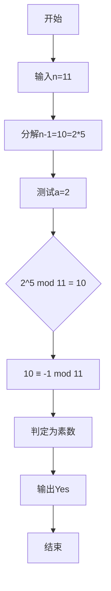

# L1-028 判断素数

## 一、前置知识
- 素数的定义和性质
- 费马小定理
- 快速幂算法
- Miller-Rabin素数测试
- 模运算

## 二、题目分析

### 1. 题目描述
- 题目链接：[L1-028 判断素数](https://pintia.cn/problem-sets/994805046380707840/exam/problems/994805140211482624)
- 本地链接：[L1-028 判断素数](../Algorithm/PTA/L1-028-判断素数.cpp)
- 难度级别：中等
- 相关标签：数论、素数判定

### 2. 题目要求
- 输入格式：第一行一个整数N,表示测试用例数量。接下来N行,每行一个正整数。
- 输出要求：对每个测试用例输出"Yes"(是素数)或"No"(不是素数)
- 时间限制：1秒
- 空间限制：64MB
- 数据范围：1 ≤ N ≤ 100, 2 ≤ 输入正整数 ≤ 10^18

### 3. 关键概念
- 素数：只能被1和自身整除的大于1的整数
- Miller-Rabin测试：一种概率性素数测试算法
- 快速幂：快速计算幂的算法
- 模运算：处理大数运算的方法

## 三、示例分析

### 1. 基本示例
```
输入：
2
11
12
输出：
Yes
No
解释：
11是素数,输出Yes
12不是素数(可以被2、3、4、6整除),输出No
```

### 2. 特殊情况
```
输入：
1
2
输出：
Yes
解释：2是最小的素数
```

### 3. 边界测试
```
输入：
1
999999999999999989
输出：
Yes
解释：这是一个接近10^18的大素数
```

## 四、解题思路

### 1. 问题分析
- 由于输入范围达到10^18,普通的试除法会超时
- 需要使用更高效的素数判定算法
- Miller-Rabin算法是一个很好的选择

### 2. 算法设计
- 使用Miller-Rabin素数测试算法
- 需要实现快速幂来支持大数模运算
- 使用__int128处理大数乘法

### 3. 解题步骤
1. 实现快速幂算法
   - 二进制分解指数
   - 模运算优化
2. 实现Miller-Rabin测试
   - 分解n-1为d*(2^r)
   - 选择测试基底
   - 进行素性测试

## 五、代码实现

### 1. 完整代码
```cpp
#include <iostream>
using namespace std;

// 快速幂计算
long long quickPow(long long a, long long n, long long mod) {
    long long ans = 1;
    while (n) {
        if (n & 1)
            ans = (__int128)ans * a % mod;
        a = (__int128)a * a % mod;
        n >>= 1;
    }
    return ans;
}

// Miller-Rabin素数测试
bool millerRabin(long long n) {
    if (n < 3 || n % 2 == 0)
        return n == 2;

    // 将n-1分解为d*(2^r)
    long long d = n - 1;
    int r = 0;
    while ((d & 1) == 0) {
        d >>= 1;
        r++;
    }

    // 用几个小素数做测试基底
    const int primes[7] = {2, 3, 5, 7, 11, 13, 17};

    for (int i = 0; i < 7; i++) {
        long long a = primes[i];
        if (a >= n)
            break;

        long long x = quickPow(a, d, n);
        if (x == 1 || x == n - 1)
            continue;

        bool flag = false;
        for (int j = 0; j < r - 1; j++) {
            x = (__int128)x * x % n;
            if (x == n - 1) {
                flag = true;
                break;
            }
        }
        if (!flag)
            return false;
    }
    return true;
}
```

### 2. 关键代码段解析
```cpp
// 快速幂核心实现
while (n) {
    if (n & 1)
        ans = (__int128)ans * a % mod;
    a = (__int128)a * a % mod;
    n >>= 1;
}
```
- 使用位运算优化乘法
- __int128处理大数乘法
- 每步都进行取模运算

### 3. 代码优化
```cpp
// 优化前
long long x = a;
for(int i = 0; i < n; i++) {
    ans = (ans * x) % mod;
}

// 优化后
while (n) {
    if (n & 1)
        ans = (__int128)ans * a % mod;
    a = (__int128)a * a % mod;
    n >>= 1;
}
```

## 六、模拟代码过程

### 1. 执行流程
以测试11是否为素数为例：
```
输入：11
过程：
1. n = 11, n-1 = 10 = 2 * 5
2. d = 5, r = 1
3. 对a = 2进行测试：
   2^5 mod 11 = 10
   10 ≡ -1 (mod 11)
4. 无需继续测试
输出：Yes
```

### 2. 图示说明


### 3. 调试技巧
- 使用小素数验证算法正确性
- 检查大数运算是否溢出
- 验证边界情况处理

## 七、复杂度分析

### 1. 时间复杂度
- 快速幂：O(log n)
- Miller-Rabin测试：O(k * log n)
- 总体：O(k * log n)，其中k是测试次数(本题为7)

### 2. 空间复杂度
- 辅助空间：O(1)
- 递归深度：无递归
- 总体空间：O(1)

### 3. 优化空间
- 可以根据数据范围减少测试基底
- 使用更优的快速幂实现
- 考虑并行化处理多个测试用例

## 八、常见错误

### 1. 代码错误
```cpp
// 错误代码
long long x = a * a % n;  // 可能溢出

// 正确代码
long long x = (__int128)a * a % n;  // 使用__int128避免溢出
```

### 2. 思路错误
- 使用普通试除法判断素数
- 忽略大数溢出问题
- 测试基底选择不当

### 3. 调试建议
- 使用已知素数验证
- 测试边界数据
- 检查溢出情况

## 九、扩展思考

### 1. 题目变形
- 统计区间内素数个数
- 判断一个数是否为素数的平方
- 找出最接近的素数

### 2. 面试相关
- Miller-Rabin算法原理
- 大数处理方法
- 算法的正确性证明

### 3. 实战技巧
- 素数判定模板
- 快速幂模板
- 大数运算技巧

## 十、相关题目

### 1. 类似题目
1. [素数判定](https://leetcode.cn/problems/count-primes/) - 计数质数
2. [最近的回文素数](https://leetcode.cn/problems/prime-palindrome/) - 结合回文数和素数

### 2. 推荐练习
- 埃氏筛法实现
- 区间素数统计
- 大数素性测试
