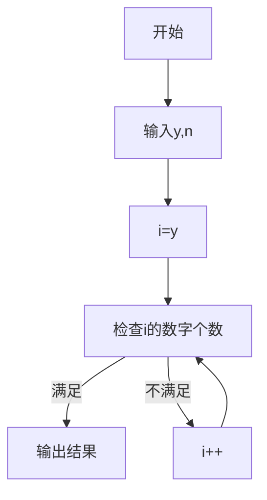

# L1-033 出生年问题

## 一、前置知识
- **数字处理**：如何提取数字的各位数字
- **集合(set)的使用**：用于统计不同数字的个数
- **循环控制**：如何遍历年份范围

## 二、题目分析

### 1. 题目描述
- 题目链接：[PAT L1-033 出生年问题](https://pintia.cn/problem-sets/994805342720868352/problems/994805401823907840)
- 本地链接：[L1-033-出生年问题.cpp](../Algorithm/PTA/L1-033-出生年.cpp)
- 难度级别：简单
- 相关标签：模拟、数字处理

### 2. 题目要求
- 输入格式：给定出生年份y和要求的数字个数n
- 输出要求：输出满足条件的年份及其年龄
- 时间限制：400ms
- 空间限制：64MB

### 3. 关键概念
- **不同数字个数**：年份中不同数字的数量
- **年龄计算**：当前年份减去出生年份
- **年份补全**：不足4位的前面补0

## 三、示例分析

### 1. 基本示例
```
输入：1988 4
输出：25 2013
解释：
1988年出生，25岁时是2013年
2013的数字为2、0、1、3，共4个不同数字
```

### 2. 特殊情况
```
输入：2000 3
输出：0 2000
解释：
2000年出生，0岁时就是2000年
2000的数字为2、0、0、0，共2个不同数字(不满足)
需要继续查找
```

## 四、解题思路

### 1. 问题分析
- 需要从出生年份开始逐年检查
- 对每个年份统计不同数字的个数
- 找到第一个满足不同数字个数等于n的年份

### 2. 算法设计
1. 从出生年份y开始遍历
2. 对每个年份转换为4位字符串(不足补0)
3. 使用set统计不同数字的个数
4. 当set大小等于n时输出结果

### 3. 解题步骤
1. 输入处理：读取y和n
2. 年份遍历：从y开始递增
3. 数字统计：将年份转为4位字符串，用set去重
4. 结果输出：找到满足条件的年份后计算年龄差

## 五、代码实现

### 1. 完整代码
```cpp
#include <iostream>
#include <string>
#include <set>
#include <iomanip>
using namespace std;

/**
 * @brief 检查年份的数字个数是否符合要求
 * @param year 要检查的年份
 * @param n 要求的数字个数
 * @return 是否符合要求
 */
bool checkYear(int year, int n) {
    string s = to_string(year);
    // 补全4位
    while (s.length() < 4) {
        s = "0" + s;
    }
    set<char> digits;
    for (char c : s) {
        digits.insert(c);
    }
    return digits.size() == n;
}

int main() {
    int y, n;
    cin >> y >> n;
  
    for (int i = y; ; i++) {
        if (checkYear(i, n)) {
            cout << i - y << " " 
                 << setw(4) << setfill('0') << i << endl;
            break;
        }
    }
  
    return 0;
}
```

### 2. 关键代码段解析
```cpp
// 补全4位数字
while (s.length() < 4) {
    s = "0" + s;
}

// 使用set自动去重
set<char> digits;
for (char c : s) {
    digits.insert(c);
}
```

## 六、模拟代码过程

### 1. 执行流程
```
输入：2000 3
过程：
2000 -> 2,0,0,0 (2个数字) 不满足
2001 -> 2,0,0,1 (3个数字) 满足
输出：1 2001
```

### 2. 图示说明


## 七、复杂度分析

### 1. 时间复杂度
- 最坏情况：O(k)，k为需要检查的年份数量
- 平均情况：O(1)，因为最多检查10000年

### 2. 空间复杂度
- 辅助空间：O(1)，只使用了固定大小的set

### 3. 优化空间
- 可以预先计算所有可能年份的数字个数
- 但考虑到年份范围有限(0-9999)，当前方法已足够高效

## 八、常见错误

### 1. 代码错误
```cpp
// 错误：没有补全4位数字
string s = to_string(year);
set<char> digits(s.begin(), s.end());
```

### 2. 思路错误
- 忘记处理不足4位的年份
- 年龄计算错误(应该用满足条件的年份减出生年份)

## 九、扩展思考

### 1. 题目变形
- 如果要求恰好n个重复数字怎么解？
- 如果年份范围扩大到10^9怎么优化？

### 2. 面试相关
- 可能被问及如何优化检查过程
- 可以讨论bitset替代set的可能性

## 十、相关题目
1. PAT乙级L1-062 - 幸运彩票(数字处理)
2. LeetCode 1295 - 统计位数为偶数的数字