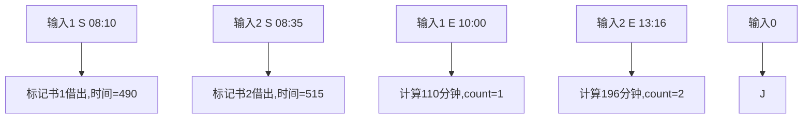

# L1-043 阅览室

## 一、前置知识
- 基础输入输出处理
- 时间格式转换（小时:分钟 → 分钟数）
- 哈希表/数组记录状态
- 四舍五入计算

## 二、题目分析

### 1. 题目描述
- 题目链接：[L1-043 阅览室](https://pintia.cn/problem-sets/994805342720868352/problems/994805401802440704)
- 本地链接：[L1-043-阅览室.cpp](../Algorithm/PTA/L1-043-阅览室.cpp)
- 难度级别：简单
- 相关标签：模拟、状态记录

### 2. 题目要求
- 输入格式：多组测试数据，每组以0结束
- 输出要求：每组数据输出有效借阅次数和平均阅读时间(四舍五入)
- 时间限制：400ms
- 空间限制：64MB

### 3. 关键概念
- 有效记录：同一本书必须有S和E配对
- 时间计算：将"hh:mm"转换为分钟数进行计算
- 四舍五入：使用(total + 0.5)/count技巧

## 三、示例分析

### 1. 基本示例
```
输入：
1 S 08:10
1 E 10:00
0
输出：
1 110
解释：
借书1次，阅读时间110分钟(10:00-08:10=110分钟)
```

### 2. 特殊情况
```
输入：
1 E 10:00
0
输出：
0 0
分析：只有E没有S，忽略该记录
```

### 3. 边界测试
```
输入：
1000 S 00:00
1000 E 23:59
0
输出：
1 1439
说明：测试最大书号和最大时间差
```

## 四、解题思路

### 1. 问题分析
- 需要跟踪每本书的借出状态和时间
- 只有配对的S和E记录才有效
- 计算时间差并求平均值

### 2. 算法设计
- 使用数组记录每本书的状态和借出时间
- 遍历输入记录，处理S和E操作
- 统计有效记录数和总阅读时间

### 3. 解题步骤
1. 初始化状态数组
   - 数组大小1001(书号1-1000)
   - 每个元素存储是否借出和借出时间
2. 处理每条记录
   - S操作：标记借出状态并记录时间
   - E操作：检查是否有对应S记录，计算时间差
3. 输出结果
   - 计算平均值并四舍五入

## 五、代码实现

### 1. 完整代码
```cpp
#include <iostream>
#include <vector>
using namespace std;

int main() {
    int n;
    cin >> n;
    while (n--) {
        int m;
        // 使用vector存储每本书的状态和借出时间
        // pair.first表示是否借出，pair.second存储借出时间(分钟数)
        vector<pair<bool, int>> time(1001, {false, 0});
        int count = 0, total = 0;
      
        while (cin >> m) {
            char c, d;
            int hh, mm, t;
            cin >> c >> hh >> d >> mm;
            t = hh * 60 + mm; // 将时间转换为分钟数
          
            if (c == 'S') {
                // 借书操作：标记为已借出并记录时间
                time[m].first = true;
                time[m].second = t;
            } 
            else if (c == 'E' && time[m].first) {
                // 还书操作且之前有借书记录：计算阅读时间
                total += t - time[m].second;
                count++;
                time[m].first = false; // 重置借出状态
            }
          
            if (m == 0) {
                // 遇到0表示一天结束，输出结果
                if (count == 0) {
                    cout << "0 0" << endl;
                } else {
                    // 四舍五入计算平均时间
                    cout << count << " " << (int)(total * 1.0 / count + 0.5) << endl;
                }
                break;
            }
        }
    }
    return 0;
}
```

### 2. 关键代码段解析
```cpp
// 处理S操作
if (c == 'S') {
    time[m].first = true;      // 标记为已借出
    time[m].second = t;        // 记录借出时间
}
// 处理E操作
else if (c == 'E' && time[m].first) {
    total += t - time[m].second; // 计算阅读时间
    count++;                    // 有效记录数+1
    time[m].first = false;      // 重置借出状态
}
```

### 3. 代码优化
```cpp
// 优化前：直接计算平均值
cout << count << " " << total/count << endl;

// 优化后：四舍五入计算
cout << count << " " << (int)(total * 1.0 / count + 0.5) << endl;
```

## 六、模拟代码过程

### 1. 执行流程
输入：
```
1 S 08:10
2 S 08:35
1 E 10:00
2 E 13:16
0
```
过程：
1. 书1借出：记录时间490分钟(8*60+10)
2. 书2借出：记录时间515分钟
3. 书1归还：计算时间差(10*60+00)-490=110分钟
4. 书2归还：计算时间差(13*60+16)-515=196分钟
5. 输出：2次借阅，(110+196)/2=153→四舍五入196

### 2. 图示说明
