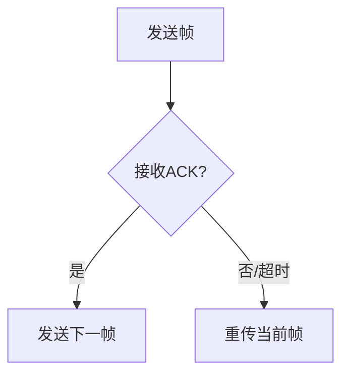

# 3.3 窗口协议
## 3.3.1 停-等ARQ协议
### 基本概念和工作原理
停-等ARQ（Stop-and-Wait ARQ）是最基础的窗口协议，其核心特点是**发送方每发送一个数据帧后必须等待确认**后方可发送下一帧[^1]。
**操作流程**：


### 关键特性
- **确认机制**：
  - 接收方正确接收后返回ACK
  - 发送方超时未收到ACK则重传
- **序列号**：只需1bit（0/1交替）
- **信道利用率**：$U = \frac{T_{frame}}{T_{frame} + RTT}$，其中RTT为往返时延

### 典型问题场景
| 场景 | 处理方式 | 图示示例 |
|------|----------|----------|
| 确认丢失 | 超时重传 |  |
| 确认迟到 | 丢弃重复帧 | 参见[^1]中3.3.1节 |

## 3.3.2 回退N帧ARQ协议
### 协议改进点
回退N帧(GBN, Go-Back-N)通过**流水线传输**显著提升效率，允许发送方连续发送多个帧而不需逐个等待确认[^2]。
**核心参数**：
- **窗口尺寸(W)**：允许连续发送的未确认帧数
- **序号范围**：$2^n$（n为序号字段位数）

### 运行机制
1. **发送过程**：
   ```python
   # 伪代码示例
   while True:
       if next_seq_num < base + N:
           send_frame(next_seq_num)
           next_seq_num += 1
       if timeout():
           resend_all_from(base)
   ```
2. **重传策略**：
   - 任何帧出错/丢失时，重传该帧及其后所有已发送帧
   - 接收方仅按序接收，丢弃乱序帧

### 性能分析
- 优点：实现简单，缓冲区需求小
- 缺点：信道利用率$U = \frac{N}{1+2BD}$，BD=带宽时延积
- 典型应用：TCP协议的基础机制[^1]

## 3.3.3 选择重传ARQ协议
### 协议优化
选择重传(SR, Selective Repeat)通过**选择性重传**和**接收窗口**进一步改进性能[^2]：
**关键改进**：
- 接收方缓存乱序但正确的帧
- 仅重传真正丢失或损坏的帧

### 实现细节
1. **窗口管理**：
   - 发送窗口(W)与接收窗口通常相等
   - 满足$W \leq 2^{n-1}$（n为序号位数）
2. **数据结构**：
   ```cpp
   // 发送方数据结构示例
   struct Sender {
       int base;
       int next_seq;
       bool ack[N];
       Frame buffer[N];
   };
   ```

### 对比分析
| 特性        | GBN            | SR             |
|-------------|----------------|----------------|
| 重传范围    | 错误帧后所有帧 | 仅错误帧       |
| 接收缓冲区  | 单帧           | 窗口大小       |
| 实现复杂度  | 简单           | 较高           |
| 信道利用率  | 中等           | 最优           |
**典型应用场景**：
- 高误码率网络（如无线网络）
- 需要高吞吐量的长延迟链路[^2]
[^1]: 计算机网络-第3章数据链路层.pptx，窗口协议基础原理
[^2]: 计算机网络-第5章传输层.pptx，TCP滑动窗口实现细节