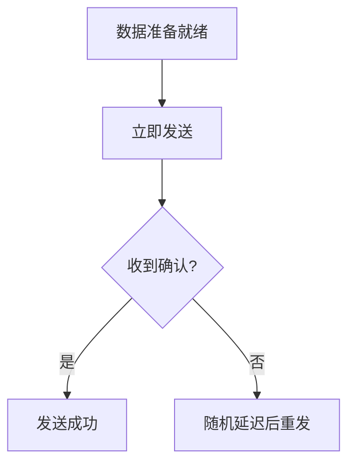

# 3.5 使用广播信道的数据链路层

## 3.5.1 ALOHA协议

### 纯ALOHA协议
**基本原理**：允许站点在任何时间自由发送数据帧[^1]

**关键参数**：
1. **脆弱时间(Vulnerable Time)**：2×帧传输时间
2. **最大吞吐量**：约18.4%
3. **重传机制**：随机退避后重传

**工作流程**：

### 时隙ALOHA
**改进点**：
- 时间被划分为固定时隙
- 站点只能在时隙开始时发送

**性能提升**：
- 脆弱时间减少为1×帧传输时间
- 最大吞吐量提升至36.8%
- **计算公式**：
  $$
 S = Ge^{-G} \quad (G为网络负载)
$$
## 3.5.2 CSMA协议
载波监听多路访问(Carrier Sense Multiple Access)采用"先听后说"机制[^2]

### 三种实现方式
| 类型 | 监听结果处理 | 特点 | 信道利用率 |
|------|--------------|------|------------|
| 非坚持CSMA | 检测到忙则随机延时再监听 | 冲突减少但延迟增加 | 中等 |
| 1-坚持CSMA | 检测到空闲立即发送 | 冲突概率高 | 高负载时低 |
| P-坚持CSMA | 检测到空闲以概率P发送 | 平衡冲突和效率 | 可调节 |

**信道传播延迟影响**：
$$
 \alpha = \frac{\tau}{T_0} \quad (\tau为传播时延, T_0为帧发送时间)
$$
## 3.5.3 CSMA/CD协议
带冲突检测的CSMA协议（以太网基础）

### 关键机制
1. **边发边听**：持续检测冲突
2. **冲突处理**：
   - 发送干扰信号
   - 二进制指数退避算法：
     
$$
 退避时间 = r \times 512 \text{比特时间} \quad (r∈[0,2^k-1])
$$
3. **争用期**：51.2μs（10Mbps以太网）

### 性能分析
**最小帧长要求**：
$$
 L_{min} = 2\tau \times R \quad (\tau为端到端延时, R为数据率)
$$

**典型参数**（10Mbps以太网）：
- 争用期：51.2μs
- 最短帧：64字节
- 最大网络跨度：2500米

[^1]: 计算机网络-第3章数据链路层.pptx，ALOHA协议原理
[^2]: 计算机网络-第3章数据链路层.pdf，CSMA/CD协议详解
- 最大吞吐量提升至36.8%
- **计算公式**：
  $$
 S = Ge^{-G} \quad (G为网络负载)
$$
## 3.5.2 CSMA协议
载波监听多路访问(Carrier Sense Multiple Access)采用"先听后说"机制[^2]

### 三种实现方式
| 类型 | 监听结果处理 | 特点 | 信道利用率 |
|------|--------------|------|------------|
| 非坚持CSMA | 检测到忙则随机延时再监听 | 冲突减少但延迟增加 | 中等 |
| 1-坚持CSMA | 检测到空闲立即发送 | 冲突概率高 | 高负载时低 |
| P-坚持CSMA | 检测到空闲以概率P发送 | 平衡冲突和效率 | 可调节 |

**信道传播延迟影响**：
$$
 \alpha = \frac{\tau}{T_0} \quad (\tau为传播时延, T_0为帧发送时间)
$$
## 3.5.3 CSMA/CD协议
带冲突检测的CSMA协议（以太网基础）

### 关键机制
1. **边发边听**：持续检测冲突
2. **冲突处理**：
   - 发送干扰信号
   - 二进制指数退避算法：
     
$$
 退避时间 = r \times 512 \text{比特时间} \quad (r∈[0,2^k-1])
$$
3. **争用期**：51.2μs（10Mbps以太网）

### 性能分析
**最小帧长要求**：
$$
 L_{min} = 2\tau \times R \quad (\tau为端到端延时, R为数据率)
$$

**典型参数**（10Mbps以太网）：
- 争用期：51.2μs
- 最短帧：64字节
- 最大网络跨度：2500米

[^1]: 计算机网络-第3章数据链路层.pptx，ALOHA协议原理
[^2]: 计算机网络-第3章数据链路层.pdf，CSMA/CD协议详解