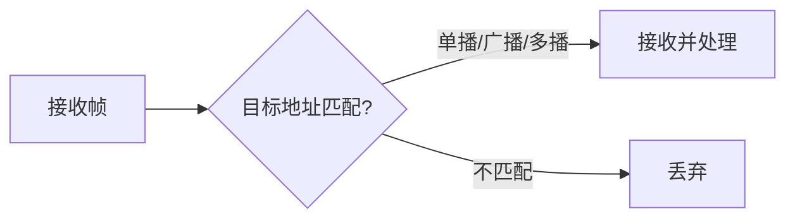

# 3.6 以太网
## 3.6.1 标准以太网

### 定义与背景
以太网（Ethernet）是一种**计算机局域网技术**，由美国施乐公司（Xerox）的Palo Alto研究中心于1975年开发，最初吞吐量为10Mbps，使用CSMA/CD协议实现共享信道访问[^1]。

**核心特性**：
- **物理介质**：早期采用同轴电缆（10Base5/10Base2）
- **拓扑结构**：总线型/星型混合拓扑
- **数据速率**：标准以太网为10Mbps

### 物理层标准
以太网标准定义了多种物理层规范，关键参数见表：

| 类型         | 传输介质      | 最大网段长度 | 信号编码       | 应用场景         |
|--------------|---------------|--------------|----------------|------------------|
| 10Base5      | 粗同轴电缆    | 500m         | 曼彻斯特编码   | 工业级骨干网     |
| 10Base2      | 细同轴电缆    | 185m         | 曼彻斯特编码   | 中小型局域网     |
| 10Base-T     | 双绞线（UTP） | 100m         | 曼彻斯特编码   | 办公室布线系统   |
| 10Broad36    | 同轴电缆      | 3600m        | DPSK调制       | 宽带数据传输     |

**示例应用**：
```cpp
// 曼彻斯特编码示例
void manchester_encode(bit data) {
    if (data == 1)
        output = "01";    // 高电平转低电平
    else
        output = "10";    // 低电平转高电平
}
```

---

## 3.6.2 以太网MAC层

### 分层架构
以太网数据链路层划分为**逻辑链路控制（LLC）子层**和**媒体接入控制（MAC）子层**：
- **MAC子层**：负责物理介质访问与帧传输，定义以太网帧结构[^2]。
- **LLC子层**：早期提供逻辑链路控制，但在TCP/IP体系中被简化。

**MAC帧格式**：

| 字段     | 长度（字节） | 功能                         |
|----------|--------------|------------------------------|
| 前导码   | 7            | 同步时钟信号                 |
| 帧起始符 | 1            | 标识帧开始（0xAA）           |
| 目的地址 | 6            | 目标MAC地址                  |
| 源地址   | 6            | 发送方MAC地址                |
| 类型     | 2            | 上层协议标识（如0x0800为IP） |
| 数据     | 46-1500      | 有效载荷                     |
| FCS      | 4            | CRC32校验码                  |

### 网络适配器
计算机通过**网络接口卡（NIC）** 连接以太网：
1. **功能**：
   - 执行MAC协议
   - 实现帧封装与解封装
   - 过滤非目标MAC帧（单播/广播/多播）
2. **MAC地址**：
   - 48位全局唯一标识符，格式为 `XX-XX-XX-XX-XX-XX`
   - 示例：`00-1A-2B-3C-4D-5E`

**筛选规则**：


---

## 3.6.3 以太网发展

### 快速以太网（100Mbps）
**演进目标**：
- 兼容标准以太网帧格式
- 保留48位MAC地址
- 支持全双工通信[^2]

**典型标准**：
- **100Base-TX**：使用Cat5双绞线，传输距离100m
- **100Base-FX**：光纤传输，距离可达2km

### 千兆/万兆以太网
| 类型          | 数据速率 | 关键特性                            | 应用场景         |
|---------------|----------|-------------------------------------|------------------|
| 千兆以太网    | 1Gbps    | 兼容CSMA/CD，支持光纤/双绞线        | 数据中心主干网   |
| 万兆以太网    | 10Gbps   | 取消CSMA/CD，全双工优先，低延迟     | 城域网骨干链路   |
| 40G/100G以太网| 40-100Gbps| 多通道绑定，光模块优化               | 超大规模数据中心 |

**技术演进公式**：
$$
 \text{有效吞吐量} = \frac{\text{帧长}}{\text{帧间隔 + 帧传输时间}} 
$$

---

[^1]: 计算机网络-第3章数据链路层.pdf，标准以太网物理层定义及历史发展
[^2]: 计算机网络-第3章数据链路层.pptx，MAC层架构与适配器功能解析