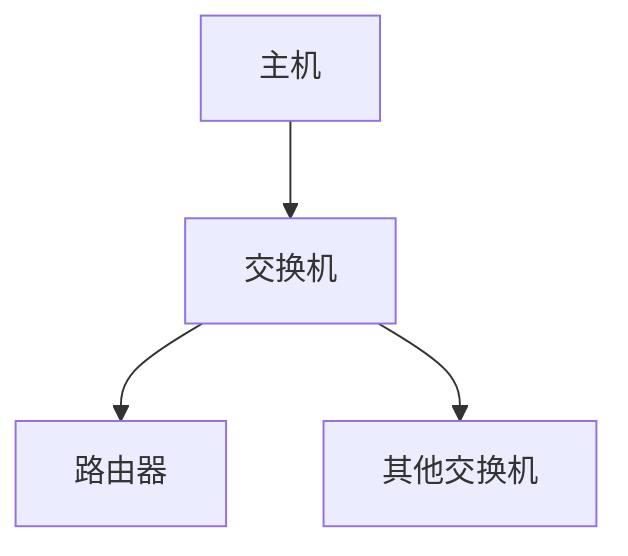

# 3.8 数据链路层交换

## 3.8.1 交换设备分类

数据链路层交换设备主要分为三类，每类设备在OSI模型中的工作层次和功能对比如下：

| 设备类型 | 工作层次 | 核心功能                                     | 转发方式           | 典型应用场景       |
|----------|----------|----------------------------------------------|--------------------|--------------------|
| **中继器** | 物理层   | 信号放大和整形                               | 比特级转发         | 延长网络传输距离   |
| **网桥**   | 数据链路层 | 连接不同局域网，基于MAC地址过滤和转发帧      | 存储转发           | 小型网络互联       |
| **交换机** | 数据链路层 | 多端口网桥，支持并行通信                     | 直通交换/存储转发  | 现代局域网核心设备 |



## 3.8.2 以太网交换机工作原理

### 转发机制
交换机通过**自学习算法**建立MAC地址表，包含三个关键步骤：

1. **学习过程**：
   - 记录源MAC地址与端口的映射关系
   - 老化时间通常为300秒（可配置）

2. **转发决策**：
   - 已知单播：定向转发
   - 未知单播：泛洪（Flooding）
   - 广播/多播：默认泛洪（可通过IGMP Snooping优化）

3. **过滤机制**：
   - 丢弃本端口收到的帧（防止环路）

### 性能指标
- **背板带宽**：交换机内部总传输能力
$$
 \text{总带宽} = 端口数 \times 端口速率 \times 2 
$$
- **包转发率**：每秒处理的数据包数（PPS）
- **延迟**：通常低于50μs（直通交换）

## 3.8.3 生成树协议（STP）

### 协议功能
STP通过**阻断冗余路径**解决网络环路问题，主要特征：
- 标准协议：IEEE 802.1D
- 收敛时间：30-50秒
- 改进版本：RSTP（快速收敛）和MSTP（多实例）

### 关键概念
| 术语          | 说明                                                                 |
|---------------|----------------------------------------------------------------------|
| 根桥（Root Bridge） | 网络中心设备，通过桥ID（优先级+MAC地址）选举产生                     |
| 根端口        | 非根桥到根桥的最短路径对应的端口                                     |
| 指定端口      | 每个网段上到根桥路径最近的端口                                       |
| BPDU          | 桥协议数据单元，包含根桥ID、路径开销等信息，默认每2秒发送一次        |

**端口状态机**：
```plaintext
Disabled → Blocking → Listening → Learning → Forwarding
```

## 3.8.4 虚拟局域网（VLAN）

现代交换网络通过VLAN实现逻辑隔离，典型配置包括：
1. **基于端口的VLAN**（静态划分）
2. **基于MAC的VLAN**（动态绑定）
3. **802.1Q标签**：4字节扩展包头，包含12位VLAN ID

**VLAN间通信**：
- 三层交换机
- 路由器单臂路由（Router-on-a-Stick）

[^1]: 计算机网络-第3章数据链路层.pptx，交换设备功能与STP协议原理
[^2]: 计算机网络-第3章数据链路层.pdf，VLAN实现机制与性能指标分析