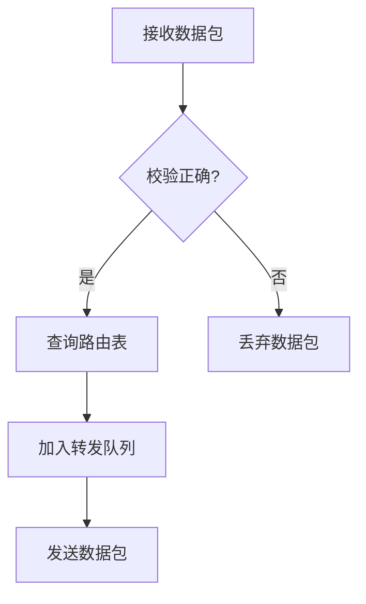

# 4.1 网络层提供的服务

## 4.1.1 存储转发数据包交换

### 基本工作原理
存储转发数据包交换是网络层的核心服务机制[^1]：
1. **接收阶段**：路由器完整接收整个数据包并存储在缓冲区中
2. **校验阶段**：检查数据包完整性（CRC校验）
3. **转发决策**：查询路由表确定输出接口
4. **排队转发**：在输出接口队列中等待发送



### 关键特性
| 特性       | 说明                              | 典型数值       |
|------------|-----------------------------------|----------------|
| 排队延迟   | 数据包在缓冲区等待处理的时间      | 1-10ms         |
| 处理延迟   | 路由查找和决策时间                | <1ms           |
| 分片重组   | 支持MTU不一致时的分片与重组       | 最小MTU=576Byte|
| 错误处理   | 通过ICMP报告传输异常              | 类型字段11种   |

### 性能优化技术
1. **快速转发**：缓存最近使用的路由条目
2. **流量整形**：令牌桶算法控制突发流量
3. **优先级队列**：对不同服务类型数据包区别处理

## 4.1.2 面向连接的服务

### 虚电路服务
面向连接的服务通过**虚电路(Virtual Circuit)**实现，其主要特点包括[^2]：
1. **连接建立**：通信前需明确路径（如X.25网络）
2. **资源预留**：预先分配带宽等网络资源
3. **顺序传输**：保证数据包按发送顺序到达

**虚电路工作流程**：
```plaintext
建立请求 → 路由选择 → 连接确认 → 数据传输 → 连接释放
```

### 协议实现对比
| 协议    | 连接建立方式 | 资源分配   | 典型应用场景   |
|---------|--------------|------------|----------------|
| X.25    | 明确信令     | 固定带宽   | 传统金融网络   |
| ATM     | 交换虚电路   | QoS保障    | 实时多媒体传输 |
| MPLS    | 标签交换     | 流量工程   | ISP骨干网      |

## 4.1.3 面向无连接服务

### IP数据报服务
TCP/IP体系的网络层采用**无连接数据报服务**，其特征为[^3]：
1. **独立路由**：每个数据包独立选择路径
2. **尽力而为**：不保证可靠性和顺序性
3. **最快转发**：基于当前网络状况动态选路

```cpp
// IP数据报头部结构（体现无连接特性）
struct ip_header {
    u_int   saddr;  // 源地址（非连接标识）
    u_int   daddr;  // 目的地址
    u_short id;     // 标识符（每个包独立）
    u_short frag;   // 分片信息
    u_char  ttl;    // 生存时间（防环路）
};
```

### 与面向连接服务对比
| 对比维度         | 面向连接                 | 无连接                   |
|------------------|--------------------------|--------------------------|
| **连接建立**     | 需要                     | 不需要                   |
| **路由一致性**   | 固定路径                 | 每个包独立选路           |
| **可靠性**       | 网络层保障               | 传输层保障（如TCP）      |
| **适用场景**     | 实时应用（语音、视频）   | 弹性应用（Web、Email）   |
| **典型协议**     | X.25、ATM、MPLS          | IPv4/IPv6                |

[^1]: 计算机网络-第4章网络层.pptx，存储转发机制与路由决策过程
[^2]: 计算机网络-第1章概述.pptx，虚电路服务实现原理
[^3]: 计算机网络-第4章网络层.pdf，IP数据报服务特性分析