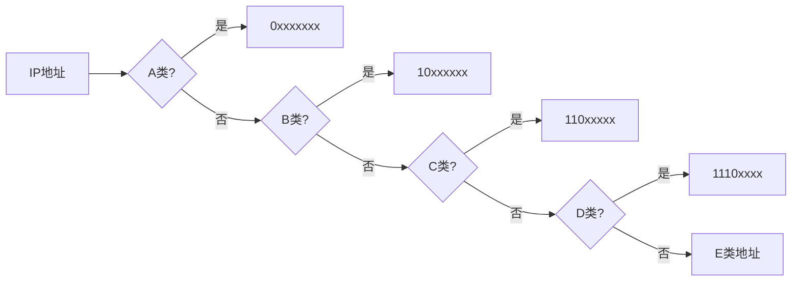

# 4.2 逻辑寻址IPv4地址

## 4.2.1 IPv4地址基础

### 地址空间与表示方法
IPv4地址是 **32位二进制数**，采用点分十进制表示法分为4个8位组[^1]：
```
二进制：11000000.10101000.00000001.00000001
十进制：192.168.1.1
```
每个8位组范围：0-255（2^8=256个可能值）

### 地址管理机构
地址分配由 **IANA（互联网号码分配机构）**统一管理，通过区域性注册机构（如APNIC）分级分配[^1]。

## 4.2.2 IPv4地址分类

### 传统分类编址
IPv4地址分为5类，关键区别在于网络号和主机号的划分比例：

| 类别 | 第一字节范围 | 网络号长度 | 主机号长度 | 用途 |
|------|--------------|------------|------------|------|
| A类  | 1-126        | 8位        | 24位       | 大型网络 |
| B类  | 128-191      | 16位       | 16位       | 中型网络 |
| C类  | 192-223      | 24位       | 8位        | 小型网络 |
| D类  | 224-239      | N/A        | N/A        | 组播地址 |
| E类  | 240-255      | N/A        | N/A        | 保留地址 |



### 特殊地址范围
1. **私有地址**（RFC 1918）：
   - 10.0.0.0/8
   - 172.16.0.0/12
   - 192.168.0.0/16
2. **回环地址**：127.0.0.0/8
3. **自动配置地址**：169.254.0.0/16

## 4.2.3 子网划分技术

### 子网掩码
用于区分网络部分和主机部分：
- **传统分类掩码**：
  - A类：255.0.0.0
  - B类：255.255.0.0
  - C类：255.255.255.0

示例计算：
```
IP地址：192.168.1.100
子网掩码：255.255.255.0
网络地址：192.168.1.0
广播地址：192.168.1.255
可用主机：192.168.1.1-254
```

### 变长子网掩码(VLSM)
允许在同一个网络中使用不同长度的子网掩码，提高地址利用率。

## 4.2.4 CIDR无类域间路由

### 核心概念
1. **斜线记法**：192.168.1.0/24
2. **地址聚合**：合并连续地址块减少路由表条目
3. **超网构造**：将多个小网络合并成大网络

示例：
```
地址块：192.168.0.0/22
包含：
192.168.0.0/24
192.168.1.0/24 
192.168.2.0/24
192.168.3.0/24
```

## 4.2.5 地址解析协议

### ARP与RARP
| 协议   | 功能     | 工作过程      |
| ---- | ------ | --------- |
| ARP  | IP→MAC | 广播查询，单播响应 |
| RARP | MAC→IP | 需要RARP服务器 |

ARP表示例：

| IP地址    | MAC地址         | 类型   |
|-----------|-----------------|--------|
| 192.168.1.1 | 00-0C-29-XX-XX-XX | 动态   |

[^1]: 计算机网络-第4章网络层.pptx，IPv4地址结构与分类方法
[^2]: 计算机网络-第4章网络层.pdf，子网划分与CIDR实现原理