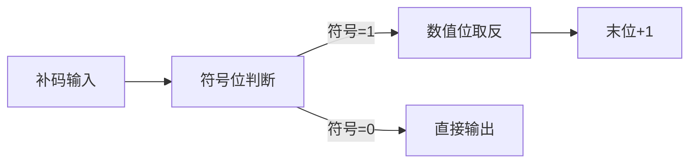

# 2.3.3 补码阵列乘法器详解

## 2.3.3.1 间接补码乘法原理
**定义**：通过算前/算后求补实现补码乘法运算，包含三个关键部件：
1. **算前求补器**：将负数补码转绝对值原码
2. **无符号阵列乘法器**：执行数值位乘法
3. **算后求补器**：结果转回补码格式

**特征**：
- 硬件复杂度：比原码乘法增加3个求补器
- 时间延迟：约2倍于原码乘法（根据[utcluj. Ro](http://users.utcluj.ro/~baruch/book_ssce/SSCE-Shift-Mult.pdf)数据）

---

## 2.3.3.2 例2.24详细解析
**题目**：计算 x=-15 × y=-13（用5位补码表示）

### 步骤1：补码转绝对值
| 数值 | 补码表示 | 算前求补结果 |
|------|----------|--------------|
| x=-15 | 10001 → 取反+1 → 01111 |
| y=-13 | 10011 → 取反+1 → 01101 |

**硬件实现**：


### 步骤 2：无符号阵列乘法
**乘法过程**：
```
      1 1 1 1 (15)
    × 1 1 0 1 (13)
    ----------
      1 1 1 1 ← 第1次部分积（乘数位1）
    0 0 0 0   ← 第2次部分积（右移，乘数位0）
  1 1 1 1     ← 第3次部分积（右移，乘数位1）
1 1 1 1       ← 第4次部分积（右移，乘数位1）
-----------
1 1 0 0 0 0 1 1 (195)
```

**关键电路**（来自 [digilentinc.com](https://learn.digilentinc.com/Documents/282)）：
- 每个 CAS 单元延迟 3 T
- 5×5 阵列总延迟：`(2n+5)T = 15T`（n=5）

### 步骤 3：结果处理
1. **符号计算**：`1 ⊕ 1 = 0`（结果为正）
2. **算后求补**：正数无需转换
3. **最终输出**：`[A×B]补 = 0 11000011`（+195）

**验证**：
- 十进制：(-15)×(-13)=195
- 二进制：11000011₂=195₁₀

---

## 2.3.3.3 对比原码与补码乘法
| 特性          | 原码乘法           | 间接补码乘法        |
|---------------|--------------------|---------------------|
| 硬件复杂度    | 无求补器           | 3 个求补器           |
| 符号处理      | 单独异或           | 集成求补过程        |
| 典型延迟      | t                 | ~2 t                |
| 适用场景      | 原码编码系统       | 主流补码系统        |

**注**：现代处理器多采用 Booth 算法优化补码乘法，减少求补操作（参考 [swarthmore.edu](https://cheever.domains.swarthmore.edu/Ref/BinaryMath/BinaryMath.html)）。