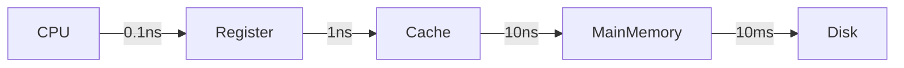
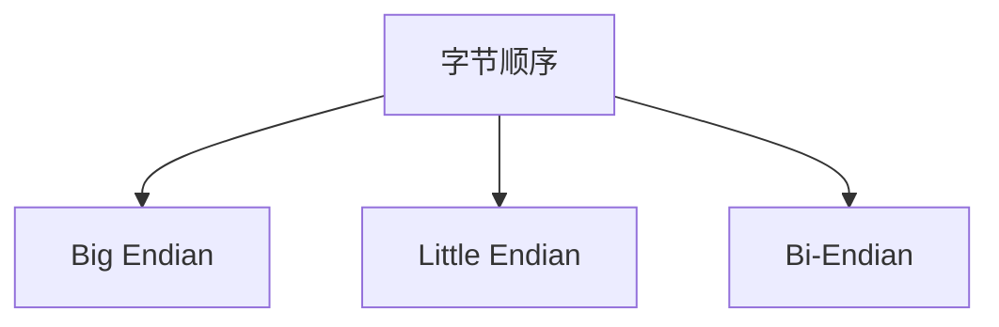
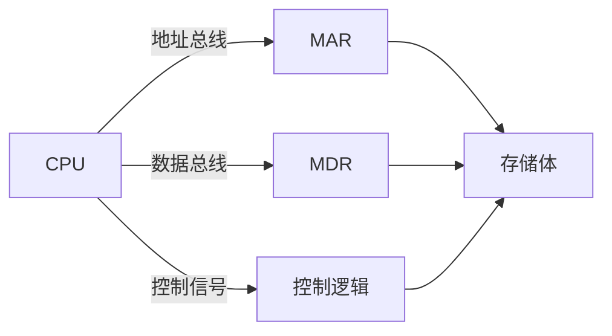
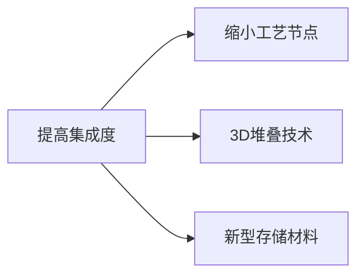

# 3.1.1 存储系统的层次结构

## 1. 层次结构的基本概念
**定义**：计算机存储系统通过多级分层设计，综合不同存储介质的特性，实现速度、容量和成本的优化平衡[^1]。

**设计依据**：
- **程序局部性原理**：
  - 时间局部性：`近期访问的数据很可能被再次使用`[^2]
  - 空间局部性：`相邻地址的数据可能被连续访问`[^2]
- 访问频率与成本平衡：`高频数据存高速层，低频数据存大容量层`

## 2. 多级存储体系
### 2.1 核心组成
| 层级 | 名称 | 访问时间 | 容量范围 | 存储介质 | 管理主体 |
|------|------|----------|----------|----------|----------|
| L0 | 寄存器 | 1-5ns | <1KB | CPU寄存器 | 编译器 |
| L1 | 高速缓存 | 2-10ns | KB-MB | SRAM | 硬件控制器 |
| L2 | 主存储器 | 50-100ns | GB级 | DRAM | 操作系统 |
| L3 | 辅助存储 | 5-10ms | TB级 | HDD/SSD | 文件系统 |

### 2.2 性能关系


## 3. 关键技术特性
### 3.1 存储器分类
| 分类标准 | 主要类型 | 典型代表 |
|----------|----------|----------|
| 存储介质 | 半导体/磁/光 | SRAM/DRAM/HDD |
| 易失性 | 易失/非易失 | DRAM/Flash |
| 访问方式 | 随机/顺序 | RAM/磁带 |
| 功能 | 系统/显示 | 内存/显存 |

### 3.2 性能指标
- **存取周期(T<sub>M</sub>)**:
  $$
 T_M = T_A + T_W
$$
  - T<sub>A</sub>: 访问时间
  - T<sub>W</sub>: 恢复时间
- **频宽(B<sub>M</sub>)**: 
$$
B_M = \frac{W}{T_M} \text{(bit/s)}
$$

## 4. 现代扩展架构
- **混合存储立方(HMC)**: 3D堆叠DRAM技术
- **持久性内存(PMEM)**: 字节寻址的非易失存储
- **存储级内存(SCM)**: 介于DRAM与SSD之间的新层级

# 3.1.2 存储器的分类

## 1. 按存储介质分类
**半导体存储器**：
- 特点：速度快、体积小、功耗低
- 类型：SRAM、DRAM、ROM等[^1]

**磁表面存储器**：
- 特点：容量大、成本低、速度慢
- 类型：硬盘、磁带等

**光存储器**：
- 特点：可移动、容量适中
- 类型：CD、DVD、蓝光等

## 2. 按存取方式分类
| 类型 | 特点 | 典型应用 |
|------|------|----------|
| 随机存取存储器(RAM) | 可直接访问任意单元 | 主存储器 |
| 顺序存取存储器(SAM) | 必须按顺序访问 | 磁带 |
| 直接存取存储器(DAM) | 先定位再顺序访问 | 磁盘 |

## 3. 按功能特性分类
### 3.1 读写性能
- **读写存储器(RWM)**：可读可写，如RAM
- **只读存储器(ROM)**：
  - 掩膜ROM
  - PROM（可编程）
  - EPROM（可擦除）
  - EEPROM（电可擦）
  - Flash ROM[^2]

### 3.2 易失性
- **易失性存储器**：断电后数据丢失，如DRAM
- **非易失性存储器**：断电后数据保留，如ROM、Flash

## 4. 按系统架构分类
**内存（主存储器）**：
- 直接与CPU交换数据
- 包括：DRAM、SRAM等

**外存（辅助存储器）**：
- 通过I/O接口与CPU通信
- 包括：硬盘、SSD等[^3]

## 5. 现代特殊存储器
- **相联存储器(CAM)**：按内容访问
- **多端口存储器**：支持并发访问
- **缓冲存储器**：集成缓存的DRAM


# 3.1.3 存储器的编址和端模式

## 1. 内存储器的编址方式

### 1.1 基本编址方法
**按字节编址**：
- 每个字节(8位)分配一个唯一地址
- 现代计算机最常用的编址方式
- 地址空间利用率高，兼容性好
- 示例：32位系统可寻址4GB空间(2^32字节)

**按字编址**：
- 每个存储字(通常4/8字节)分配一个地址
- 早期计算机常用方式
- 地址空间利用率较低
- 字地址通常是字内最低字节地址

**地址计算公式**：
```math
Loc(a_i) = base\_address + i × element\_size
```

### 1.2 多维数组编址
**行优先顺序**：
```math
address = base + (i × columns + j) × element\_size
```
**列优先顺序**：
```math
address = base + (j × rows + i) × element\_size
```

## 2. 存储器访问

### 2.1 访问粒度
| 访问类型 | 数据量 | 特点 | 典型指令 |
|---------|--------|------|----------|
| 字节访问 | 1字节 | 最精细粒度 | MOVB (x86) |
| 半字访问 | 2字节 | 16位处理 | MOVW |
| 字访问 | 4字节 | 32位处理 | MOVL |
| 双字访问 | 8字节 | 64位处理 | MOVQ |

### 2.2 访问特性
- **随机访问**：直接通过地址访问(O(1)时间)
- **对齐访问**：地址需是数据大小的整数倍
- **非对齐访问**：可能引起性能下降或异常

## 3. 端模式(Endianness)

### 3.1 基本概念


### 3.2 详细对比
| 特性 | Big Endian | Little Endian | Bi-Endian |
|------|-----------|--------------|-----------|
| 字节顺序 | MSB在低地址 | LSB在低地址 | 可配置 |
| 网络传输 | 标准 | 需转换 | 自动适应 |
| 典型架构 | PowerPC, SPARC | x86, ARM | MIPS, ARMv8 |
| 数值0x0A0B0C0D存储 | 0A 0B 0C 0D | 0D 0C 0B 0A | 可配置 |

## 4. 总线宽度与字节地址

### 4.1 总线匹配
```cpp
// 32位总线上的内存访问示例
uint32_t* word_ptr = (uint32_t*)0x1000;
*word_ptr = 0xAABBCCDD; // 一次写入4字节
```

### 4.2 地址对齐
- 32位系统：4字节对齐(地址末2位=00)
- 64位系统：8字节对齐(地址末3位=000)
- 非对齐访问可能引发总线错误

## 5. 内存的总体结构

### 5.1 基本组成


### 5.2 关键参数
| 组件 | 功能 | 典型位宽 |
|------|------|----------|
| MAR | 地址寄存器 | 32/64位 |
| MDR | 数据寄存器 | 64/128位 |
| 地址总线 | 寻址空间 | 32/64线 |
| 数据总线 | 传输带宽 | 64/128线 |
| 控制总线 | 操作信号 | 10-20线 |

### 5.3 存储体组织
- 多体交叉存储：提高并行度
- 存储体(Bank)划分：减少访问冲突
- 行列地址复用：减少引脚数量

# 3.1.4 存储器的技术指标

## 1. 存储容量
**定义**：存储器可存储信息的总量，通常以字节(Byte)或比特(bit)为单位表示[^1]

**表示方法**：
- **基本公式**：存储字数 × 存储字长
- **示例配置**：
  - 1M×1bit
  - 256K×4bit
  - 128K×8bit

**容量单位换算**：

$$1KB = 2^{10}Bytes = 1024Bytes$$
$$1MB = 2^{20}Bytes = 1024KB$$
$$1GB = 2^{30}Bytes = 1024MB$$


## 2. 存取速度
### 2.1 访问时间(TA)
**定义**：从启动访问到完成数据读写所需的时间[^2]

**影响因素**：
- 存储介质物理特性
- 寻址电路延迟
- 典型值：DRAM约50-100ns，SRAM约5-10ns

### 2.2 存取周期(TM)
**定义**：连续两次独立访问操作的最小时间间隔

**与访问时间关系**：
```math
T_M = T_A + T_W
```
其中$T_W$为恢复时间

## 3. 带宽性能
### 3.1 数据传送速率
**计算公式**：

$$$B_M = \frac{W}{T_M} \quad (bit/s)$$$

其中W为总线宽度

**示例计算**：
- 总线宽度64bit，存取周期50ns：

$$B_M = \frac{64}{50×10^{-9}} = 1.28×10^9 bit/s = 1.6GB/s$$


## 4. 可靠性指标
| 指标 | 定义 | 典型值 |
|------|------|--------|
| MTBF | 平均无故障时间 | >10^6小时 |
| 误码率 | 出错位数/总传输位数 | <10^-12 |

## 5. 功耗特性
**分类**：
- **静态功耗**：维持存储状态所需功率
- **动态功耗**：读写操作时消耗功率

**优化技术**：
- 低电压供电(1.2V-3.3V)
- 休眠模式
- 动态频率调节

## 6. 集成度与成本
**衡量标准**：
- 存储密度(bit/mm²)
- 每位成本(￥/bit)

**发展趋势**：


[^1]: 计算机硬件组成文档，存储部件说明

