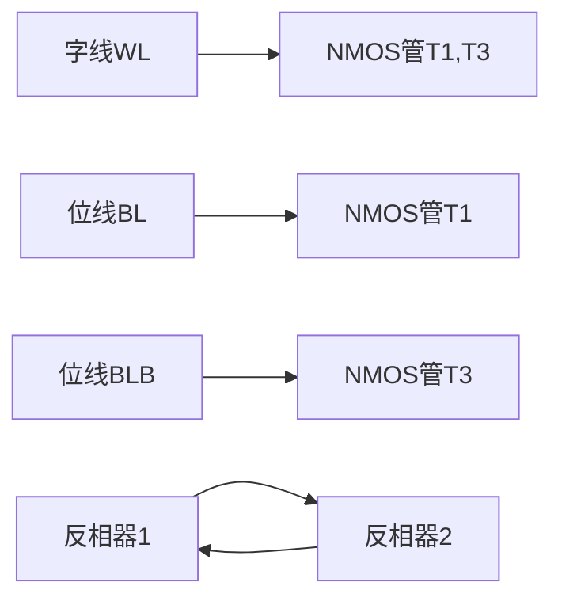
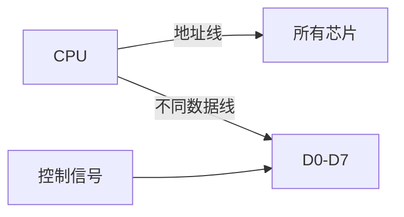
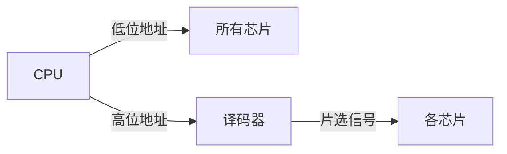

# 3.2 静态随机存取存储器(SRAM)

## 1. SRAM基本概念
**定义**：采用双稳态触发器作为存储单元的非易失性半导体存储器[^1]

**核心特性**：
- **存储原理**：利用交叉耦合的反相器保持数据
- **数据保持**：不需刷新，通电即可保持数据
- **访问速度**：典型访问时间5-10ns

## 2. 存储单元结构
### 2.1 六晶体管(6T)单元


**工作特点**：
- 读写操作通过字线和位线控制
- 两个稳定状态表示0/1
- 静态功耗极低

## 3. SRAM组织结构
### 3.1 芯片内部结构
| 组件 | 功能 | 特点 |
|------|------|------|
| 存储阵列 | 数据存储 | M×N矩阵排列 |
| 行译码器 | 选择行线 | log₂M位输入 |
| 列多路器 | 选择列线 | 支持位扩展 |
| 灵敏放大器 | 信号放大 | 提高读取可靠性 |

**容量计算公式**：
```
总容量 = 行数 × 列数 × 位宽
```

## 4. 关键性能参数
| 参数 | 典型值 | 影响因素 |
|------|-------|---------|
| 访问时间 | 5-10ns | 工艺节点/电路设计 |
| 静态功耗 | 1-10μW/Mb | 漏电流控制 |
| 工作电压 | 1.0-1.8V | 工艺特征尺寸 |
| 工作频率 | 500MHz-2GHz | 电路优化程度 |

## 5. SRAM时序特性
### 5.1 读周期时序
```
tRC(读周期) ≥ tAA(地址访问时间) + tOH(输出保持)
```
关键参数：
- tAA：地址有效到数据输出延迟
- tOHA：地址变化后数据保持时间

### 5.2 写周期时序
**关键约束**：
```
tWC ≥ tAW(地址建立) + tDW(数据有效) + tWR(写恢复)
```
典型值：
- tWP(写脉冲宽度)：3-10ns
- tDH(数据保持)：1-2ns

## 6. 应用场景
- **CPU高速缓存**：L1/L2 Cache
- **嵌入式存储器**：MCU片上存储
- **网络设备**：路由表存储
- **特殊应用**：FPGA配置存储器

# 主存容量的扩展

## 1. 基本扩展方法

现代计算机系统主要通过以下几种方式扩展主存容量：

### 1.1 位扩展
**原理**：增加存储字长（数据位宽）
- **计算公式**：`总片数 = 目标数据位宽 / 芯片位宽`
- **特点**：
  - 数据总线宽度增加
  - 地址空间不变
  - 典型应用：将8片256K×1bit芯片扩展为256KB（256K×8bit）内存

### 1.2 字扩展
**原理**：增加可寻址存储单元数量
- **计算公式**：`总片数 = 目标容量 / 单个芯片容量`
- **特点**：
  - 数据总线宽度不变
  - 地址空间增大
  - 示例：将8片256K×8bit芯片扩展为2048KB（2MB）内存

### 1.3 字位同时扩展
**原理**：同时增加数据位宽和存储单元数量
- **计算公式**：
  ```
  总片数 = (目标容量/单个芯片容量) × (目标位宽/芯片位宽)
  ```
- **典型场景**：将8片1K×4bit芯片扩展为4K×8bit存储系统

## 2. 具体实现技术

### 2.1 位扩展实现


**连接特点**：
- 并联所有芯片的地址线和控制信号
- 每个芯片负责不同的数据位

### 2.2 字扩展实现

