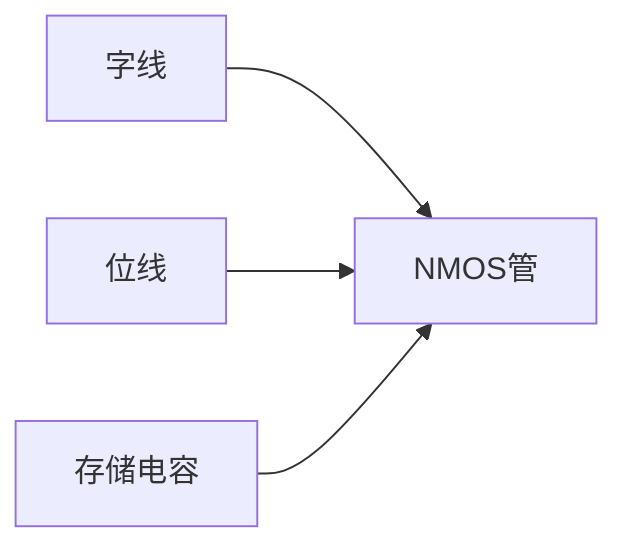
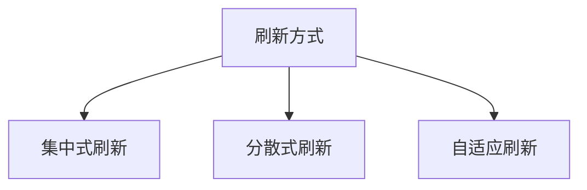

# 3.3 动态随机存取存储器(DRAM)

## 1. DRAM基本概念
**定义**：利用电容存储电荷来保存数据的易失性半导体存储器[^1]

**核心特性**：
- **存储原理**：电容电荷表示数据(有电荷=1，无电荷=0)
- **刷新需求**：需定期刷新(典型64ms周期)
- **访问速度**：50-100ns级访问时间

## 2. 存储单元结构
### 2.1 单晶体管(1T1C)单元


**工作特点**：
- 1个晶体管作为开关
- 1个电容存储数据
- 面积比SRAM小4-6倍

## 3. DRAM组织结构
### 3.1 芯片内部架构
| 组件 | 功能 | 特点 |
|------|------|------|
| 存储阵列 | 数据存储 | 行列矩阵组织 |
| 行缓冲 | 临时数据存储 | 提高访问速度 |
| 地址复用 | 减少引脚 | 分时传送行列地址 |
| 刷新电路 | 数据保持 | 自动刷新控制 |

**容量计算**：
```
总容量 = 行数 × 列数 × 位宽
```

## 4. 关键性能参数
| 参数 | 典型值 | 说明 |
|------|-------|------|
| 访问时间 | 50-100ns | 包括行列地址延迟 |
| 刷新周期 | 64ms | 每行需定期刷新 |
| 工作电压 | 1.2-3.3V | 取决于工艺节点 |
| 功耗 | 100-500mW | 含刷新功耗 |

## 5. 刷新机制
### 5.1 刷新方式


**集中式刷新特点**：
- 集中时间刷新所有行
- 存在"死时间"(0.5-1%周期)
- 刷新时间=行数×刷新周期

### 5.2 刷新时序
```
tREF = 64ms
刷新间隔 = tREF / 行数
```

## 6. DRAM发展
### 6.1 技术演进
| 技术 | 特点 | 带宽提升 |
|------|------|----------|
| SDRAM | 同步时钟 | 100-200MB/s |
| DDR | 双倍数据率 | 2×SDRAM |
| DDR2 | 4倍预取 | 2×DDR |
| DDR3 | 8倍预取 | 2×DDR2 |
| DDR4 | Bank分组 | 1.6-3.2GB/s |

### 6.2 现代改进
- **3D堆叠**：HBM/HMC技术
- **非易失DRAM**：NVDIMM
- **近内存计算**：PIM架构

