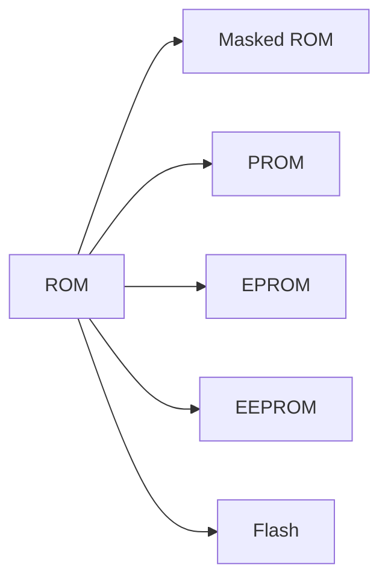

# 3.4 只读存储器

## 3.4.1 基本类型与特征
- **定义**：非易失性存储器，数据写入后不可修改或需特殊操作修改。
- **主要类型**：
  - **Masked ROM**：出厂时固化数据，不可修改。
  - **PROM**：用户一次性编程写入。
  - **EPROM**：紫外线擦除后重复编程。
  - **EEPROM**：电信号擦除，按字节修改。
  - **Flash Memory**：块擦除，支持快速编程。



---

## 3.4.2 闪存技术

### NOR Flash
- **特征**：
  - **随机读取快**：支持XIP（直接执行代码）。
  - **擦除单位**：区块或整片。
  - **接口**：独立数据/地址总线。
  - **应用**：存储固件、引导程序。
- **示例芯片**：S29AL016J-2MX8/1MX16
  - **接口信号**：
    ```markdown
    | 信号    | 功能               |
    |---------|--------------------|
    | A19~A0  | 20位地址总线       |
    | DQ0~15  | 16位数据总线       |
    | CE#     | 片选信号           |
    ```

### NAND Flash
- **特征**：
  - **高密度存储**：页为读写单位，块为擦除单位。
  - **接口**：复用数据/地址总线。
  - **应用**：SSD、存储卡。
- **对比表格**：

| 特性   | NOR Flash | NAND Flash |
| ---- | --------- | ---------- |
| 读取速度 | 高         | 中          |
| 擦除次数 | 约10^6次    | 约10^7次     |
| 适用场景 | 代码存储      | 数据存储       |

---

## 3.4.3 闪存工作方式
- **状态机控制**：
  - 上电默认进入读模式。
  - 需特定命令序列切换至擦除/编程模式。
- **编程流程**：
  1. 发送擦除命令。
  2. 验证擦除完成（RY/BY#信号）。
  3. 发送编程指令写入数据。

---

# 3.5 并行存储器

## 3.5.1 双端口存储器
- **定义**：允许两个端口独立访问同一存储单元。
- **结构**：
  ```mermaid
  flowchart LR
  A[CPU] --> B[双端口RAM]
  C[I/O设备] --> B
  ```
- **应用**：多核处理器共享内存。

---

## 3.5.2 多模块交叉存储器
- **顺序方式**：
  - **地址分配**：连续地址分配至同一模块。
  - **带宽公式**：
    $$
 t_2 = mT \quad (m为字数，T为周期)
$$
- **交叉方式**：
  - **地址分配**：地址低位选择模块。
  - **带宽公式**：  
    
$$
 t_1 = T + (m-1)\tau \quad (\tau为总线周期)
$$
- **示例计算**（连续读4字）：
  ```python
  # 参数：T=200ns, τ=50ns, m=4
  t_顺序 = 4 * 200 = 800ns
  t_交叉 = 200 + 3*50 = 350ns
  带宽_顺序 = 256位 / 800e-9 ≈ 320Mb/s
  带宽_交叉 = 256位 / 350e-9 ≈ 730Mb/s
  ```

---

## 3.6 高速缓冲存储器（Cache）

### 3.6.1 设计原则
- **命中率**：
  
$$
 H = \frac{N_c}{N_c + N_m}
$$
- **平均访问时间**：  
  
$$
 t_a = H \cdot t_c + (1-H) \cdot t_m
$$
- **系统效率**：  
  
$$
 e = \frac{1}{H + (1-H) \cdot r} \quad (r = t_m / t_c)
$$
---

### 3.6.2 地址映射方式
- **全相联映射**：
  - **特征**：主存块可存入任意Cache行。
  - **缺点**：硬件复杂度高。
- **直接映射**：
  - **规则**：主存块号对Cache行数取模。
  - **示例**：地址 `BBBBBB` 分解为：
    ```
    标记 = BB (16进制)
    行号 = 2BEE (16进制)
    ```
- **组相联映射**：
  - **结构**：将Cache分为多组，组内全相联。
  - **公式**：  
    
$$
 组号 = j \mod u \quad (u为组数)
$$

---

### 3.6.3 替换策略
- **算法对比**：

| 算法   | 特点       | 适用场景   |
| ---- | -------- | ------ |
| LRU  | 替换最久未访问行 | 高局部性程序 |
| FIFO | 替换最早进入行  | 简单硬件实现 |
| RAND | 随机替换     | 低资源消耗  |

---

### 3.6.4 写策略
- **写回法（Write-Back）**：
  - **特点**：仅修改Cache，换出时写回主存。
  - **标记位**：每行设置“脏位”标识修改状态。
- **全写法（Write-Through）**：
  - **特点**：Cache与主存同步更新。
  - **缺点**：增加主存访问次数。
