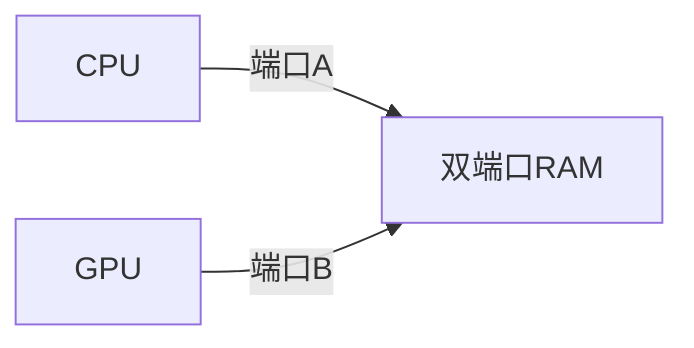
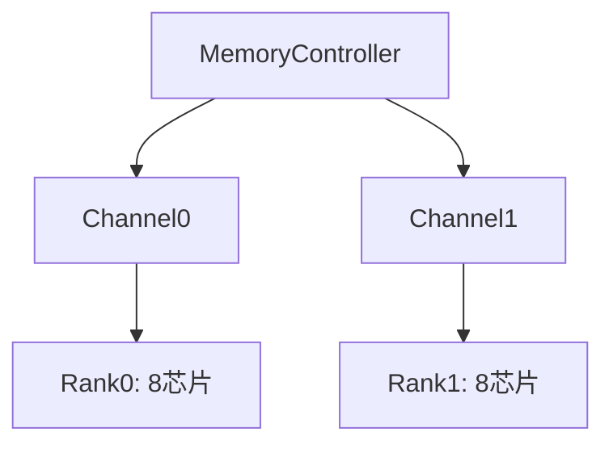

## 3.5 并行存储器

### 3.5.1 双端口存储器
- **定义**：允许两个独立设备同时访问同一存储单元的特殊存储器
- **结构特征**：
  - 两套独立地址/数据/控制总线
  - 冲突检测机制：片内仲裁逻辑解决同时读写冲突
  - **典型应用**：多核处理器共享内存、I/O设备直连存储



- **冲突处理机制**：

| 冲突类型 | 处理方式           |
| ---- | -------------- |
| 同地址写 | 总线锁定，顺序执行      |
| 读写重叠 | 数据总线隔离，状态寄存器标记 |

---

### 3.5.2 多模块交叉存储器

#### 存储模块组织方式对比
| 特征         | 顺序方式                  | 交叉方式                  |
|--------------|--------------------------|--------------------------|
| 地址分配     | 连续地址分配至同一模块    | 低位地址决定模块号       |
| 访问特点     | 串行访问                  | 流水线式并行访问         |
| 带宽公式     | $$t_2 = mT$$             | $$t_1 = T + (m-1)\tau$$  |
| 适用场景     | 简单控制逻辑              | 高性能计算系统           |

#### 四模块交叉存储实例
```python
# 参数配置
T = 200e-9   # 存储周期200ns
τ = 50e-9    # 总线周期50ns
m = 4        # 连续读取4字
word_size = 64  # 64位字长

# 计算带宽
def calc_bandwidth(t, bits):
    return bits / t

# 顺序方式
t_seq = m * T
seq_bw = calc_bandwidth(t_seq, 4*64)  # 320Mb/s

# 交叉方式 
t_inter = T + (m-1)*τ
inter_bw = calc_bandwidth(t_inter, 4*64)  # 730Mb/s
```

#### 地址映射机制
- **交叉方式地址解码**：
  ```c++
  // 四模块交叉地址解码示例
  uint32_t module_id = (address >> 2) & 0x3;  // 取地址bit[3:2]
  uint32_t module_addr = address >> 4;        // 模块内地址
  ```

#### 性能优化公式
- **最小交叉度**：
  $$ m_{min} = \frac{T}{\tau} $$
- **加速比**：
  $$ S = \frac{t_2}{t_1} = \frac{mT}{T+(m-1)\tau} $$

---

### 3.5.3 多体并行架构
- **关键技术**：
  - **Bank交错访问**：物理分布的多存储体并行工作
  - **内存控制器调度**：支持并发请求队列
  - **通道绑定**：多通道数据总线同步传输

- **现代DDR4架构特性**：

| 特性     | 参数        |     |
| ------ | --------- | --- |
| 突发长度   | BL8/BL16  |     |
| 传输速率   | 3200MT/s  |     |
| Bank数量 | 16 Bank分组 |     |
| 预取架构   | 8n预取      |     |


