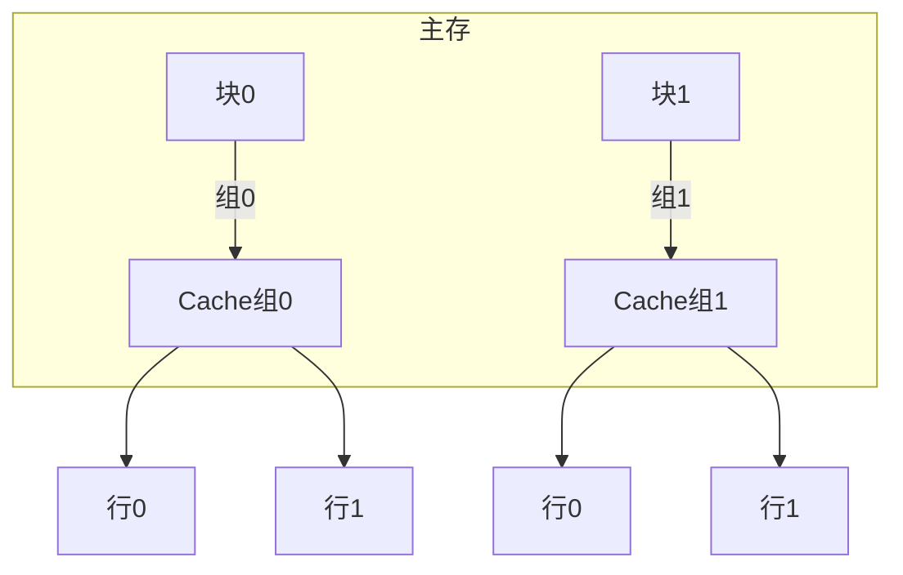

# 3.6 高速缓冲存储器（Cache）

## 3.6.1 设计原则
- **核心目标**：通过**层级存储结构**缩小CPU与主存速度差异
	- **关键指标**：
  - **命中率**：
    $$
 H = \frac{N_c}{N_c + N_m} \quad (N_c: \text{Cache命中次数}, N_m: \text{主存访问次数})
$$
  - **平均访问时间**：  
    
$$
 t_a = H \cdot t_c + (1-H) \cdot t_m
$$
  - **系统效率**：
    $$
 e = \frac{1}{H + (1-H) \cdot r} \quad (r = t_m / t_c)
$$

### 计算示例（P101例3.4）
```python
# 参数：Nc=1900, Nm=100, tc=50ns, tm=250ns
H = 1900 / (1900+100) = 0.95
r = 250 / 50 = 5
e = 1 / (5 + (1-5)*0.95) = 83.3%
ta = 50 / 0.833 ≈ 60ns
```

---

## 3.6.2 地址映射方式

### 全相联映射
- **定义**：主存块可存入Cache任意行
- **特征**：
  - **高灵活性**：冲突率低
  - **硬件成本**：需全表比较电路（CAM）
- **地址结构**：
  ```
  | 标记(s位) | 字地址(w位) |
  ```

### 直接映射
- **规则**：主存块号对Cache行数取模

$$
 \text{行号} = j \mod m \quad (j: \text{主存块号}, m: \text{Cache行数})
$$
- **示例**（地址BBBBBB解析）：
  ```c++
  // 地址BBBBBB(hex) = 101110111011101110111011(bin)
  tag = 10111011  // 前8位(BB)
  line = 101110111011101110  // 中间14位(2BEE)
  offset = 11  // 末2位(3)
  ```

### 组相联映射
- **结构**：

$$
 \text{组号} = j \mod u \quad (u: \text{组数})
$$
- **术语**：
  - **路(Way)**：每组包含的并行比较通道数
  - **典型配置**：4路组相联（每组4行）



---

## 3.6.3 替换策略

| 算法       | 原理                     | 优点                 | 缺点               |
|------------|--------------------------|----------------------|--------------------|
| **LRU**    | 替换最久未访问行         | 高局部性程序性能优   | 需时间戳记录       |
| **FIFO**   | 替换最早进入行           | 硬件实现简单         | 易替换高频访问行   |
| **RAND**   | 随机选择替换行           | 零额外硬件开销       | 性能不稳定         |

### LRU实现示例
```markdown
1. 每行设置年龄计数器
2. 访问行时计数器清零
3. 其他行计数器+1
4. 替换计数器最大值的行
```

---

## 3.6.4 写策略

### 写回法（Write-Back）
- **操作流程**：
  1. 写命中时仅修改Cache
  2. 被替换时检查"脏位"决定是否写回主存
- **特点**：
  ```mermaid
  flowchart LR
    CPU写操作 --> Cache[更新Cache]
    Cache --脏位=1--> 替换时写回主存
  ```

### 全写法（Write-Through）
- **操作规则**：
  - 写命中时同步更新Cache和主存
  - 写未命中时直接写入主存（WTNWA策略）
- **对比表格**：

| 特性    | 写回法    | 全写法    |
| ----- | ------ | ------ |
| 主存一致性 | 延迟更新   | 实时同步   |
| 总线带宽  | 低      | 高      |
| 适用场景  | 高写操作频率 | 多处理器系统 |

### 写一次法（Write-Once）
- **混合策略**：
  - 首次写命中时同步主存
  - 后续写操作采用写回模式
- **优势**：兼顾总线监听和多核一致性
