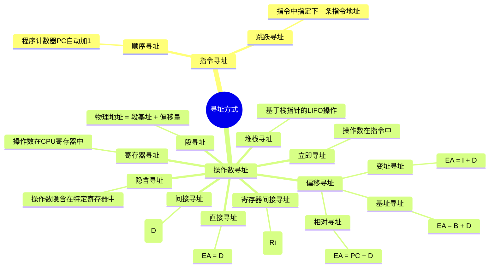
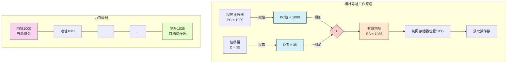
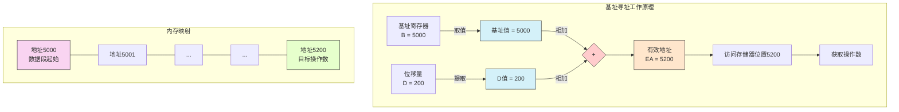

# 4.3 指令和数据的寻址方式

## 4.3.1 寻址方式的概念

### 定义与目的

- **寻址方式**（Addressing Mode）是指在采用地址指定方式访问存储单元时，**形成有效地址的各种方法**。
- 存储器可以存放指令，也可以存放数据。
- CPU访问存储器有两个主要目的：**取指令**（fetch）和**存取操作数**（load/store）。
- **有效地址EA**（Effective Address，也称逻辑地址）是CPU实际访问存储单元的地址。
- **形式地址**（Formal Address）是指令中直接给出的地址码。
- 冯·诺依曼结构中，指令寻址和数据寻址是**交替进行**的。
- 哈佛结构中，指令寻址和数据寻址是**独立进行**的。

## 4.3.2 指令的寻址方式

### 顺序寻址方式

- **定义**：通常情况下，指令在内存中是**按顺序存放**的，指令的执行顺序就是指令在内存中的存放顺序。
- **特征**：
    - CPU从存储器地址A1取出第一条指令并执行。
    - 接着从地址A1后面的相邻地址取出第二条指令并执行。
    - 依此类推，程序按照指令在内存中的存放顺序依次执行。
- **实现**：可以采用**程序计数器**（Program Counter，PC，也称指令指针寄存器）**自动加一**的方式来形成下一次取指的地址。

### 跳跃（转移）寻址方式

- **定义**：下一条指令的地址码不是由程序计数器简单自动给出，而是**由本条指令给出**。
- **特征**：
    - 转移指令的地址码字段包含下一条指令的地址。
    - 执行跳跃指令时，将指令中给出的地址码送入**PC**中。
    - 下一次取指时将从PC指定的新地址开始，实现程序的转移。
    - 在遇到下一条转移指令之前，程序仍然按照PC的值顺序执行（即顺序寻址）.

## 4.3.3 操作数的基本寻址方式

### 操作数的来源

操作数可以从以下三个来源获取：

1. 由指令中的地址码部分**直接给出**操作数。
2. 操作数存放在**CPU内的数据寄存器**中。
3. 操作数存放在**内存的数据区**（含I/O寄存器）中。
    - 在指令中直接给出操作数的内存有效地址。
    - 指令的地址字段给出形式地址（位移量），在指令执行时依据某种方式变换为有效地址再存取操作数.

### 隐含寻址

- **定义**：指令中的某个操作数或其地址**隐含**在某个通用寄存器或指定的内存单元中。
- **示例**：Intel 8086乘法指令 `mul opr`
    - 约定被乘数隐含使用**AX**或**AL**寄存器。

### 立即寻址

- **定义**：指令的地址字段指出的**不是操作数的地址**，而是**操作数本身**。
- **特征**：操作数作为指令的一部分直接存储在指令字中。
- **示例**：Intel 8086指令 `mov al, 7`
    - `7` 就是立即数，直接存储在指令中。
    - 指令格式示例：
      
        ```
        1011-0-000-00000111
        mov        Ri
        ```
        
        其中 `00000111` 就是立即数 `7` 的二进制表示。

### 直接寻址

- **定义**：在指令中的地址码字段中给出的操作数的**形式地址D就是操作数在内存中的有效地址E**。通常称形式地址D为直接地址。
- **特征**：E = D。
- **访问**：S = (E) = (D)，表示操作数S是内存地址E（即D）单元的内容。
- **指令格式示例**：
  
    ```
    OP  X1  D
    ```
    
    其中D直接指向内存中的操作数S。

### 间接寻址（内存间址）

- **定义**：指令中地址字段给出的**形式地址D不是操作数本身，也不是操作数的地址**，而是**操作数地址在内存中的存放地址**（存放操作数地址的内存单元的地址）。D单元的内容才是操作数的有效地址。
- **特征**：E = (D)。
- **访问**：S = (E) = ((D))，表示操作数S是内存地址E（即内存单元D的内容）单元的内容。
- **指令格式示例**：
  
    ```
    OP  X2  D
    ```
    
    其中D指向内存中的一个单元，该单元存放着操作数S的实际地址。

### 直接间接结合寻址

- **定义**：结合直接寻址和间接寻址，指令中通过一个标志位（如I)来指示寻址方式。
- **特征**：
    - 指令格式示例：
      
        ```
        操作码  I  D
        ```
        
    - **I = 0**：直接寻址，有效地址 E = D。
    - **I = 1**：间接寻址，有效地址 E = (D)。

### 寄存器寻址

- **定义**：操作数不放在内存中，而是放在**CPU内部的通用数据寄存器**中。
- **特征**：
    - 指令格式中给出的是存放操作数的寄存器编号。
    - 有效地址E就是该寄存器的地址（或编号）。
    - 操作数S就是该寄存器的内容。
- **优点**：指令通常比较短，指令执行时间短，速度快。
- **示例**：8086指令 `mov al, bl` （将寄存器BL的内容传送到AL）[18, citing mov al, 7 which is Immediate Addressing but the description fits R-R]. The citation links to the mov al, 7 example, but the description "操作数不放在内存中，而是放在CPU内部的通用数据寄存器中" and "指令通常比较短 * 指令执行时间短" are key characteristics of RR type instructions which are discussed later.

### 寄存器间接寻址

- **定义**：指令格式中给出的寄存器中存放的**内容不是操作数本身**，而是**操作数在内存中存放的地址**。
- **特征**：
    - 间接地址在寄存器中。
    - 操作数在内存单元中。
    - 如果指令格式中给出的是寄存器Ri，则有效地址 E = (Ri).
    - 操作数 S = (E) = ((Ri)).
- **指令格式示例**：
  
    ```
    操作码  寻址特征  寄存器号
    ```
    
    该寄存器号指定的寄存器（如Ri）存放着操作数的地址.

### 偏移寻址 (Offset Addressing)

- **定义**：有效地址由**专用寄存器**（如PC、基址寄存器、变址寄存器）的内容加上指令格式中的**形式地址D（位移量）**而形成.
- **特征**：有效地址 E = (专用寄存器) + D.
- 偏移寻址包括相对寻址、基址寻址和变址寻址。

#### 相对寻址 (Relative Addressing)

- **定义**：将**程序计数器PC的内容加上指令格式中的形式地址D**而形成操作数的有效地址.
- **特征**：
    - 形式地址D称为位移量，其值可正可负，相对于当前指令地址进行浮动.
    - 有效地址 E = (PC) + D.
- **优点**：
    - 指令中不必给出绝对地址，指令长度可以缩短.
    - 程序可以放在内存的任何位置（**便于实现程序浮动或再定位**）.
- **示例**：
    - PC = 1000，指令地址 = 1000.
    - 指令格式中的位移量D = 35.
    - 有效地址 E = (PC) + D = 1000 + 35 = 1035.
    - 指令格式示例：
      
        ```
        OP  X3  D
        ```
        
        D是位移量.


这个图例展示了相对寻址的工作原理，包括：

1. 程序计数器(PC)当前的值（例如1000）
2. 从指令中提取的位移量D（例如35）
3. 两者相加形成有效地址EA(1035)
4. 最终从内存位置1035获取操作数

图例右侧展示了内存布局，突出显示了当前指令位置和目标操作数位置的关系。

#### 基址寻址 (Base Addressing)

- **定义**：将**CPU内的基址寄存器的内容加上指令格式中的形式地址D**而形成操作数的有效地址.
- **特征**：
    - 基址寄存器（如B）存放程序或数据段的起始地址（基地址），通常不变.
    - 形式地址D是相对于基地址的位移量.
    - 有效地址 E = (B) + D.
- **优点**：
    - 可以**扩大寻址范围**.
    - 便于实现**程序再定位**（通过修改基址寄存器的值即可将整个程序或数据块移动位置）.
- **指令格式示例**：
  
    ```
    OP  X4  D
    ```
    
    其中D是位移量.



这个图例展示了基址寻址的工作原理，包括：

1. 基址寄存器(B)当前的值（例如5000），通常存放程序或数据段的起始地址
2. 从指令中提取的位移量D（例如200）
3. 两者相加形成有效地址EA(5200)
4. 最终从内存位置5200获取操作数

图例右侧展示了内存布局，突出显示了数据段起始位置和目标操作数位置的关系。

#### 变址寻址 (Indexed Addressing)

- **定义**：把CPU中**某个变址寄存器（如I）的内容与位移量D相加**形成操作数的有效地址.
- **特征**：
    - 变址寄存器通常用来存放地址的修改量或偏移量，其值可以使用指令修改.
    - 形式地址D通常是基地址，而(I)是偏移量.
    - 有效地址 E = (I) + D. (Note: Source text EA = (I)*S + A is for IA-32 specific scaled indexed addressing. The general definition is E = (I) + D.)
- **目的**：主要用于**访问复合数据结构**，如数组元素（通过改变变址寄存器值来访问不同元素）.
- **与基址寻址的区别**：
    - 目的不同：基址寻址侧重于扩大寻址空间和实现多道程序，变址寻址侧重于访问数据结构.
    - 寄存器值变化：变址寄存器值可以自动或用指令修改，基址寄存器通常不变.

### 段寻址 (Segment Addressing)

- **定义**：程序中的指令和数据按照逻辑结构首先分成**段**，每个段内均以段起始地址为基址编址.
- **特征**：
    - 物理地址由**段基地址**和**段内偏移量**组合而成.
      
    - **示例**：Intel 8086.
      
        - 整个1M存储空间划分成若干最大长度64K字节的段.
        - 段内地址是16位偏移量.
        - 20位物理地址 = 段基地址（由CPU中的段寄存器提供）+ 16位偏移量.
        - 段寄存器中的16位基地址自动**左移4位**（相当于乘以16）与16位偏移量相加，形成20位物理地址.
        
        $$ \text{物理地址} = (\text{段寄存器内容} \ll 4) + \text{偏移量} $$ (Note: $\ll 4$ represents left shift by 4 bits, equivalent to multiplying by $2^4 = 16$. The source mentions this implicitly by stating the 16-bit segment register content is shifted left by 4 bits.)
        

### 堆栈寻址 (Stack Addressing)

- **定义**：对堆栈进行操作（入栈push, 出栈pop）时，**CPU并不直接给出被操作单元的地址**，而是依据数据入出栈的顺序由硬件或软件自动给出地址或保证操作顺序.
  
- **特征**：
    
    - 数据遵循**后进先出**（LIFO: Last In First Out）的原则. Source uses FILO (First In Last Out) but defines it as '先进后出', which is equivalent to LIFO. Will use LIFO as it's more common in English computing terminology, but reference the source's definition.
    - 堆栈可以是**硬件堆栈**或**存储器堆栈**（软堆栈）. 来源重点描述存储器堆栈.
- **存储器堆栈 (软堆栈)**：
    
    - 利用常规内存空间的一部分或几部分实现.
    - 有一个固定的**栈底**和一个浮动的**栈顶**.
    - CPU内部设置一个**堆栈指针**（Stack Pointer，SP）寄存器，指示当前栈顶的位置.
    - 堆栈指示器指定的存储器单元就是堆栈的栈顶.
    - 栈底位置固定，无需存储.
- **入栈 (Push) 操作**：
    
    - 将数据存入栈顶，然后更新栈顶位置（通常是地址减小，取决于堆栈增长方向）.
    - 操作示例：`push A`
    - 步骤：1. (A) → M[sp] (将寄存器A或内存单元A的内容存入SP指向的内存单元)； 2. (SP) - 1 → SP (SP内容减1，SP指向新的栈顶). (Note: Some architectures increment SP on push; source example decrements SP. Assume SP points _to_ the top element _before_ push).
    
    ```
    graph TD
        A[数据源 A] --> B{存储到 M[SP]}
        B --> C[SP - 1 -> SP]
        C --> D[新的栈顶]
    ```
    
- **出栈 (Pop) 操作**：
  
    - 从栈顶取出数据，然后更新栈顶位置（通常是地址增大）.
    - 操作示例：`pop A`
    - 步骤：1. (SP) + 1 → SP (SP内容加1，SP指向旧的栈顶元素的下一个位置)； 2. M[sp] → A (将SP指向的内存单元的内容取出到寄存器A或内存单元A). (Note: Source diagram implies SP is updated _before_ the read, so SP points _to_ the element to be read. Let's follow the source definition strictly.) Source definition: pop A: (SP)+1→SP, M[sp]→A. The diagram shows SP pointing at the element _after_ it has been popped. This sequence might imply SP is incremented _before_ reading the element it will then point _past_. A common implementation is read M[sp], then increment SP. Let's stick to the source's explicit definition text.
    
    ```
    graph TD
        A[SP + 1 -> SP] --> B{从 M[SP] 读取}
        B --> C[数据到 A]
        C --> D[新的栈顶]
    ```
    

### 寻址方式的选择

- 有些指令**固定使用**某种寻址方式。
- 有些指令允许使用**多种寻址方式**。
    - 在指令中加入**寻址方式字段**指明。
    - 对不同的寻址方式分配**不同的操作码**（看作不同指令）。
- **示例**：8086的`mov`指令
    - 支持R-R (Register-Register), S-R (Storage-Register), I-R (Immediate-Register), I-S (Immediate-Storage) 等类型。
    - 不同类型有不同的二进制操作码。
    - 汇编助记符可能相同（如都是`mov`）。

## 4.3.4 寻址方式举例

### IA-32 寻址方式

IA-32（Intel Architecture, 32-bit）支持多种寻址方式。物理地址形成方式在实地址模式和保护模式下不同.

- **实地址模式**：段寻址方式。16位段基址左移4位，加上16位段内偏移量，得到20位物理地址。
- **保护模式**：32位段基地址加上段内偏移量得到32位**线性地址**，由存储管理部件将其转换成32位物理地址.

IA-32常见的寻址方式及其有效地址EA算法如下表所示：

|序号|寻址方式名称|有效地址EA算法|说明|
|:--|:--|:--|---|
|(1)|立即寻址|操作数 = A|操作数A在指令中|
|(2)|寄存器寻址|EA = R|操作数在某寄存器内，指令给出寄存器号|
|(3)|偏移量寻址|EA = A|偏移量A在指令中，可以是8位、16位、32位|
|(4)|基址寻址|EA = (B)|B为基址寄存器，(B)为该寄存器内容|
|(5)|基址+偏移量|EA = (B) + A||
|(6)|比例变址+偏移量|EA = (I)*S + A|I为变址寄存器，S为比例因子（1，2，4，8）|
|(7)|基址+变址+偏移|EA = (B) + (I) + A||
|(8)|基址+比例变址+偏移量|EA = (B) + (I)*S + A||
|(9)|相对寻址|指令地址 = (PC) + A|PC为程序计数器或当前指令指针寄存器|

### RS型指令寻址方式示例

某16位计算机的二地址RS型指令结构示例如下：

```
15         9 8 7           4 3            0
------------------------------------------
|    OP    |  —  | 通用寄存器 |   I   |  X   |    位移量D    |
------------------------------------------
```

其中，OP为操作码字段（6位），通用寄存器字段（4位）指定一个源操作数寄存器，I为间接寻址标志位（1位），X为寻址方式字段（2位），D为位移量字段（16位）。通过I、X、D的组合，可以构成下表所示的寻址方式：

| I | X | 有效地址E | 说明 | 寻址方式 | | :-- | :-- | :---------- | :------------------- | :----------------- | | (1) 0 | 00 | E=D | | **直接寻址** | | (2) 0 | 01 | E=(PC)+D | PC为程序计数器 | **相对寻址** | | (3) 0 | 10 | E=(R2)+D | R2为变址寄存器 | **变址寻址** | | (4) 1 | 11 | E=(R3) | R3为寄存器地址 | **寄存器间接寻址** | | (5) 1 | 00 | E=(D) | D为内存单元地址 | **存储器间接寻址** | | (6) 0 | 11 | E=(R1)+D | R1为基址寄存器 | **基址寻址** |

这些示例说明了如何在指令格式中通过标志位和字段的组合来实现不同的寻址方式。