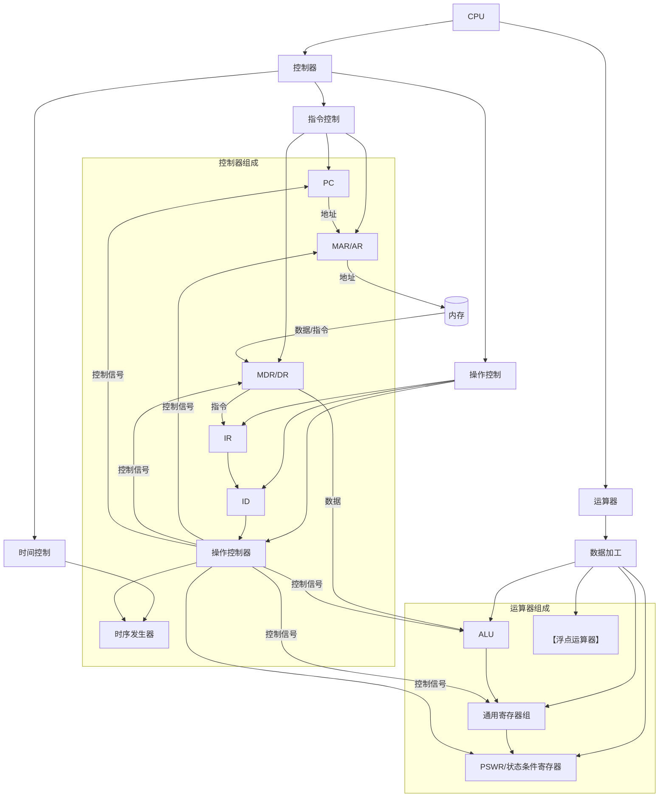
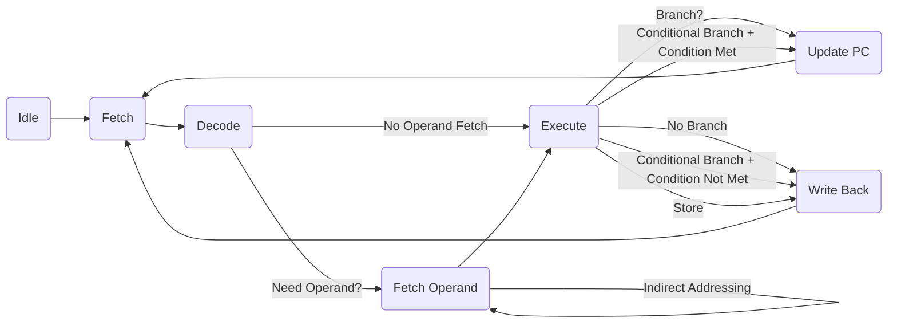

# 5.1 CPU的功能与组成
## 5.1.1 CPU的功能
中央处理单元（CPU）是计算机系统的核心部件，负责解释计算机指令以及处理计算机软件中的数据。CPU主要包含**指令控制**、**操作控制**、**时间控制**和**数据加工**这四大功能。

### 指令控制
**定义：** 指令控制功能负责**控制程序的执行顺序**。它是程序顺序执行的核心。
**特征：**
- 控制程序的执行流程。
- 确定当前应取出的指令。
- 决定下一条要执行的指令的地址。
**相关部件：**
- **程序计数器 (PC)**：也称指令计数器、指令地址计数器或指令指针，用于存放下一条指令的地址。
- **(内存) 地址寄存器 (MAR/AR)**：用于保存当前CPU所访问的内存单元或I/O接口的地址。
- **(内存) 数据寄存器 (MDR/DR)**：也作缓冲寄存器，作为CPU和内存、外部设备接口之间信息传送的中转站。

### 操作控制
**定义：** 操作控制功能负责根据指令解释，产生每条指令所需的各种操作信号，送往相应的部件，从而控制这些部件按指令的要求进行动作。
**特征：**
- 在指令取出后，CPU依据指令的**操作码字段**和**形式地址字段**来解释指令。
- 指出指令是何种操作，以及如何获取操作数地址。
- 产生控制信号，指挥相关部件执行操作。
**相关部件：**
- **指令寄存器 (IR)**：保存当前正在执行的一条指令。指令执行时，指令先被从内存取到缓冲寄存器(DR)，再传送至指令寄存器。
- **指令译码器 (ID)**：指令寄存器中的操作码字段是指令译码器的输入。译码器对指令进行译码或测试，产生相应的操作控制信号。
- **操作控制器**：根据指令操作码和时序信号，产生各种操作控制信号，以便正确地建立数据通路，从而完成取指令和执行指令的控制。

### 时间控制
**定义：** 时间控制功能负责对指令各个操作实施时间的定时，给出整个系统的定时信号。
**特征：**
- 为每个微操作带上时间标记.
- 有条理、有节奏地指挥机器的动作.
- 提供计算机各部分工作所需的时间标志.
**相关部件：**
- **时序发生器**：在CPU内设置，用于给出整个系统的定时信号. 时序发生器产生指令周期的各级定时信号.

### 数据加工
**定义：** 数据加工功能通过算术或逻辑运算将原始信息转换成所需的结果.
**特征：**
- 执行**算术运算**.
- 执行**逻辑运算**和**逻辑测试**.
**相关部件：**
- **ALU (算术逻辑运算单元)**：执行算术和逻辑运算.
- **【浮点运算器】**：专门用于浮点数的运算.
- **通用寄存器组**：用于存放源操作数和结果操作数. 现代CPU通常有多个通用寄存器具有累加器功能.
- **状态条件寄存器 (PSWR)**：通常作为程序状态字寄存器的一部分. 保存由算术/逻辑指令运行结果建立的各种条件码（如进位C、溢出V、零Z、负N标志）以及中断和系统工作状态等信息、控制位.

## 5.1.2 CPU的基本组成
CPU主要由**控制器**和**运算器**两大部分组成。

### 控制器
**性质：** **控制部件**。
**组成：**
- 程序计数器 (PC)
- 指令寄存器 (IR)
- 指令译码器 (ID)
- 时序产生器 (或时序发生器)
- 操作控制器
**功能：** **协调和指挥整个计算机系统的操作**。具体包括指令控制、操作控制、时序控制。
- **取指：** 从内存中取出一条指令，并指出下一条指令在内存中的位置。
- **分析：** 对指令进行译码或测试，并产生相应的操作控制信号。
- **执行：** 指挥并控制CPU、内存和输入/输出设备之间的数据传送以及对数据的加工。

### 运算器
**性质：** **执行部件**。
**组成：**
- 算术逻辑运算单元 (ALU)
- 通用寄存器组
- 数据缓冲寄存器 (DR) (注：DR也常被列在主要寄存器中)
- 程序状态字寄存器 (PSWR，或状态条件寄存器)
**功能：** **数据加工**。
- 算术运算
- 逻辑运算与逻辑测试

### CPU的结构与数据通路
CPU内部的信息传送通过**CPU内部总线**进行。CPU与外界交换信息通过**系统总线**进行。
**数据通路定义：** CPU内各个寄存器以及系统总线之间的信息传送通路。指令的执行过程就是在CPU内各部件之间以及CPU与外部部件之间，依次、依条件传递信息并进行必要的判断和数据加工的过程.
以下是一个简化的CPU结构框图，展示了主要部件及其关系（使用Mermaid语法）：

这个图展示了控制器和运算器的主要组成部分以及它们之间的信息流向。注意DR(J)在图中被包含在了运算器组成中，同时作为内存和CPU之间的数据缓冲。

## 5.1.3 CPU中的主要寄存器
CPU内部有多种寄存器，它们在指令执行过程中扮演着关键角色.

### 数据缓冲寄存器 (DR)
**功能：**
- **输入缓冲：** 暂存由内存单元或I/O接口读出的指令或数据.
- **输出缓冲：** 暂存向内存单元或I/O接口存入的数据.
**作用：**
- 作为CPU和内存、外部设备接口之间信息传送的**中转站**.
- **补偿CPU和内存、外设接口之间操作速度的差别**.
- 作为内存操作数的缓冲**参加CPU的运算**.

### 指令寄存器 (IR)
**功能：** **保存当前正在执行的一条指令**.
**特征：**
- 指令首先从内存取到缓冲寄存器(DR)中，然后传送至IR.
- IR中的操作码字段是指令译码器(ID)的输入.

### 程序计数器 (PC)
**功能：** **用于确定下一条指令的地址**.
**特征：**
- 程序开始执行前，将第一条指令所在的内存单元地址送入PC.
- 顺序执行指令时，CPU自动修改PC的内容，使其保持下一条指令的地址.
- 执行转移类操作时，将程序的后继指令的地址送入PC.

### 内存地址寄存器 (MAR/AR)
**功能：** **保存当前CPU所访问的内存单元或I/O接口的地址**.
**特征：**
- 用于保持地址信息，**补偿内存和CPU之间的速度差别**.
- 外围设备的地址可以看作内存单元地址.

### 通用数据寄存器 (R0～R3等)
**功能：**
- **早期：** 单累加器结构，累加器作为与ALU有直接通路的通用寄存器，为ALU提供工作区.
- **当前：** 通用寄存器堆结构，CPU中有多个（十几个、几十个甚至上百个）通用寄存器，**任何一个寄存器均可存放源操作数和结果操作数**，都具有累加器功能.

### 程序状态字寄存器 / 状态条件寄存器 (PSWR)
**功能：**
- **保存由算术指令和逻辑指令运行或测试的结果建立的各种条件码**。
  例如：
    - 进位标志 (C)
    - 溢出标志 (V)
    - 零标志 (Z)
    - 负标志 (N)
- **保存中断和系统工作状态等信息**.
- **保存控制位**.
**思考：** 各个寄存器的宽度和什么因素相关？ 根据文档内容推断，寄存器的宽度通常与**数据总线宽度**、**地址总线宽度**以及**机器字长**等因素相关。例如，MAR的宽度通常与地址总线宽度及内存地址空间有关；MDR的宽度与数据总线宽度及机器字长有关；通用寄存器和PSWR的宽度通常与机器字长有关。

## 5.1.4 操作控制器和时序发生器
操作控制器和时序发生器是控制器中的关键部件，共同协作产生控制信号，指挥计算机各部件有序工作.

### 操作控制器的功能
**功能：** **根据指令操作码和时序信号，产生各种操作控制信号，以便正确地建立数据通路，从而完成取指令和执行指令的控制**.

### 操作控制器的实现方式
操作控制器主要有两种实现方式：硬布线控制器和微程序控制器.

#### 硬布线 (hardwired) 控制器
**定义：** 使用组合逻辑电路产生固定时序控制信号的控制器. 控制信号形成部件是由门电路组成的复杂树形网络.
**特征：**
- 用**组合逻辑电路**实现.
- 产生**固定时序**控制信号.
- 控制信号形成部件结构不规整.
**优缺点：**
- **优点：速度快**，微命令产生速度取决于电路延迟.
- **缺点：** 设计、调试、维护困难，难以实现设计自动化. 控制器核心结构零乱，不便于检查和调试. 不易修改、扩展指令系统功能.
**实现示例：** 硬布线控制器设计的具体步骤包括画出指令流程图、设计控制操作时序、进行微操作综合（列出每个微操作控制信号产生的布尔代数表达式并简化），最后进行电路实现. 例如，一个微操作控制信号 `LDPC` 的逻辑函数表达式可能为：
```
LDPC = M1 · T4 + M2 · T4 · JMP
```
其中 `M1`, `M2` 代表机器周期，`T4` 代表节拍脉冲，`JMP` 代表转移指令的操作码译码输出信号. 这是一个基于时序和指令操作码的布尔表达式示例。
基于有限状态机的硬布线控制器是另一种实现思路，它结合了组合逻辑与时序逻辑. 指令执行过程通过有限状态机(FSM)描述.

这是一个简化的基于状态机的指令周期流程示例。每个椭圆代表一个状态，线段表示状态转移，线段旁的标识表示转移条件.

#### 微程序 (microprogrammed) 控制器
**定义：** 采用存储逻辑实现的控制器. 微操作信号代码化，将每条机器指令转化为一段微程序并存入控制存储器中，微操作控制信号由微指令产生.
**特征：**
- 采用**存储逻辑**实现.
- 每条机器指令对应一段**微程序**.
- 微程序由**微指令**组成.
- 微指令存放在**控制存储器 (控存)** 中.
**优缺点：**
- **优点：** 设计规整，调试、维护及更新、扩充指令方便，易于实现自动化设计.
- **缺点：** 指令执行速度比硬布线控制器慢，因为每条微指令都需要从控存中读取.
**核心概念：**
- **微命令：** 控制部件通过控制线向执行部件发出的各种控制命令.
- **微操作：** 执行部件接受微命令后进行的最基本操作. 微命令是微操作的控制信号，微操作是微命令控制的操作过程.
- **微指令：** 一组实现一定操作功能的微命令的组合. 通常以编码形式存放在控存的一个单元中.
- **微程序：** 实现一条机器指令功能的一组微指令组成的序列.
微程序控制器是基于微程序设计技术实现操作控制的.

### 时序发生器
**功能：** **用逻辑电路产生指令周期的各级定时信号**. 产生一组时序信号送到操作控制器.
**组成：**
- **时钟源：** 通常由石英晶体振荡器等组成，提供频率稳定且电平匹配的方波时钟脉冲信号.
- **脉冲发生器：** 通常采用**环形脉冲发生器**形式，产生一组有序的、间隔相等或不等的脉冲序列，通过译码电路产生节拍脉冲.
- **节拍脉冲和读写时序译码逻辑：** 对脉冲发生器输出进行译码，产生最后的节拍脉冲和存储器读/写时序信号. 例如，设在一个CPU周期中产生四个等间隔的节拍脉冲T1-T4。其译码逻辑可能包含如下关系（这里用伪布尔表达式表示）：
    ```
    T1 = C0 & C3' & C2' & C1' // Example based on typical ring counter logic, actual logic depends on specific implementation.
    T2 = C0 & C3' & C2' & C1 // Example
    T3 = C0 & C3' & C2 & C1' // Example
    T4 = C0 & C3' & C2 & C1 // Example
    ```
    其中 C 是环形脉冲发生器的输出. 存储器读/写时序信号的译码逻辑表达式示例：
    ```
    RD' = T2 · MREQ' // 在机器周期T2节拍且有访存请求时产生读信号 (示例逻辑，具体见源文档表达式)
    WE' = T3 · MREQ' // 在机器周期T3节拍且有访存请求时产生写信号 (示例逻辑，具体见源文档表达式)
    ```
    这里的表达式是基于源文档提供的逻辑表达式符号表示的 `T2·MREQ'` 等，并假定 `MREQ'` 表示访存请求有效.
- **启停控制逻辑：** 控制时序部件何时开始和停止发出时序控制信号. 确保计算机上电复位后，时序发生器能从第一个节拍脉冲前沿开始工作，并在停机时关闭.
启停控制逻辑可以通过作为主时钟输出的门控信号或作为节拍信号发生器各个输出信号的门控信号来实现.
以上内容详细阐述了CPU的功能、组成及其主要部件，包括寄存器、操作控制器和时序发生器，并尝试结合了来源文档中提供的图示和公式信息。