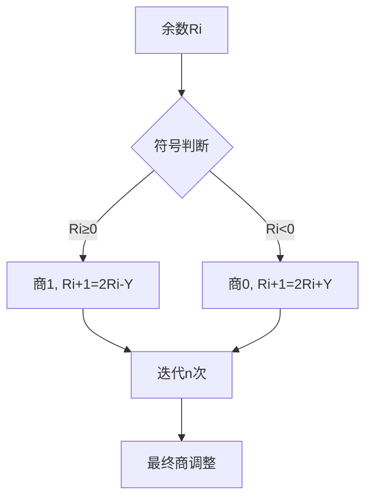
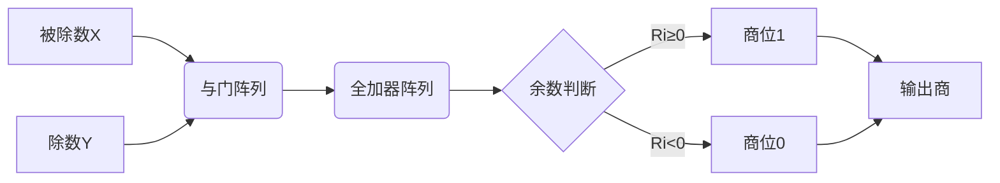

# 2.4 定点除法运算

## 2.4.1 原码除法运算
### 原码恢复余数法
- **定义**：通过减法判断余数正负，若为负则恢复余数并调整商的算法。
- **运算规则**：
  1. **符号处理**：商的符号由被除数与除数符号位异或得到：
     $$
S = X_f \oplus Y_f
$$  
  2. **数值计算**：绝对值相除，余数左移逐位比较：  
     - 若余数≥0：商1，余数左移后减除数  
     - 若余数<0：商0，余数恢复（加除数）后左移减除数  

**示例**：计算(-0.1001) ÷ (0.1101)  
| 步骤 | 余数操作                     | 商（二进制） |  
|------|------------------------------|--------------|  
| 初始 | 00.1001（被除数）             | 0000         |  
| 1    | -11.0011（减除数补码）= 11.1100 | 0            |  
| 恢复 | +00.1101 → 00.1001            | 0            |  
| 左移 | 01.0010                       | 0            |  
| 2    | -00.1101 → 00.0101            | 01           |  
**结果**：商=1.1011（原码），余数=0.00000111 

---
### 原码不恢复余数法（加减交替法）
- **原理**：将恢复余数的操作与下一步骤合并，减少运算次数。  
- **递推公式**：  
  $$
R_{i+1} = 2R_i \pm Y \quad (\text{根据余数符号选择加减})
$$  

**流程**：  


**特征**：  
- 硬件复杂度低，适合通用处理器  
- 运算速度比恢复余数法快约33% 

---

## 2.4.2 补码除法运算
### 补码加减交替法
- **符号规则**：  
  - 被除数与除数同号：余数=被除数-除数  
  - 被除数与除数异号：余数=被除数+除数  
- **递推规则**：  
  - 余数与除数同号：商1，余数左移减除数  
  - 余数与除数异号：商0，余数左移加除数  

**示例**：计算(-15) ÷ (-13)（补码形式）  
1. 输入补码：`[X]补=10001`, `[Y]补=10011`  
2. 求绝对值：`|X|=1111`, `|Y|=1101`  
3. 原码乘积：`1111×1101=11000011`  
4. 符号位：`0`（负数×负数）  
**结果**：商补码=`0110000011`，余数=`0.00000001` 

---

## 2.4.3 阵列除法器设计
### 结构原理
- **并行计算**：通过多级全加器和与门阵列实现余数并行处理。  
- **延迟优化**：采用流水线设计减少关键路径延迟。  

**Mermaid流程图**：  


**性能对比**：  
| 类型         | 延迟（时钟周期） | 硬件复杂度 |  
|--------------|------------------|------------|  
| 串行除法器   | 32               | 低         |  
| 阵列除法器   | 5                | 高         | 

---

## 2.4.4 关键问题与优化
### 溢出处理
- **条件**：  
  - 定点小数除法要求：
$$
|X| < |Y|
$$  
  - 定点整数除法要求：
$$
|X| > |Y|
$$  

**解决方法**：  
1. 预判溢出：计算前检查被除数高位是否小于除数。  
2. 双符号位：通过符号位组合判断溢出类型：  
   | 双符号位 | 含义     |  
   |----------|----------|  
   | 00       | 正数     |  
   | 01       | 上溢     |  
   | 10       | 下溢     |  
   | 11       | 负数     | 

---

### 精度优化策略
- **扩展字长**：使用32位中间结果防止舍入误差。  
- **牛顿迭代法**：通过迭代逼近提高倒数精度（误差<2^{-n}）：  
  $$
Q_{i+1} = Q_i \cdot (2 - D \cdot Q_i)
$$  
**代码块**：  
```cpp
// 牛顿迭代法求倒数（C语言示例）
float reciprocal(float D) {
    float Q = 0.001f; // 初始猜测值
    for(int i=0; i<4; i++) {
        Q = Q * (2 - D * Q);
    }
    return Q;
}
``` 
```