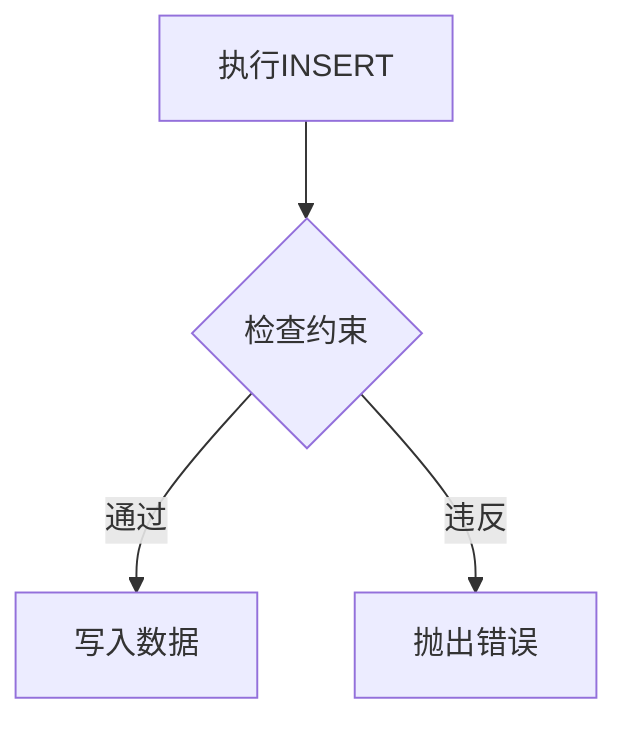
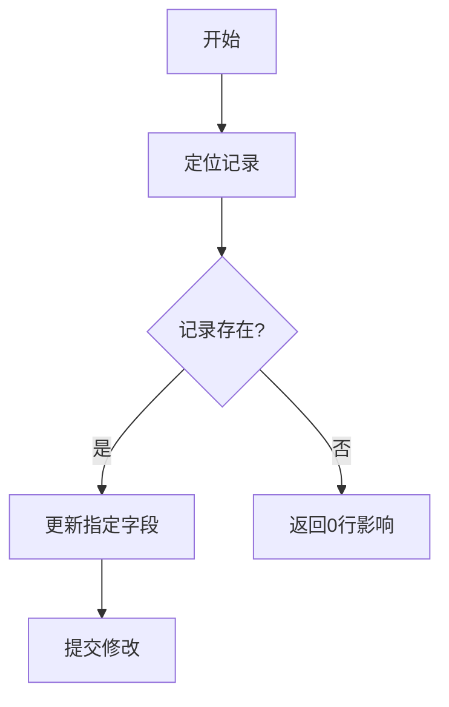
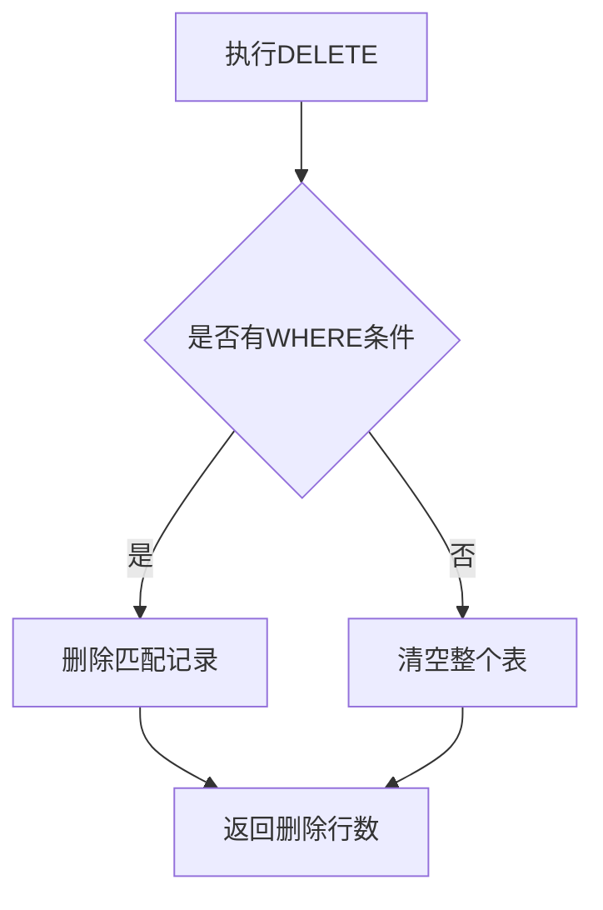

# 3.5.1 插入数据

## 1. 插入元组

### 1.1 基本语法
**定义**：通过`INSERT INTO`语句向表中添加单个元组
**语法**：
```sql
INSERT INTO <表名> [(<属性列1>[,<属性列2>...])]
VALUES (<常量1>[,<常量2>]...);
```

**特征**：
- 未指定属性列时需提供完整元组（与表定义顺序一致）
- 指定部分属性列时，未列出的列自动赋`NULL`值
- 值类型必须与列定义匹配

**示例**：
```sql
-- 插入完整元组
INSERT INTO Student 
VALUES ('201215126','张成民','男',18,'CS');

-- 插入部分列（Grade自动为NULL）
INSERT INTO SC(Sno,Cno) 
VALUES ('201215128','1');
```

## 2. 插入子查询结果

### 2.1 批量插入
**定义**：将子查询结果集批量插入目标表
**语法**：
```sql
INSERT INTO <表名> [(<列名1>[,<列名2>...])]
子查询;
```

**特征**：
- 子查询的列数与目标列数必须相同
- 常用于数据统计结果的持久化存储

**示例**：
```sql
-- 创建系平均年龄表
CREATE TABLE Dept_age(
    Sdept CHAR(15),
    Avg_age SMALLINT
);

-- 插入统计结果
INSERT INTO Dept_age(Sdept,Avg_age)
SELECT Sdept,AVG(Sage) 
FROM Student 
GROUP BY Sdept;
```

## 3. 完整性约束检查

### 3.1 约束类型
**关键约束**：
1. **实体完整性**：主键列不允许为NULL[^1]
2. **参照完整性**：外键值必须存在于被参照表中
3. **用户定义完整性**：
   - `NOT NULL`约束
   - `UNIQUE`约束
   - 值域约束

**异常处理**：


## 4. 空值处理

### 4.1 显式与隐式空值
**定义**：
- 显式：直接使用`NULL`关键字
- 隐式：未指定的列自动赋`NULL`

**示例对比**：
```sql
-- 显式空值
INSERT INTO SC VALUES ('201215126','1',NULL);

-- 隐式空值
INSERT INTO SC(Sno,Cno) VALUES ('201215126','1');
```

## 5. 多行插入优化

### 5.1 批量插入语法
**高效写法**：
```sql
INSERT INTO Student(Sno,Sname,Ssex) 
VALUES 
    ('001','张三','男'),
    ('002','李四','女'),
    ('003','王五','男');
```

**性能对比**：

| 方式       | 事务开销 | 网络IO | 适用场景         |
|------------|----------|--------|------------------|
| 单条INSERT | 高       | 多     | 零星数据插入     |
| 批量INSERT | 低       | 少     | 大规模数据导入   |

## 6. 特殊插入技术

### 6.1 带条件的插入
**示例**（使用`WHERE NOT EXISTS`避免重复）：
```sql
INSERT INTO Course(Cno,Cname)
SELECT 'CS101','数据库' 
WHERE NOT EXISTS (
    SELECT 1 FROM Course WHERE Cno='CS101'
);
```

### 6.2 插入默认值
**语法**：
```sql
-- 使用DEFAULT关键字
INSERT INTO Student(Sno,Sname,Ssex,Sage) 
VALUES ('004','赵六',DEFAULT,20);

-- 使用DEFAULT VALUES
INSERT INTO Student DEFAULT VALUES;
```

## 7. 错误处理机制

### 7.1 常见错误类型
1. **类型不匹配**：如将字符串插入整型列
2. **约束冲突**：违反主键/外键/唯一约束
3. **空值违规**：向`NOT NULL`列插入`NULL`

**处理方案**：
```cpp
try {
    executeSQL("INSERT...");
} catch(SQLException e) {
    // 记录错误日志
    // 返回友好错误信息
}
```

## 8. 性能优化建议

### 8.1 批量插入优化
**技术手段**：
- 使用事务包裹批量操作
- 临时禁用索引和约束检查
- 采用`LOAD DATA INFILE`（MySQL特有）

**示例事务**：
```sql
START TRANSACTION;
INSERT INTO table1 VALUES(...);
INSERT INTO table2 VALUES(...);
COMMIT;
```

# 3.5.2 修改数据

## 1. 基本语法与功能

### 1.1 语法结构
**标准语法**：
```sql
UPDATE <表名>
SET <列名>=<表达式>[, <列名>=<表达式>]...
[WHERE <条件>];
```

**核心功能**：
- 修改指定表中满足WHERE条件的元组
- SET子句指定要被修改的列和新值[^1]

**特征对比**：

| 子句      | 作用                          | 是否可选 |
|-----------|-----------------------------|----------|
| UPDATE    | 指定目标表                    | 必选     |
| SET       | 指定修改的列和值               | 必选     |
| WHERE     | 筛选要修改的记录               | 可选     |

## 2. 修改操作类型

### 2.1 单记录修改
**典型场景**：基于主键的精确更新
**示例**：
```sql
-- 将学号201215121的学生年龄改为22岁
UPDATE Student
SET Sage = 22
WHERE Sno = '201215121';
```
**执行流程图**：


### 2.2 多记录修改
**批量更新**：不带WHERE条件的全表更新
**示例**：
```sql
-- 所有学生年龄增加1岁
UPDATE Student
SET Sage = Sage + 1;
```

**性能影响**：
- 全表扫描可能导致锁表
- 大数据量建议分批处理

## 3. 条件更新技术

### 3.1 子查询更新
**典型应用**：基于其他表数据进行条件更新
**示例**：
```sql
-- 计算机系学生成绩置零
UPDATE SC
SET Grade = 0
WHERE Sno IN (
    SELECT Sno 
    FROM Student 
    WHERE Sdept = 'CS'
);
```

**执行过程**：
1. 先执行子查询获取计算机系学生学号
2. 在SC表中定位对应记录
3. 批量更新Grade字段

## 4. 完整性约束检查

### 4.1 约束类型
**修改时检查**：
1. **实体完整性**：禁止修改主键值
2. **参照完整性**：外键修改需满足引用关系
3. **用户定义完整性**：
   - NOT NULL约束
   - CHECK约束
   - 值域约束[^1]

**异常处理**：
```cpp
try {
    executeUpdate("UPDATE...");
} catch(SQLException e) {
    // 回滚事务
    // 返回错误信息
}
```

## 5. 特殊更新场景

### 5.1 表达式更新
**计算更新**：
```sql
-- 基于现有值的计算更新
UPDATE Employee
SET Salary = Salary * 1.1  -- 涨薪10%
WHERE Dept = 'IT';

-- 使用CASE条件更新
UPDATE Products
SET Price = CASE 
    WHEN Stock > 100 THEN Price * 0.9
    ELSE Price * 1.1
END;
```

### 5.2 多表关联更新
**标准语法**（MySQL示例）：
```sql
UPDATE TableA a
JOIN TableB b ON a.id = b.aid
SET a.col1 = b.col2
WHERE a.status = 1;
```

## 6. 性能优化建议

### 6.1 索引利用
**最佳实践**：
- WHERE条件列应建立索引
- 避免在SET表达式中使用非索引列计算

**对比测试**：

| 条件类型   | 10万记录耗时 | 索引效果 |
|------------|--------------|----------|
| 主键条件   | 0.02s        | ★★★★★    |
| 普通索引   | 0.15s        | ★★★★☆    |
| 无索引列   | 2.31s        | ★☆☆☆☆    |

### 6.2 批量更新策略
**分批次处理**：
```sql
-- 每次更新1000条
WHILE EXISTS(SELECT 1 FROM Table WHERE...) BEGIN
    UPDATE TOP(1000) Table
    SET ...
    WHERE ...
END
```

---

# 3.5.3 删除数据

## 1. 基本语法与功能

### 1.1 标准语法格式
```sql
DELETE FROM <表名>
[WHERE <条件>];
```

**核心功能**：
- 删除指定表中满足WHERE子句条件的元组
- 省略WHERE子句时将删除表中全部数据（保留表结构）[^1]

**执行流程**：


## 2. 删除操作类型

### 2.1 条件删除
**精确删除示例**：
```sql
-- 删除指定学号的学生记录
DELETE FROM Student
WHERE Sno = '201215128';
```

**范围删除示例**：
```sql
-- 删除年龄大于30的学生记录
DELETE FROM Student
WHERE Sage > 30;
```

### 2.2 全表删除
**两种实现方式对比**：

| 方法                | 特点                         | 日志记录 |
|---------------------|----------------------------|---------|
| DELETE FROM Table   | 逐行删除，可回滚               | 完整记录 |
| TRUNCATE TABLE      | 直接删除数据页，不可回滚         | 最小记录 |

### 2.3 关联删除
**使用子查询**：
```sql
-- 删除计算机系学生的选课记录
DELETE FROM SC
WHERE Sno IN (
    SELECT Sno 
    FROM Student 
    WHERE Sdept = 'CS'
);
```

## 3. 完整性约束检查

### 3.1 删除时的约束验证
1. **参照完整性**：
   - 被其他表引用的记录默认不可删除
   - 可通过`ON DELETE CASCADE`设置级联删除[^1]

2. **外键约束处理**：
```sql
-- 创建表时设置级联删除
CREATE TABLE SC (
    Sno CHAR(9),
    Cno CHAR(4),
    FOREIGN KEY (Sno) REFERENCES Student(Sno)
    ON DELETE CASCADE
);
```

## 4. 性能优化建议

### 4.1 大数据量删除策略
**分批删除方案**：
```sql
-- 每次删除1000条记录
WHILE EXISTS(SELECT 1 FROM LargeTable WHERE...) 
BEGIN
    DELETE TOP(1000) FROM LargeTable
    WHERE...
END
```

**性能对比**：

| 方案           | 100万记录耗时 | 锁持续时间 |
|---------------|--------------|-----------|
| 直接DELETE     | 120s         | 长期锁表   |
| 分批DELETE     | 145s         | 短期锁表   |
| TRUNCATE      | 2s           | 瞬间完成   |

## 5. 特殊删除场景

### 5.1 基于其他表的条件删除
**多表关联删除语法**（MySQL示例）：
```sql
DELETE t1 FROM Table1 t1
JOIN Table2 t2 ON t1.id = t2.ref_id
WHERE t2.status = 0;
```

### 5.2 删除重复数据
**保留单条重复记录**：
```sql
-- 使用窗口函数删除重复项
WITH CTE AS (
    SELECT *,
           ROW_NUMBER() OVER(PARTITION BY col1,col2 ORDER BY id) AS rn
    FROM DupTable
)
DELETE FROM CTE WHERE rn > 1;
```

## 6. 注意事项

### 6.1 事务使用建议
```sql
BEGIN TRANSACTION;
DELETE FROM CriticalTable
WHERE...
-- 验证影响行数后再提交
IF @@ROWCOUNT = EXPECTED_ROWS
    COMMIT;
ELSE
    ROLLBACK;
```

### 6.2 删除前备份
**临时存档方案**：
```sql
-- 将待删除数据存入存档表
INSERT INTO BackupTable
SELECT * FROM TargetTable
WHERE...

-- 确认无误后执行删除
DELETE FROM TargetTable
WHERE...
```

