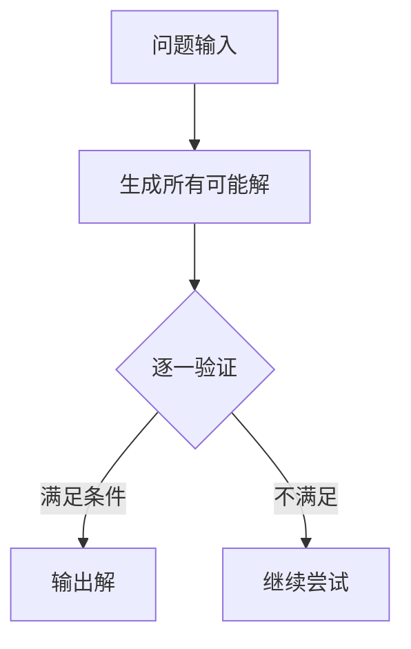

# 蛮力法的设计思想

## 1. 基本概念
### 1.1 定义
**蛮力法**（Brute Force Method）又称穷举法（Enumerate Method），是一种基于计算机运算速度快这一特性，在解决问题时采取的"懒惰"策略[^1]。其核心思想是：
- 不经过（或经过很少的）优化思考
- 将问题的所有可能情况或过程交给计算机一一尝试
- 从中找出满足条件的解

### 1.2 特征
主要特点包括：
- **全面性**：覆盖所有可能的解空间
- **简单性**：算法逻辑直接，无需复杂推导
- **低效性**：时间复杂度通常较高（如O(n!)或O(2^n)）
- **基准性**：可作为衡量更高效算法的性能底线[^2]



## 2. 设计方法
### 2.1 穷举范围确定
关键步骤：
1. 分析问题涉及的**所有可能情况**
2. 确定解空间的**边界条件**
3. 建立**系统化枚举**机制（如排列组合）

示例（百钱百鸡问题）：
```cpp
for(int x=0; x<=100/5; x++)        // 公鸡范围
    for(int y=0; y<=100/3; y++)    // 母鸡范围
        for(int z=0; z<=100*3; z++)// 小鸡范围
            if(5*x + 3*y + z/3 == 100 && z%3 == 0)
                cout << x << y << z;
```

### 2.2 约束条件表达
需明确：
- **必要条件**：解必须满足的数学/逻辑关系
- **剪枝策略**：提前排除明显无效的候选解

约束表达式示例：
$$
\begin{cases} 
a = y_2 - y_1 \\
b = x_1 - x_2 \\
c = x_1y_2 - y_1x_2 \\
ax + by \equiv c \text{（同号判定）}
\end{cases}
$$

## 3. 典型应用
### 3.1 查找问题
| 算法      | 时间复杂度 | 特点          |
| ------- | ----- | ----------- |
| 顺序查找    | O(n)  | 逐个比较直到找到目标  |
| 朴素字符串匹配 | O(mn) | 文本串与模式串逐位比对 |

**改进方向**：通过预计算（如KMP算法）减少重复比较[^4]

### 3.2 排序问题
经典蛮力排序算法对比：

```python
# 选择排序伪代码
def selection_sort(arr):
    for i in range(len(arr)):
        min_idx = i
        for j in range(i+1, len(arr)):
            if arr[j] < arr[min_idx]:
                min_idx = j
        arr[i], arr[min_idx] = arr[min_idx], arr[i]
```

### 3.3 组合优化
**任务分配问题**的蛮力解法：
1. 生成所有n!种排列
2. 计算每种排列的总成本
3. 选择成本最小的方案

成本矩阵示例：
$$
\begin{bmatrix}
9 & 2 & 7 \\
6 & 4 & 3 \\
5 & 8 & 1 \\
\end{bmatrix}
$$

### 3.4 图问题
**哈密顿回路**判定流程：
1. 生成顶点全排列（共n!种）
2. 检查每个排列是否满足：
   - 相邻顶点有边连接
   - 首尾顶点形成闭环

**计算复杂度**：O(n!) → 仅适用于小规模图（n≤10）[^5]

## 4. 优劣分析
### 4.1 优势
- **通用性强**：理论上可解决所有可计算问题
- **实现简单**：适合快速原型开发
- **结果准确**：保证找到全局最优解（如果存在）

### 4.2 局限性
- **效率低下**：解空间爆炸问题（如n>20的组合问题）
- **资源消耗大**：需要大量内存存储中间结果
- **实用范围窄**：仅适用于小规模或低维问题

## 5. 改进策略
### 5.1 剪枝优化
- **数学约束**：利用问题特性提前终止无效搜索
- **启发式规则**：根据经验优先搜索更可能区域

### 5.2 问题转化
如将除法问题转化为乘法问题，减少枚举量：
```cpp
// 原问题：DDDDDD/A = ABCAB
// 转化为：DDDDDD = A * ABCAB
for(int A=3; A<=9; A++)
    for(int D=1; D<=9; D++)
        if(满足位数约束) ...
```

### 5.3 并行计算
利用现代多核CPU/GPU同时处理多个候选解

[^1]: 基于计算机运算速度快这一特性，采取"懒惰"策略，不经优化直接枚举所有可能解
[^2]: 可作为衡量同类问题更高效算法的时间性能基准
[^4]: 通过预计算next数组避免主串指针回退
[^5]: 对于n个顶点的图，需要检查n!种排列组合