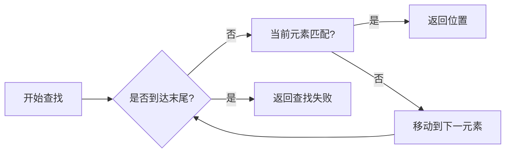

# 查找问题中的蛮力法

## 1. 基本概念
### 1.1 定义
**蛮力法**在查找问题中的应用是指采用**顺序比较**的方式，逐个检查数据结构中的元素，直到找到目标值或遍历完所有元素[^1]。其核心特征是：
- 不依赖数据的有序性或特殊结构
- 无需预处理或额外存储空间
- 通过**线性扫描**完成搜索过程

### 1.2 典型算法
| 算法类型 | 时间复杂度 | 空间复杂度 | 
|---------|------------|------------|
| 顺序查找 | O(n)       | O(1)       |
| 朴素字符串匹配 | O(mn)    | O(1)       |



## 2. 顺序查找实现
### 2.1 基本实现
```cpp
int SeqSearch(int arr[], int n, int key) {
    for(int i=0; i<n; i++) {
        if(arr[i] == key) 
            return i;  // 查找成功
    }
    return -1;  // 查找失败
}
```
**特点**：
- 适用于数组/链表等线性结构
- 平均比较次数：$\frac{n+1}{2}$（成功时）
- 最坏情况需要n次比较[^2]

### 2.2 改进方案
**设置哨兵**减少比较次数：
```cpp
int SeqSearch2(int arr[], int n, int key) {
    arr[n] = key;  // 末尾设置哨兵
    int i = 0;
    while(arr[i] != key) i++;
    return (i < n) ? i : -1;
}
```
性能对比：
- 原始版本：每次循环需进行**两次判断**（边界+匹配）
- 哨兵版本：仅需**一次判断**（匹配）

## 3. 字符串匹配
### 3.1 BF算法
**Brute-Force**算法的核心流程：
1. 对齐文本串和模式串起始位置
2. 逐个比较对应字符
3. 出现不匹配时，模式串右移1位
4. 重复直到找到匹配或遍历完成

```python
def BF_search(text, pattern):
    n, m = len(text), len(pattern)
    for i in range(n-m+1):
        j = 0
        while j < m and text[i+j] == pattern[j]:
            j += 1
        if j == m:
            return i
    return -1
```

### 3.2 性能分析
- **最好情况**：O(m)（首次匹配成功）
- **最坏情况**：O(mn)（如text="aaa...aab"，pattern="aab"）
- **实际应用**：短文本或简单模式时仍具实用价值[^5]

## 4. 应用场景
### 4.1 适用情况
- **小规模数据**（n < 100）
- **无序数据**集合
- **一次性查找**（无重复查询需求）
- **实现验证**（作为更优算法的基准）

### 4.2 典型案例
1. 内存中的临时数据查找
2. 嵌入式系统资源受限环境
3. 算法教学中的基础示例

## 5. 优化方向
### 5.1 预处理优化
- **排序+二分查找**：将O(n)降至O(log n)
- **哈希表**：理想情况下达到O(1)查找

### 5.2 算法改进
```cpp
// 带跳跃的改进版本
int optimizedSearch(int arr[], int n, int key) {
    int step = sqrt(n);  // 设置跳跃步长
    int i = 0;
    while(i < n && arr[i] < key) 
        i += step;
    // 在局部范围内进行线性查找
    for(int j=max(0,i-step); j<min(i,n); j++)
        if(arr[j] == key) return j;
    return -1;
}
```

### 5.3 并行计算
利用SIMD指令集实现多数据并行比较：
```assembly
; 示例：使用SSE指令同时比较4个整数
movdqu xmm0, [arr]     ; 加载16字节数据
pcmpeqd xmm0, xmm1     ; 与key向量比较
pmovmskb eax, xmm0     ; 获取比较结果掩码
```

[^1]: 通过逐个比较元素的方式实现查找，不依赖数据的有序性
[^2]: 最坏情况下需要遍历全部n个元素才能确定查找失败
[^5]: 虽然时间复杂度较高，但在小规模问题中仍具有实用价值