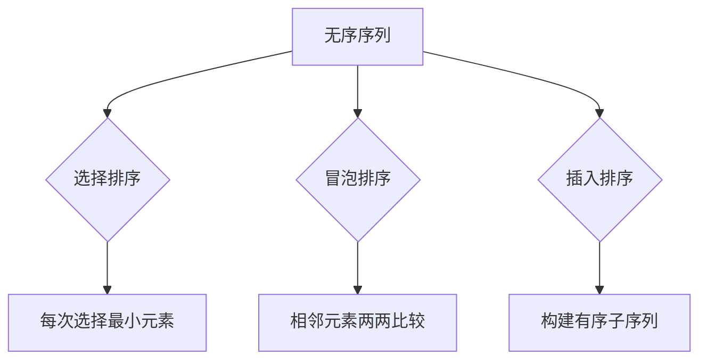

# 排序问题中的蛮力法

## 1. 基本概念
### 1.1 定义
**蛮力法**在排序问题中的应用是指通过**简单直接的比较和交换**操作，逐步将无序序列变为有序序列的方法[^1]。其核心特征是：
- 不采用复杂的分治或递归策略
- 通过**相邻元素比较**或**全局扫描**完成排序
- 时间复杂度通常为O(n²)

### 1.2 典型算法
| 算法类型 | 时间复杂度 | 空间复杂度 | 稳定性 |
|---------|------------|------------|--------|
| 选择排序 | O(n²)      | O(1)       | 不稳定 |
| 冒泡排序 | O(n²)      | O(1)       | 稳定   |
| 插入排序 | O(n²)      | O(1)       | 稳定   |



## 2. 选择排序
### 2.1 算法实现
```cpp
void SelectSort(int r[], int n) {
    for(int i=0; i<n-1; i++) {
        int index = i;
        for(int j=i+1; j<n; j++) {
            if(r[j] < r[index]) 
                index = j;  // 记录最小值位置
        }
        if(index != i) 
            swap(r[i], r[index]);  // 交换元素
    }
}
```
**特点**：
- 比较次数固定为$\frac{n(n-1)}{2}$次
- 元素交换次数最多n-1次
- 不适用于大规模数据排序[^4]

### 2.2 性能分析
- **最好情况**：O(n²)（已有序仍需完整比较）
- **最坏情况**：O(n²)
- **适用场景**：数据量小且交换成本高的场景

## 3. 冒泡排序
### 3.1 算法实现
```cpp
void BubbleSort(int r[], int n) {
    for(int i=0; i<n-1; i++) {
        for(int j=0; j<n-i-1; j++) {
            if(r[j] > r[j+1]) 
                swap(r[j], r[j+1]);  // 相邻元素交换
        }
    }
}
```

### 3.2 优化版本
**带标志位的冒泡排序**：
```cpp
void OptimizedBubbleSort(int r[], int n) {
    bool swapped;
    for(int i=0; i<n-1; i++) {
        swapped = false;
        for(int j=0; j<n-i-1; j++) {
            if(r[j] > r[j+1]) {
                swap(r[j], r[j+1]);
                swapped = true;
            }
        }
        if(!swapped) break;  // 无交换时提前终止
    }
}
```
**性能对比**：
- 原始版本：固定n(n-1)/2次比较
- 优化版本：最好情况O(n)（已有序时）

## 4. 插入排序
### 4.1 算法实现
```python
def InsertionSort(arr):
    for i in range(1, len(arr)):
        key = arr[i]
        j = i-1
        while j >=0 and arr[j] > key:
            arr[j+1] = arr[j]
            j -= 1
        arr[j+1] = key
```

### 4.2 特点分析
- **最好情况**：O(n)（已有序序列）
- **最坏情况**：O(n²)（逆序序列）
- **适用场景**：
  - 小规模数据排序
  - 基本有序的数据集
  - 作为快速排序的补充（小数组时切换）

## 5. 应用与比较
### 5.1 算法对比
| 指标        | 选择排序 | 冒泡排序 | 插入排序 |
|-------------|----------|----------|----------|
| 比较次数    | O(n²)    | O(n²)    | O(n²)    |
| 交换次数    | O(n)     | O(n²)    | O(n²)    |
| 额外空间    | O(1)     | O(1)     | O(1)     |
| 稳定性      | 不稳定   | 稳定     | 稳定     |

### 5.2 适用场景
1. **教学演示**：理解排序基本原理
2. **小规模数据**（n < 1000）
3. **嵌入式系统**：资源受限环境
4. **算法基准**：作为优化算法的对比基线

## 6. 优化方向
### 6.1 算法改进
```cpp
// 双向选择排序（同时找最大最小）
void DoubleSelectSort(int arr[], int n) {
    int left = 0, right = n-1;
    while(left < right) {
        int min = left, max = right;
        for(int i=left; i<=right; i++) {
            if(arr[i] < arr[min]) min = i;
            if(arr[i] > arr[max]) max = i;
        }
        swap(arr[left], arr[min]);
        if(max == left) max = min;  // 修正max位置
        swap(arr[right], arr[max]);
        left++; right--;
    }
}
```

### 6.2 混合策略
- **TimSort**：插入排序+归并排序
- **内省排序**：快速排序+堆排序
- **分块处理**：大数据集分块后使用蛮力法排序

[^1]: 通过简单直接的比较和交换操作完成排序，不采用复杂策略
[^4]: 选择排序的比较次数固定为n(n-1)/2次，与数据初始状态无关