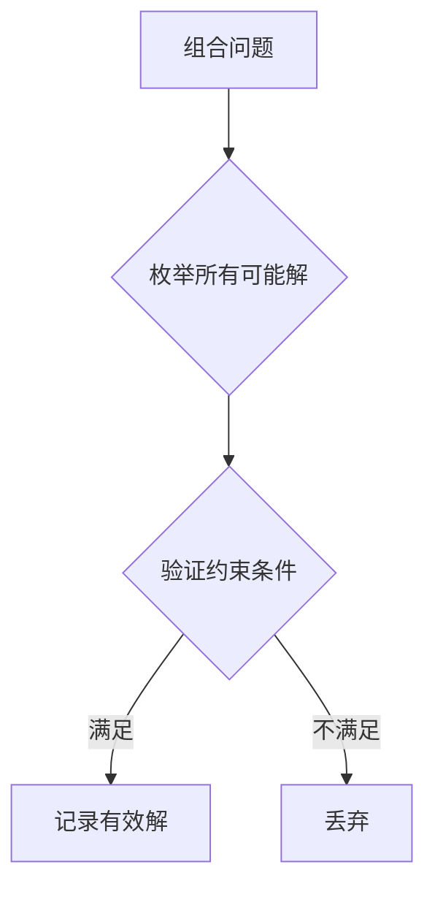

# 组合问题中的蛮力法

## 1. 基本概念
### 1.1 定义
**蛮力法**在组合问题中的应用是指通过**穷举所有可能的候选解**，从中找出满足条件的解的解决方法[^1]。其核心特征是：
- 系统性地**生成所有可能组合**
- **逐个验证**每个候选解的可行性
- 适用于解空间**有限**的组合问题

### 1.2 典型问题
| 问题类型 | 候选解数量 | 时间复杂度 |
|---------|------------|------------|
| 子集生成 | 2^n | O(2^n) |
| 0/1背包 | 2^n | O(2^n) |
| 任务分配 | n! | O(n!) |
| 排列组合 | P(n,k) | O(n^k) |



## 2. 经典问题解决
### 2.1 子集生成问题
**问题描述**：给定集合A={a₁,a₂,...,aₙ}，生成所有2ⁿ个子集

**比特串法实现**：
```cpp
void GenerateSubsets(int n) {
    for(int i=0; i < (1<<n); i++) { // 2^n种组合
        cout << "{ ";
        for(int j=0; j<n; j++) {
            if(i & (1<<j))         // 检查第j位是否为1
                cout << a[j] << " "; 
        }
        cout << "}" << endl;
    }
}
```
**时间复杂度**：O(n×2ⁿ) [^4]

### 2.2 0/1背包问题
**问题描述**：给定n个物品（重量wᵢ，价值vᵢ）和容量C的背包，求价值最大的可行子集

**蛮力法步骤**：
1. 生成所有可能的物品子集（共2ⁿ个）
2. 计算每个子集的总重量和价值
3. 过滤出重量≤C的子集
4. 选择其中价值最大的子集

**示例**（参考材料2）：
| 物品 | 重量 | 价值 |
|------|------|------|
| 1 | 7 | 42 |
| 2 | 3 | 12 |
| 3 | 4 | 40 |
| 4 | 5 | 25 |

```python
# 伪代码实现
max_value = 0
best_subset = []
for subset in all_subsets(items):
    weight = sum(item.w for item in subset)
    if weight <= C:
        value = sum(item.v for item in subset)
        if value > max_value:
            max_value = value
            best_subset = subset
```

## 3. 任务分配问题
### 3.1 问题描述
将n个任务分配给n个人，每人一个任务，使总成本最小（成本矩阵C[i][j]表示第i个人做第j个任务的成本）[^2]

### 3.2 蛮力法实现
```cpp
int MinCost(int C[n][n]) {
    int perm[n]; // 排列数组
    for(int i=0; i<n; i++) perm[i] = i;
  
    int min_cost = INT_MAX;
    do {
        int cost = 0;
        for(int i=0; i<n; i++)
            cost += C[i][perm[i]]; // 计算当前排列成本
        if(cost < min_cost) 
            min_cost = cost;
    } while(next_permutation(perm, perm+n));
  
    return min_cost;
}
```
**示例成本矩阵**：
$$
\begin{bmatrix}
9 & 2 & 7 \\
6 & 4 & 3 \\
5 & 8 & 1 \\
\end{bmatrix}
$$
**最优解**：人员1→任务2(2)，人员2→任务3(3)，人员3→任务1(5)，总成本=10

## 4. 算法优化方向
### 4.1 剪枝策略
- **约束传播**：提前终止不符合条件的搜索路径
```python
# 背包问题剪枝示例
def backtrack(items, idx, current_w, current_v, best):
    if current_w > C: return  # 重量剪枝
    if current_v + remaining_v[idx] <= best: return  # 价值剪枝
    # ...继续搜索...
```

### 4.2 问题转化
将组合问题转化为其他形式以减少计算量：
- **整数规划**：用数学表达式描述约束条件
- **对称性消除**：避免重复计算等效解

### 4.3 并行计算
```java
// 并行生成子集示例
IntStream.range(0, 1<<n).parallel().forEach(i -> {
    processSubset(i); // 并行处理每个子集
});
```

## 5. 应用与局限性
### 5.1 适用场景
1. **小规模问题**（n≤20）
2. **精确解需求**的场景
3. **算法验证**阶段
4. **多约束组合**问题

### 5.2 局限性
- **计算爆炸**：n>25时难以承受（2²⁵≈3千万次运算）
- **资源消耗大**：需要存储大量中间结果
- **效率低下**：相比动态规划等算法差距显著

**性能对比表**：

| 算法 | n=10 | n=20 | n=30 |
|------|------|------|------|
| 蛮力法子集生成 | 1ms | 1s | 34年 |
| 动态规划 | 0.1ms | 0.5ms | 2ms |

[^1]: 通过穷举所有可能的候选解并验证条件来解决问题
[^2]: 通过生成全排列并计算每种分配方案的成本寻找最优解
[^4]: 每个子集需要O(n)时间处理，共2ⁿ个子集