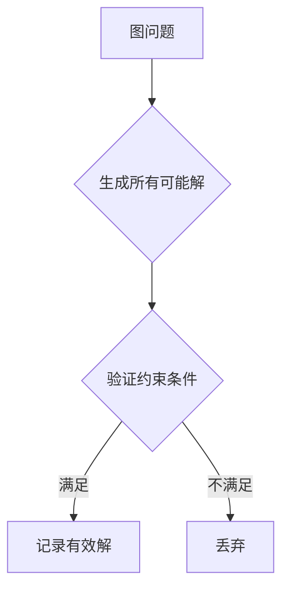

# 图问题中的蛮力法

## 1. 基本概念
### 1.1 定义
**蛮力法**在图问题中的应用是指通过**穷举所有可能的解**并验证其正确性的方法[^1]。其核心特征是：
- 生成图中所有可能的**路径排列**
- **逐一检查**每条路径是否满足问题条件
- 适用于**小规模图**或作为算法基准

### 1.2 典型问题
| 问题类型 | 候选解数量 | 时间复杂度 |
|---------|------------|------------|
| 哈密顿回路 | n! | O(n!) |
| TSP问题 | (n-1)!/2 | O(n!) |
| 最近点对 | C(n,2) | O(n²) |



## 2. 哈密顿回路问题
### 2.1 问题描述
在无向图G=(V,E)中找出一条经过**每个顶点恰好一次**并**返回起点**的回路[^5]

### 2.2 蛮力法实现
```cpp
bool HasHamiltonCycle(Graph G) {
    int perm[V.size()];
    for(int i=0; i<V.size(); i++) perm[i] = i;
  
    do {
        bool valid = true;
        // 检查相邻顶点是否有边
        for(int i=0; i<V.size()-1; i++) 
            if(!G.hasEdge(perm[i], perm[i+1])) {
                valid = false;
                break;
            }
        // 检查首尾是否相连
        if(valid && G.hasEdge(perm[V.size()-1], perm[0]))
            return true;
    } while(next_permutation(perm, perm+V.size()));
  
    return false;
}
```
**验证条件**：
1. $(v_{i_j}, v_{i_{j+1}}) \in E$ （$1 \leq j \leq n-1$）
2. $(v_{i_n}, v_{i_1}) \in E$

## 3. TSP旅行商问题
### 3.1 问题描述
在**加权完全图**中寻找**最短哈密顿回路**[^6]

### 3.2 蛮力法步骤
1. 生成所有可能的城市排列（共(n-1)!种）
2. 计算每种排列的路径总长度
3. 选择长度最短的合法回路

**示例**（4城市问题）：
```
8
a —— b
| \ / |
| / \ |
d —— c
2   3
```
路径组合：

| 路径 | 长度 | 是否最优 |
|------|------|----------|
| a→b→c→d→a | 18 | 否 |
| a→b→d→c→a | 11 | 是 |
| a→c→b→d→a | 23 | 否 |

**时间复杂度**：O(n!) → 20城市时约6×10¹⁸次计算

## 4. 算法优化方向
### 4.1 剪枝策略
- **路径截断**：当前路径长度已超过已知最优解时终止搜索
```python
def tsp_brute(path, current_length):
    if current_length > best_length:  # 剪枝
        return
    # ...继续搜索...
```

### 4.2 问题转化
- **动态规划**：TSP问题可转化为DP状态压缩问题（O(n²2ⁿ)）
- **近似算法**：2-近似最小生成树法

### 4.3 并行计算
```java
// 并行处理排列组合
IntStream.range(0, permCount).parallel().forEach(i -> {
    checkTSPPath(permutations[i]); 
});
```

## 5. 应用与局限性
### 5.1 适用场景
1. **小规模图**（n ≤ 10）
2. **精确解需求**严格的场景
3. **算法正确性验证**
4. **教学演示**目的

### 5.2 局限性
- **计算爆炸**：n>15时不可行（15!≈1.3万亿）
- **效率极低**：相比启发式算法差距显著
- **内存消耗**：需要存储大量中间路径

**性能对比表**：

| 算法 | 10城市 | 15城市 | 20城市 |
|------|--------|--------|--------|
| 蛮力法 | 3.6s | 1.4天 | 7.7万年 |
| 动态规划 | 0.01s | 0.3s | 10s |
| 遗传算法 | 0.001s | 0.005s | 0.02s |

[^1]: 通过穷举所有可能的路径排列来寻找满足条件的解
[^5]: 需要验证每个排列是否构成闭合回路且经过所有顶点
[^6]: 在加权图中寻找最短哈密顿回路，解空间规模为(n-1)!/2