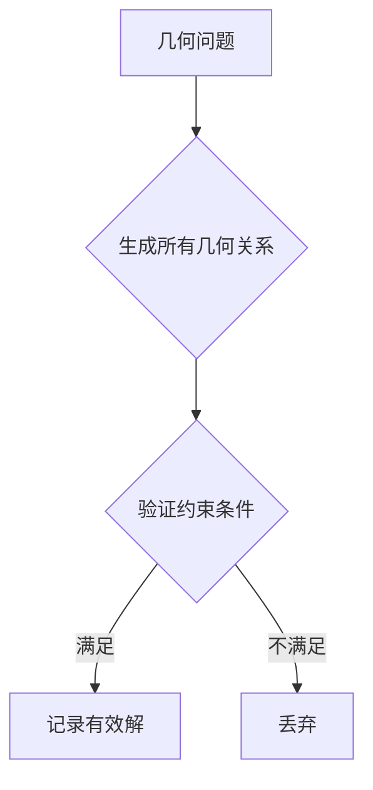

# 几何问题中的蛮力法

## 1. 基本概念
### 1.1 定义
**蛮力法**在几何问题中的应用是指通过**枚举所有可能的几何关系**并逐一验证的求解方法[^1]。其核心特征是：
- 直接计算**所有几何元素间的关系**
- 通过**遍历所有可能组合**寻找解
- 适用于**低维几何**和小规模问题

### 1.2 典型问题
| 问题类型 | 候选解数量 | 时间复杂度 |
|---------|------------|------------|
| 最近点对 | C(n,2) | O(n²) |
| 凸包问题 | C(n,3) | O(n³) |
| 线段相交 | C(m,2) | O(m²) |



## 2. 最近点对问题
### 2.1 问题描述
在二维平面上给定n个点，找出**距离最小的点对**[^6]

### 2.2 蛮力法实现
```cpp
double ClosestPoints(int n, Point points[]) {
    double minDist = INFINITY;
    for(int i=0; i<n-1; i++) {
        for(int j=i+1; j<n; j++) {
            double dx = points[i].x - points[j].x;
            double dy = points[i].y - points[j].y;
            double dist = dx*dx + dy*dy; // 避免开方运算
            if(dist < minDist) {
                minDist = dist;
            }
        }
    }
    return sqrt(minDist);
}
```
**优化技巧**：
- 比较距离平方而非实际距离（减少sqrt计算）
- 提前终止不可能的点对比较

## 3. 凸包问题
### 3.1 问题描述
找出包含所有点的**最小凸多边形**

### 3.2 蛮力法实现
**极点法**：
1. 生成所有可能的三点组合（共C(n,3)种）
2. 检查其他点是否都在该三角形构成的半平面内
3. 保留满足条件的边作为凸包边界

**直线方程法**：
1. 生成所有两点构成的直线（共C(n,2)条）
2. 检查其他点是否都在该直线的同一侧
3. 如果满足则该边属于凸包

```python
def brute_force_convex_hull(points):
    hull_edges = []
    n = len(points)
    for i in range(n):
        for j in range(i+1, n):
            a = points[j].y - points[i].y
            b = points[i].x - points[j].x
            c = points[i].x*points[j].y - points[i].y*points[j].x
            left_side = right_side = 0
            valid = True
            for k in range(n):
                if k == i or k == j:
                    continue
                pos = a*points[k].x + b*points[k].y - c
                if pos < 0:
                    left_side += 1
                elif pos > 0:
                    right_side += 1
                if left_side * right_side != 0:  # 点分布在两侧
                    valid = False
                    break
            if valid:
                hull_edges.append((i,j))
    return hull_edges
```

## 4. 线段相交问题
### 4.1 问题描述
给定平面上n条线段，找出所有**相交的线段对**

### 4.2 蛮力法实现
```cpp
vector<pair<int,int>> FindIntersections(vector<Segment> segs) {
    vector<pair<int,int>> res;
    for(int i=0; i<segs.size()-1; i++) {
        for(int j=i+1; j<segs.size(); j++) {
            if(CheckIntersection(segs[i], segs[j])) {
                res.emplace_back(i,j);
            }
        }
    }
    return res;
}
```
**交集判定方法**：
1. 快速排斥实验（矩形相交测试）
2. 跨立实验（叉积方向判断）

## 5. 应用与优化
### 5.1 适用场景
1. **点数较少**（n ≤ 100）的几何问题
2. **精确解需求**严格的场景
3. **算法正确性验证**
4. **教学演示**目的

### 5.2 优化方向
**分治策略**（最近点对问题）：
```cpp
double ClosestPair(Point points[], int n) {
    if(n <= 3) return BruteForce(points, n); // 小规模直接蛮力
  
    // 按x坐标排序并分区
    sort(points, points+n, xCompare); 
    int mid = n/2;
  
    // 递归解决左右分区
    double dl = ClosestPair(points, mid);
    double dr = ClosestPair(points+mid, n-mid);
    double d = min(dl, dr);
  
    // 合并处理边界区域
    return CheckStrip(points, n, mid, d);
}
```
**复杂度对比**：

| 算法 | n=100 | n=10,000 | n=1,000,000 |
|------|-------|----------|-------------|
| 蛮力法 | 0.5ms | 500ms | 58天 |
| 分治法 | 0.1ms | 10ms | 1.5s |

[^1]: 通过枚举所有几何元素的可能关系来寻找满足条件的解
[^6]: 比较所有C(n,2)个点对的距离找出最小者