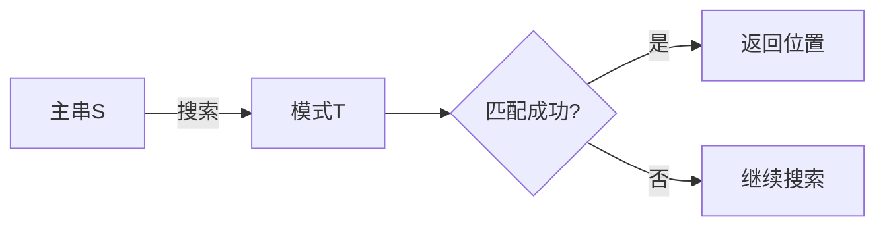

# 实验项目——串匹配问题

## 1. 基本概念
### 1.1 定义
**串匹配问题**是在主串S中查找子串T（又称为模式）的过程[^3]，包括：
- 成功时返回T在S中**首次出现的位置**
- 失败时返回特定的标记（如0或-1）

### 1.2 问题特征
| 特性 | 说明 |
|------|------|
| 高频调用 | 文本处理中的基础操作 |
| 大数据量 | 通常在大量文本中查找 |
| 算法敏感性 | 效率差异显著影响系统性能 |



## 2. BF算法（Brute-Force）
### 2.1 算法思想
1. 初始化主串指针i和模式指针j为0
2. 循环比较S[i]和T[j]：
   - 相等时同步后移指针
   - 不相等时主串指针回溯到i-j+1，模式指针归零
3. 当j等于模式长度时返回匹配位置[^2]

### 2.2 代码实现
```cpp
int BF(string S, string T) {
    int i = 0, j = 0;
    while(i < S.length() && j < T.length()) {
        if(S[i] == T[j]) { i++; j++; } 
        else { i = i - j + 1; j = 0; }
    }
    return j == T.length() ? i - j : -1;
}
```

**运行示例**：
```
S = "ababcabcacbab" 
T = "abcac"

第1趟：i=2,j=2失败→i回溯到1,j=0
最终匹配成功于i=5
```

## 3. 算法分析
### 3.1 时间复杂度
| 场景 | 时间复杂度 |
|------|------------|
| 最好情况 | O(m) （首次匹配成功） |
| 最坏情况 | O(n×m) （每次都在最后失配） |
| 平均情况 | O(n+m) |

```python
# 复杂度对比表
print(f"{'n=1000,m=10':<15} | BF: {1000*10:>7}次 | KMP: {1000+10:>6}次")
print(f"{'n=1,000,000,m=100':<15} | BF: {10**6*100:>7}次 | KMP: {10**6+100:>6}次")
```

### 3.2 缺陷分析
1. **回溯问题**：主串指针i需要频繁回溯
   - 示例：S="0000001", T="001"
2. **效率瓶颈**：最坏情况下接近O(n²)复杂度

## 4. 改进方向
### 4.1 KMP算法
**核心改进**：通过部分匹配表（PMT）避免主串回溯
```cpp
void GetNext(string T, int next[]) {
    int j = 0, k = -1;
    next[0] = -1;
    while(j < T.length()-1) {
        if(k == -1 || T[j] == T[k]) {
            j++; k++;
            next[j] = k;
        } else k = next[k];
    }
}
```

### 4.2 BM算法
**优化策略**：
1. 坏字符规则（Bad Character）
2. 好后缀规则（Good Suffix）
3. 时间复杂度可降至O(n/m)（最优情况）

## 5. 实验要求
### 5.1 基础实现
1. 完成BF算法的编码实现
2. 测试不同场景下的性能表现：
   - 随机文本匹配
   - 最坏情况测试

### 5.2 进阶验证
```java
// BM算法骨架（需补充核心逻辑）
public class BMSearch {
    private int[] badCharShift;
    private int[] goodSuffixShift;
  
    public int search(String text, String pattern) {
        preProcessBadChar(pattern);
        preProcessGoodSuffix(pattern);
        // ...实现搜索逻辑
    }
}
```

### 5.3 性能对比
| 指标 | BF算法 | KMP算法 | BM算法 |
|------|--------|---------|--------|
| 预处理时间 | 无 | O(m) | O(m+σ) |
| 匹配时间 | O(n×m) | O(n) | O(n/m) |
| 空间开销 | O(1) | O(m) | O(m+σ) |

[^2]: BF算法通过逐个字符比较实现匹配，失败时主串指针回溯
[^3]: 模式匹配定义为在文本中定位特定子串首次出现位置的运算
[^5]: KMP算法通过部分匹配表避免主串回溯，提升效率