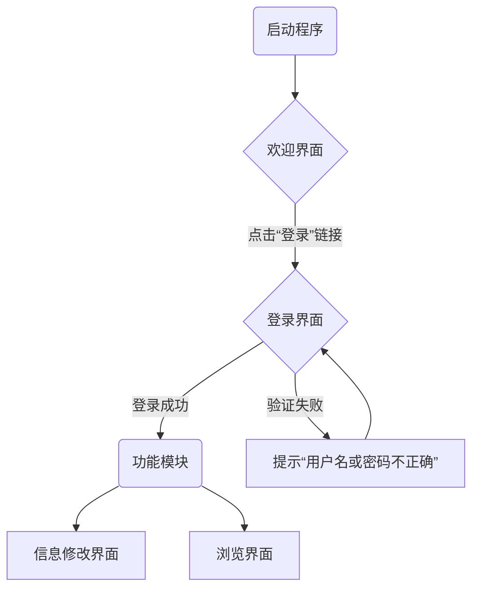

# 项目一：学生信息管理系统 (第一部分)

本项目旨在开发一个基于C#窗体应用（Windows Forms）的学生信息管理系统。第一部分将重点介绍系统的界面设计、开发环境搭建，并详细实现**欢迎界面**与**登录界面**的核心功能。

## 1.1 系统简介与开发环境

本节将宏观介绍系统的构成、目标与开发前的准备工作，为后续编码提供清晰的蓝图。

### 1.1.1 项目背景与目标
该系统是为**厦门大学嘉庚学院**设计的学生信息管理工具。系统的目标是提供一个用户友好的图形界面，通过模块化的窗体设计，实现对学生信息的有效管理、查询和修改，最终构建一个稳定、易用的桌面应用程序。

### 1.1.2 核心界面概览
系统主要由以下四个核心界面组成，它们构成了基础的用户交互流程：

- **欢迎界面 (Welcome Form)**: 应用程序的启动页面，展示系统名称，并提供唯一的登录入口。
- **登录界面 (Login Form)**: 用于用户身份验证，只有合法的管理员才能访问系统核心数据管理功能。
- **信息修改界面 (Update Form)**: 登录成功后，用于添加、修改或删除学生详细信息。
- **信息浏览界面 (Browser Form)**: 登录成功后，用于查询和展示所有学生信息。



### 1.1.3 开发环境与项目创建
在编码前，需配置开发环境并创建项目基本结构。

1.  打开 Visual Studio，选择 **“创建新项目”**。
2.  在项目模板中搜索并选择 **“Windows 窗体应用(.NET Framework)”**，语言选择 C#。
3.  配置项目名称（例如：`StudentAdminSystem`）和存储位置。
4.  选择一个稳定的 .NET Framework 版本（如 .NET Framework 4.7.2），点击创建。
5.  项目生成后，将默认的 `Form1.cs` 文件**重命名**为 `Welcome.cs`，以匹配其功能。

### 1.1.4 窗体文件创建
根据系统设计，需额外创建三个功能窗体。

**操作流程**：在**解决方案资源管理器**中，右键点击项目名称 → **添加** → **新建项** → 选择 **“窗体(Windows 窗体)”** 模板，并按需命名。

| 窗体文件名称 | 功能介绍 |
| :--- | :--- |
| **`Login.cs`** | **登录窗体**，负责处理用户身份验证。 |
| **`Update.cs`** | **更新信息窗体**，负责学生信息的增、删、改操作。 |
| **`Browser.cs`** | **浏览信息窗体**，负责展示和查询学生数据。 |

## 1.2 欢迎界面 (Welcome Form) 的实现

欢迎界面是用户与系统的第一个交互节点，设计需简洁明了。

### 1.2.1 全局窗体变量与实例化
为实现窗体间的顺畅调用，在主窗体 `Welcome` 中定义全局静态变量来持有其他窗体的唯一实例。

- **定义全局变量**：
在 `Welcome` 类的定义内部，使用 `public static` 关键字声明窗体变量。

```csharp
// 文件: Welcome.cs
public partial class Welcome : Form
{
    // 定义全局静态窗体变量，便于跨窗体访问
    public static Login LoginForm;
    public static Update updateForm;
    public static Browser browerForm;     
  
    // ... 构造函数及其他代码
}
```

- **窗体实例化**：
在 `Welcome` 窗体的构造函数 `Welcome()` 中，对窗体变量进行实例化，确保在使用前已创建对象。

```csharp
// 文件: Welcome.cs -> 构造函数
public Welcome()
{
    InitializeComponent();
    // 实例化登录窗体和更新窗体
    LoginForm = new Login();
    updateForm = new Update();          
}
```

### 1.2.2 界面控件布局与属性
欢迎界面主要由标签（`Label`）和链接标签（`LinkLabel`）构成。

| 控件类型 | 含义 | 控件名称 (`Name`) |
| :--- |:---|:---|
| `Label` | 系统名称 | `lblName` |
| `Label` | 学校名称 | `lblSchool` |
| `LinkLabel` | 登录入口 | `lklblLogin` |

#### 1.2.2.1 标签控件 (Label) 属性配置

| 控件名称 | 属性 | 设置值 | 描述 |
| :--- |:---|:---|:---|
| `lblName` | **`Text`** | `学生信息管理系统` | 控件显示的文本内容。 |
| | **`Font`** | `微软雅黑, 22.2pt` | 文本的字体、大小及样式。 |
| | **`TextAlign`** | `MiddleRight` | 文本在控件内的对齐方式。 |
| `lblSchool`| **`Text`** | `厦门大学嘉庚学院` | |
| | **`Font`** | `微软雅黑, 16.2pt` | |
| | **`TextAlign`** | `MiddleRight` | |

#### 1.2.2.2 链接标签 (LinkLabel) 属性配置
`LinkLabel` 控件增加了超链接功能，可响应点击事件。

- **核心属性**：
  - `LinkColor`: 链接在未被访问时的颜色。
  - `VisitedLinkColor`: 链接在被访问后的颜色。
  - `LinkVisited`: 布尔值，标记链接是否已被访问。

| 控件名称 | 属性 | 设置值 | 描述 |
|:---|:---|:---|:---|
| `lklblLogin` | **`LinkColor`** | `DarkViolet` | 链接初始颜色设置为深紫色。 |
| | **`VisitedLinkColor`** | `Red` | 链接被点击后颜色变为红色。 |
| | **`LinkVisited`** | `False` | 初始状态设置为未访问。 |

### 1.2.3 LinkLabel 事件处理
为 `lklblLogin` 控件的 `LinkClicked` 事件编写处理代码，以实现界面跳转。

| 控件名称 | 事件 | 响应函数 |
| :--- |:---|:---|
| `lklblLogin` | `LinkClicked` | `lklblLogin_LinkClicked` |

```csharp
private void lklblLogin_LinkClicked(object sender, LinkLabelLinkClickedEventArgs e)
{
    // 1. 将链接状态设置为“已访问”，触发颜色变化
    lklblLogin.LinkVisited = true;

    // 2. 隐藏当前的欢迎界面
    this.Hide();

    // 3. 显示已在全局实例化的登录窗体
    LoginForm.Show();          
}
```

## 1.3 登录界面 (Login Form) 的实现

登录界面是系统的安全门户，负责验证用户身份。

### 1.3.1 界面控件布局
登录界面包含用户名、密码输入框以及操作按钮。

| 控件类型 | 含义 | 控件名称 (`Name`) | `Text` 属性 |
|:---|:---|:---|:---|
| `TextBox` | 用户名输入框 | `txtName` | *(空)* |
| `TextBox` | 密码输入框 | `txtPwd` | *(空)* |
| `Button` | 登录按钮 | `btnLogin` | `登录` |
| `Button` | 重写按钮 | `btnClear` | `重写` |

### 1.3.2 窗体属性高级配置
对 `Login` 窗体进行属性优化，提升用户体验。

| 属性 | 设置值 | 描述 |
|:---|:---|:---|
| **`FormBorderStyle`** | `FixedDialog` | 设置为固定对话框样式，防止用户调整窗口大小。 |
| **`StartPosition`** | `CenterScreen` | 使窗体启动时在屏幕中央显示。 |
| **`AcceptButton`** | `btnLogin` | 按下 **Enter** 键时，自动触发 `btnLogin` 按钮的点击事件。 |
| **`CancelButton`** | `btnClear` | 按下 **Esc** 键时，自动触发 `btnClear` 按钮的点击事件。 |
| **`Size`** | `600, 400` | 设置窗体的默认尺寸。 |

### 1.3.3 控件详解与事件处理

#### 1.3.3.1 文本框 (TextBox) 属性设置
- **`txtName`** (`Name`属性)：用于接收用户名输入。
- **`txtPwd`** (`Name`属性)：用于接收密码输入，其 `PasswordChar` 属性应设置为 `*`，以星号掩码保护密码隐私。

#### 1.3.3.2 按钮 (Button) 事件处理

- **登录按钮 (`btnLogin`) 的 `Click` 事件**
这是登录功能的核心逻辑。代码首先进行输入校验，然后验证用户凭据。

**C# 实现代码**
```csharp
private void btnLogin_Click(object sender, EventArgs e)
{
    // 检查输入是否为空
    if (txtName.Text == string.Empty || txtPwd.Text == string.Empty)
    {
        MessageBox.Show("信息不完整！", "提示");
        return; // 中断后续执行
    }

    // 验证用户名和密码 (此处为硬编码示例，实际项目应连接数据库)
    if (!txtName.Text.Equals("admin") || !txtPwd.Text.Equals("admin"))
    {
        MessageBox.Show("用户名或密码不正确！", "提示");
        return;
    }
    else
    {
        // 登录成功，显示信息更新窗体
        Welcome.updateForm.Show();
        // 关闭当前登录窗体
        this.Close();
    }
}
```

- **重写按钮 (`btnClear`) 的 `Click` 事件**
此事件用于一键清空所有输入框，方便用户重新输入。

**C# 实现代码**
```csharp
private void btnClear_Click(object sender, EventArgs e)
{
    // 调用 TextBox 控件内置的 Clear() 方法清空文本
    txtName.Clear();
    txtPwd.Clear();
}
```